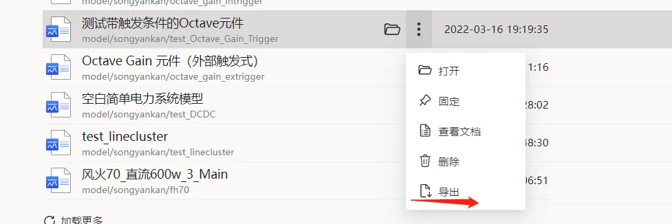

## SimStudio 更新至 v3.2.1 版本

1. 新增了外部触发式和固定频率触发式的 Octave 元件及其模板算例，相比每时步触发计算的 Octave 元件，计算方式更灵活，效率更高。

   1. 固定频率触发式 Octave 元件默认自带 Trigger 参数组和 Trigger 参数（触发频率[Hz]），通过设置触发计算频率 Trigger 实现固定频率触发计算。

   2. 外部触发式 Octave 元件自带默认自带 Trigger 参数组和 Trigger 虚拟输入引脚（外部触发信号输入端口[上升沿触发]），通过在外部给定上升沿信号实现条件触发计算。[示例算例](https://cloudpss.net/model/songyankan/test_Octave_Gain_Trigger)

2. 修复了 Octave 元件报错提示显示异常的问题。

3. 新增了多级嵌套算例的快捷导入导出功能。若当前用户拥有算例全部自定义子元件/算例的可读权限时，在个人中心中可对该算例及其依赖元件/算例进行批量导出和导入。

   

   

   :::tip

   可读权限定义为以下2种情况：

   1. 模块/算例为当前用户所有；
   2. 模块/算例非当前用户所有，但模块/算例的权限为“公开”，且已勾选“允许查看内部细节”。
   
   :::

   :::warning

   批量导入算例时，全部依赖的子模块将保存至当前用户名下。若存在 RID 冲突，则会自动覆盖 RID 相同的算例。请谨慎使用。

   ::: 

## AppStudio 更新至 v3.2.0 版本

1. 改善了 AppStudio 和 SimStudio 在参数输入框中编辑复杂表达式的体验。在表达式输入模式下，选中输入框后，按 <kbd>Ctrl</kbd> 可呼出输入框的扩展编辑界面。在扩展编辑界面中，支持输入和编辑多行复杂表达式。

   
