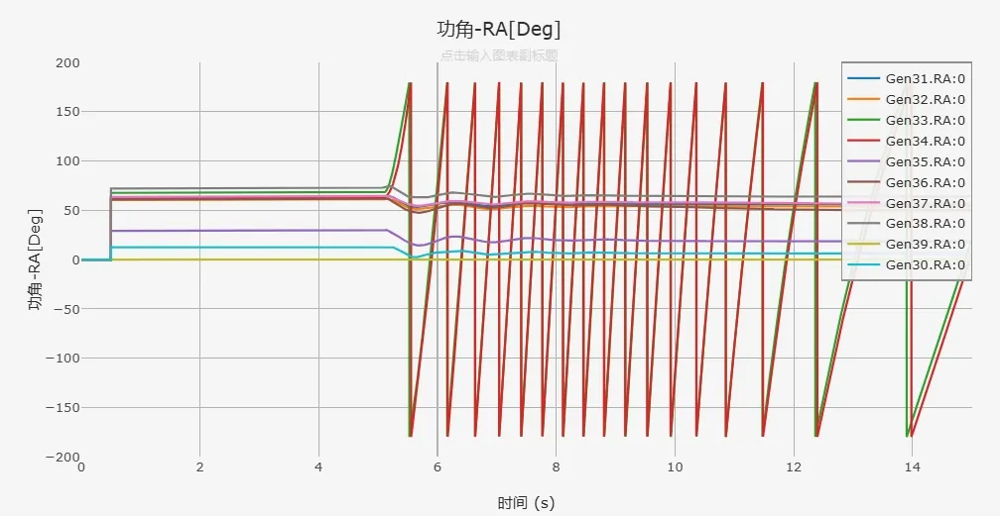
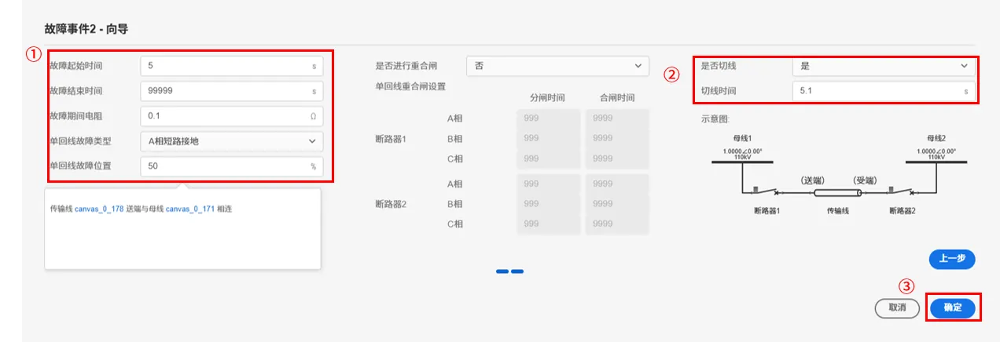
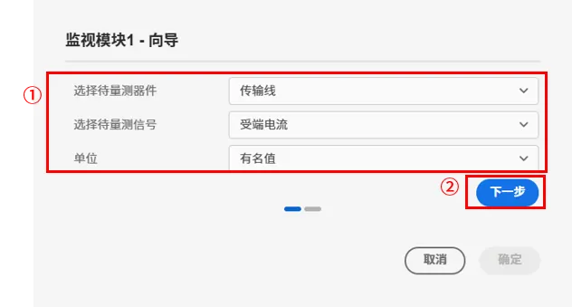
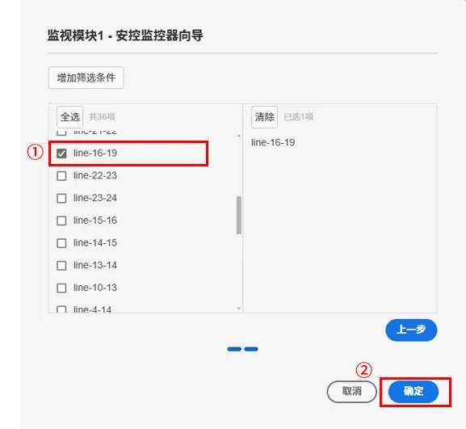
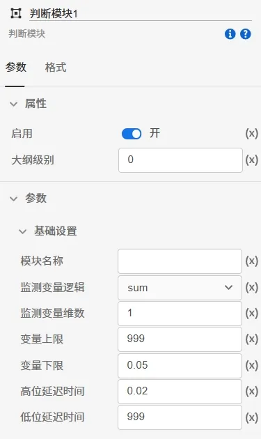
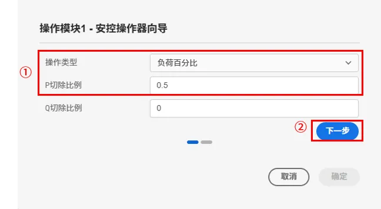
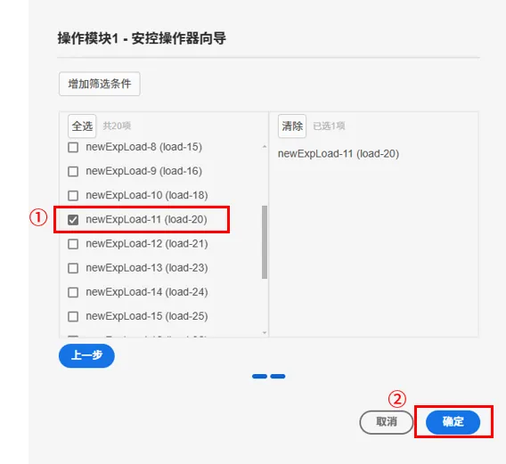
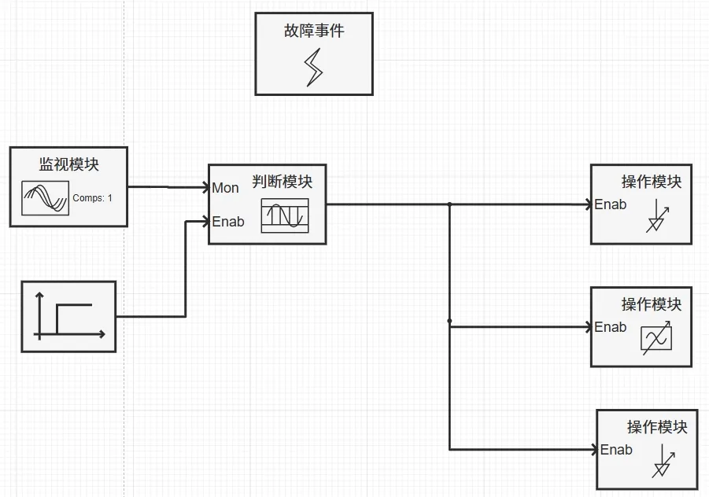
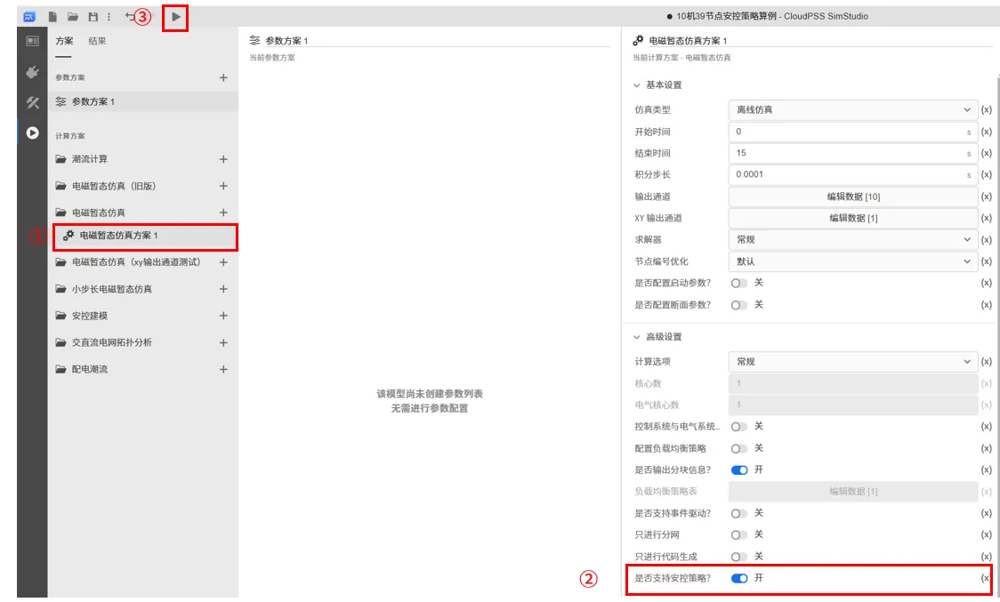
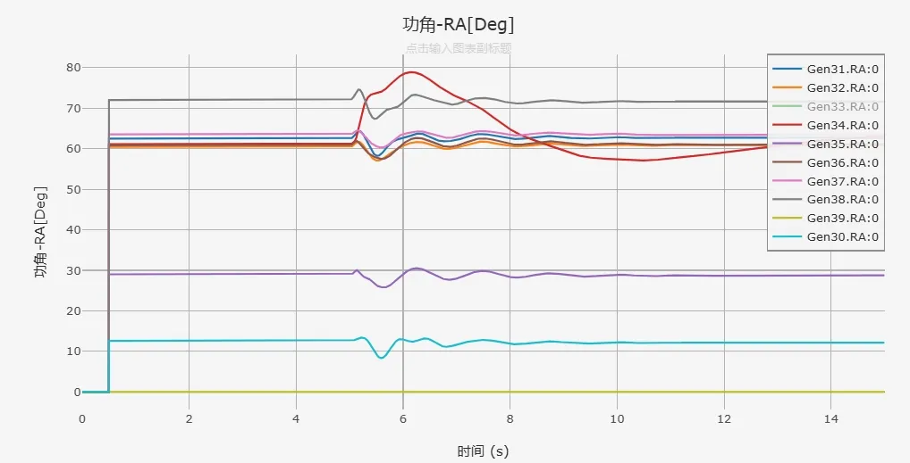

电力系统安全稳定控制（以下简称安控）系统旨在应对潜在的系统故障和运行风险，通过对电力系统潜在风险的监测与安控策略执行，保障系统的安全稳定运行。

## 模块组成
cloudPSS 的安控模块库由**故障事件**、**监视模块**、**判断模块**和**操作模块**组成，具体的功能描述如下：
1. 故障事件
   - 负责模拟多种常见的电力系统故障，包括传输线短路、变压器故障、切机、切负荷、母线跳所有出线等；
   - 提供灵活的故障定义与模拟功能，支持单一故障和多故障组合。

2. 监视模块
   - 用于对电力系统中关键设备的运行信号进行实时监视，支持的信号包括电压、电流、频率、功率等；

3. 判断模块
   - 与监视模块共同构成监控单元，通过逻辑运算和设定的控制触发条件，判断是否需要执行安控操作；
   - 支持自定义逻辑规则配置，例如基于阈值的触发条件或多信号组合逻辑。

4. 操作模块
   - 负责执行具体的安控操作，包括切机、切负荷动作。

## 案例
下面以**10 机 39 节点标准测试系统**为例，具体介绍安控模块库的使用方法。

假如线路 16-19 在 5s 断线跳闸，机组（Gen33、Gen34）的功率盈余会导致功角振荡(相对于机组Gen39)和负荷母线 bus20 的瞬时性过压，其余负荷母线由于功率缺额，存在不同程度的瞬时电压下降。

针对上述运行场景，使用安控模块设置故障，并配置一套安控策略进行校验：
- 使用**故障事件**元件模拟线路 16-19 断线故障；
- 使用**监视模块**监视线路 16-19 的电流，使用**判断模块**判断电流信号是否持续0.2s 低于 0.01kA，满足条件输出触发信号；
- 使用**操作模块**进行切机和切负荷操作，切除电机 Gen33，切除负载 load-20 的 25% 有功功率，切除负载 load-15、load-16、load-21 的 50% 有功功率和 25% 无功功率。

具体的元件设置如下所述：
- 将**故障事件**拖拽至图纸，可自动弹出元件的向导界面，选择**故障类型**为交流传输线故障，**传输线类型**为单回线；筛选框中会自动筛选出算例中的所有传输线，勾选 line-16-19，点击下一步。

- 将**是否切线**选项设置为是，切线时间为 5s，点击向导界面的确定按钮。

- 将**监视模块**拖拽至图纸，可自动弹出元件的向导界面，**选择待量测器件**为传输线，**选择待量测信号**为受端电流，选择**单位**为有名值，点击下一步。

- 筛选框中会自动筛选出算例中的所有传输线，勾选 line-16-19，点击向导界面的确定按钮。

- 将**判断模块**拖拽至图纸，在右侧的参数列表中设置元件参数，设置**变量下限**为 0.01，**低位延迟时间**为 0.2，其余参数均为默认值。

- 将**操作模块**拖拽至图纸，可自动弹出元件的向导界面，选择**操作类型**为负荷百分比，设置**P切除比例**为 0.5，点击下一步。

- 筛选框中会自动筛选出算例中的所有负荷，勾选 load-20，点击向导界面的确定按钮。

- 同理，再拖拽两个**操作模块**，其中一个操作模块选择**操作类型**为负荷百分比，设置**P切除比例**为 0.5， **q切除比例**为 0.25，在筛选框勾选  load-15、load-16、load-21，点击向导界面的确定按钮。另一个操作模块选择**操作类型**为切机，在筛选框勾选  Gen33，点击向导界面的确定按钮。

- 将**监视模块**的输出引脚和**判断模块**的 `Mon` 引脚相连；**判断模块**的使能信号可由信号发生器提供，本案例中使用阶跃信号发生器与 `Enab` 引脚相连，阶跃信号发生器在 2s 产生阶跃信号；将**判断模块**的输出引脚分别与三个**操作模块**的 `Enab` 引脚相连，最终的连接关系如下图所示。

- 在**运行标签页**，选择电磁暂态方案，开启**是否支持安控策略**按钮，点击启动任务按钮。

- 在结果页面，可以看出，监测的电流在 5s 跌落，**判断模块**在 5.02s 输出信号触发**操作模块**的切机，切负荷操作。
  

- 从功角曲线和母线电压结果可以看出，通过安控操作，系统能够稳定运行，没有出现功角振荡和瞬时过压现象。

### 示例案例下载连接
算例文件下载：
[10 机 39 节点标准测试系统安控算例](./case.cmdl) 