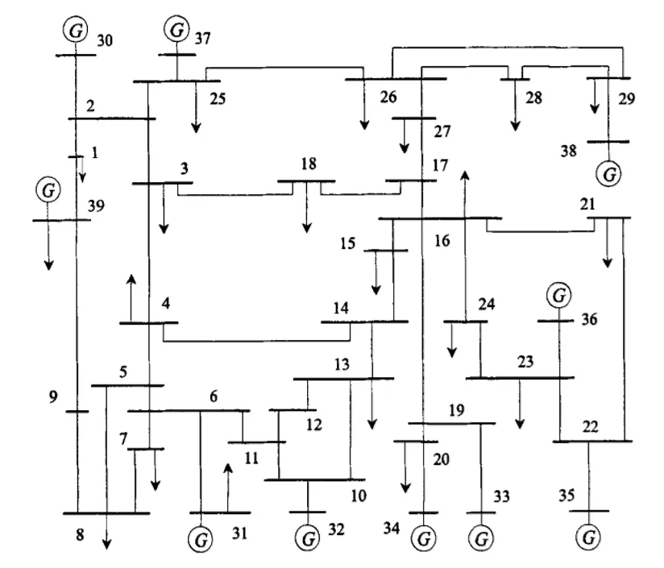
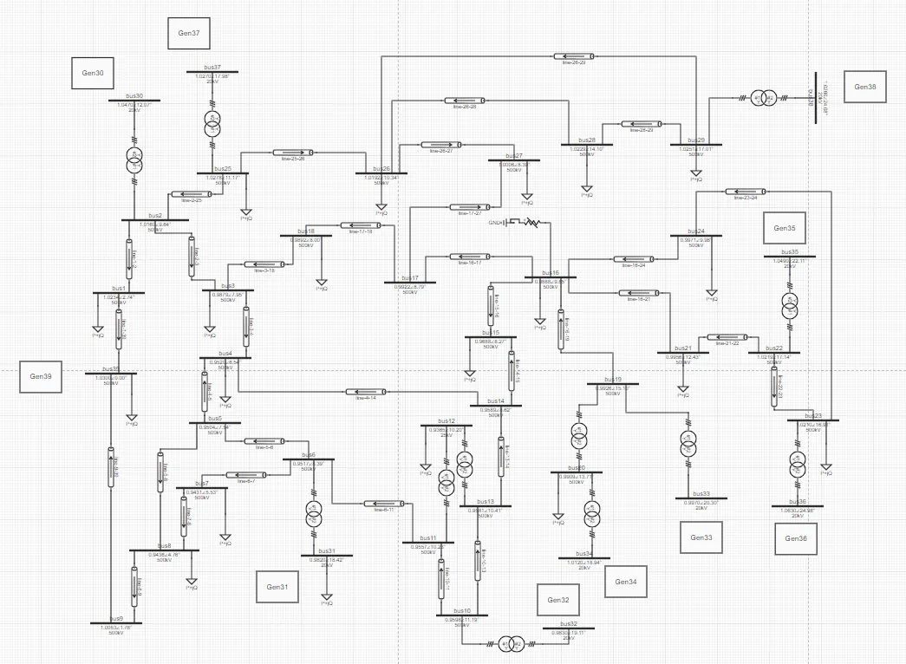
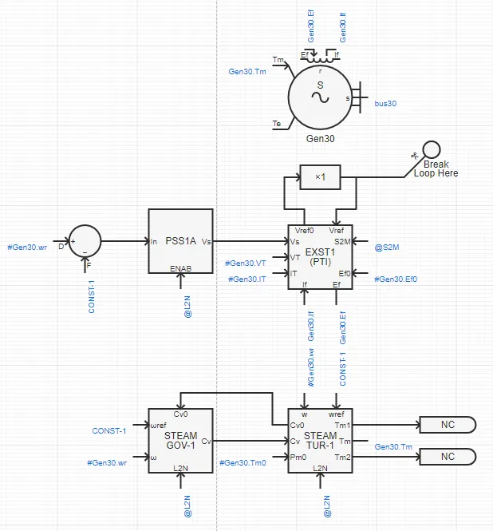
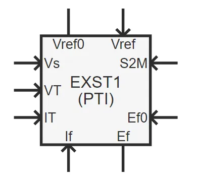
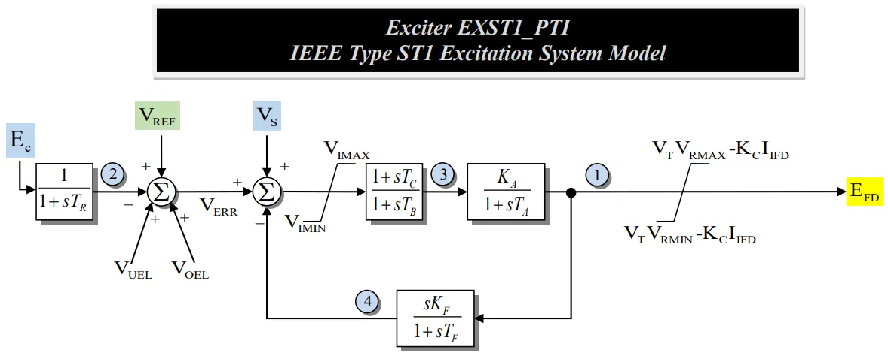
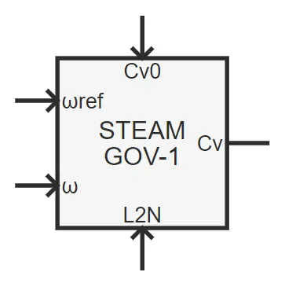
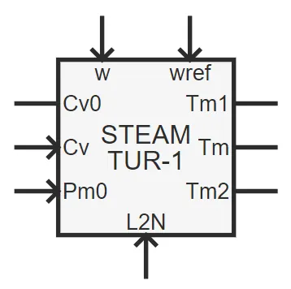
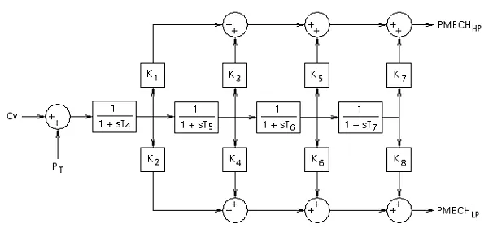

## 描述
IEEE 39节点标准系统，是美国新英格兰地区的一个电力网络。该系统包括10台发电机，39个母线，12台变压器。所有电机均采用了励磁、调速以及电力系统稳定器PSS进行调控。
作为测试，在实例算例中，于bus-16母线处添加了时长0.1s的三项接地短路故障，用户可根据需要自行修改、删除或添加。

系统可以选择两种启动方式：S2M启动方式与稳态潮流断面启动方式。详见[潮流断面启动](../../../../../documents/software/20-emtlab/60-power-flow/30-initializing-from-power-flow-results/index.md#潮流断面启动)

该算例可用于传统暂态稳定分析，励磁、调速控制器设计，系统调频等特性分析等。

## 模型介绍

### 模型拓扑

IEEE39节点算例拓扑图如下，其中39号节点为松弛节点。除松弛节点外，各电机相连的母线（30-38）电压等级均为20kV，另外12号节点为25kV，剩下所有母线电压均为500kV.

CloudPSS上该算例采用单线图构建，其拓扑如下。

#### 子系统功能

CloudPSS上的IEEE39节点标准系统中，对电机采用了子系统功能进行封装。每个子系统内部的拓扑如下图所示（以30号电机为例），每台电机包含励磁器、调速器、原动机、电力系统稳定器四种控制器模型。

### 模型参数

所有电机参数、传输线参数、变压器参数来源于文献^[Luc Gérin-Lajoie. IEEE PES Task Force on Benchmark Systems for Stability Controls[R]. EMTP-RV 39-bus system, Version 1.5 - Mars 04, 2015]。

#### 发电机参数

发电机原始标幺值参数如下:

| UnitNo. | RatedPower | H | Ra | x'd | x'q | xd | xq | T'do | T'qo | xl |
| :--- | :--- | :--- | :--- | :--- | :--- | :--- | :--- | :--- | :--- | :--- |
| 1  | 10000  | 5.000  | 0.000 | 0.600  | 0.800  | 2.000  | 1.900  | 7.000  | 0.700  | 0.300  |
| 2  | 1000  | 3.030  | 0.000  | 0.697  | 1.700  | 2.950  | 2.820  | 6.560  | 1.500  | 0.350  |
| 3  | 1000  | 3.580  | 0.000  | 0.531  | 0.876  | 2.495  | 2.370  | 5.700  | 1.500  | 0.304  |
| 4  | 1000  | 2.860  | 0.000  | 0.436  | 1.660  | 2.620  | 2.580  | 5.690  | 1.500  | 0.295  |
| 5  | 600   | 4.333  | 0.000  | 0.792  | 0.996  | 4.020  | 3.720  | 5.400  | 0.440  | 0.324  |
| 6  | 1000  | 3.480  | 0.000  | 0.500  | 0.814  | 2.540  | 2.410  | 7.300  | 0.400  | 0.224  |
| 7  | 1000  | 2.640  | 0.000  | 0.490  | 1.860  | 2.950  | 2.920  | 5.660  | 1.500  | 0.322  |
| 8  | 1000  | 2.430  | 0.000  | 0.570  | 0.911  | 2.900  | 2.800  | 6.700  | 0.410  | 0.280  |
| 9  | 1000  | 3.450  | 0.000  | 0.570  | 0.587  | 2.106  | 2.050  | 4.790  | 1.960  | 0.298  |
| 10 | 1000  | 4.200  | 0.000  | 0.310  | 0.080  | 1.000  | 0.690  | 10.200  | 0.000  | 0.125  |

经过折算后（折算方法见2.2.1），实际使用的发电机参数如下：

| Bus No. | Rs | Xls | Xd | Xq | Rfd | Rkd | Rkq | Xlfd | Xlkd | Xlkq |
| :--- | :--- | :--- | :--- | :--- | :--- | :--- | :--- | :--- | :--- | :--- |
| 39 | 0.0002 | 0.3 | 2 | 1.9 | 0.00078  | 0.08842  | 0.07805  | 0.36429  | 0.30000  | 0.16552  |
| 31 | 0.0002 | 0.35 | 2.95 | 2.82 | 0.00121  | 0.08680  | 0.11626  | 0.40044  | 0.26421  | 0.15970  |
| 32 | 0.0002 | 0.304 | 2.495 | 2.37 | 0.00114  | 0.08339  | 0.09828  | 0.25324  | 0.40916  | 0.15710  |
| 33 | 0.0002 | 0.295 | 2.62 | 2.58 | 0.00115  | 0.22949  | 0.10351  | 0.15010  | 0.09017  | 0.05636  |
| 34 | 0.0002 | 0.324 | 4.02 | 3.72 | 0.00208  | 0.03440  | 0.17167  | 0.53585  | 1.07442  | 0.48710  |
| 35 | 0.0002 | 0.224 | 2.54 | 2.41 | 0.00096  | 0.06964  | 0.10510  | 0.31334  | 0.48576  | 0.19141  |
| 36 | 0.0002 | 0.322 | 2.95 | 2.92 | 0.00132  | 0.16917  | 0.11841  | 0.17947  | 0.14560  | 0.08041  |
| 37 | 0.0002 | 0.28 | 2.9 | 2.8 | 0.00117  | 0.07570  | 0.11947  | 0.32609  | 0.41083  | 0.18230  |
| 38 | 0.0002 | 0.298 | 2.106 | 2.05 | 0.00118  | 0.08605  | 0.08481  | 0.32017  | 0.34453  | 0.16644 |
| 30 | 0.0002 | 0.125 | 1 | 0.69 | 0.00029  | 0.09301  | 0.03207  | 0.23460  | 0.38542  | 0.16051  |

#### 线路参数

传输线原始参数如下表。其中，标幺值参数为线路全长参数（潮流计算使用的参数），有名值参数为单位长度参数（根据标幺值参数和基准容量、电压、线路长度折算）。在CloudPSS提供的39节点标准算例中，线路参数采用标幺值的方式录入。

以下标么值的线路参数基值选取：电压基值为500kV，功率基值为100MW。

| | | R1(pu)  | X1(pu)  | B1(pu)  | km  | R1(ohm/km)  | X1(ohm/km)  | B1(uS/km)  | R0(ohm/km)  | X0(ohm/km)  | B0(uS/km) |
| :--- | :--- | :--- | :--- | :--- | :--- | :--- | :--- | :--- | :--- | :--- | :--- |
| 1   | 2   | 0.0035  | 0.0411  | 0.6987  | 275.5  | 0.032  | 0.373  | 1.015  | 0.318  | 1.119  | 0.609  |
| 1  | 39  | 0.001  | 0.025  | 0.75  | 167.6  | 0.015  | 0.373  | 1.790  | 0.149  | 1.119  | 1.074  |
| 2  | 3  | 0.0013  | 0.0151  | 0.2572  | 101.2  | 0.032  | 0.373  | 1.017  | 0.321  | 1.119  | 0.610  |
| 2  | 25  | 0.007  | 0.0086  | 0.146  | 57.6  | 0.304  | 0.373  | 1.013  | 3.036  | 1.119  | 0.608  |
| 3  | 4  | 0.0013  | 0.0213  | 0.2214  | 142.8  | 0.023  | 0.373  | 0.620  | 0.228  | 1.119  | 0.372  |
| 3  | 18  | 0.0011  | 0.0133  | 0.2138  | 89.1  | 0.031  | 0.373  | 0.959  | 0.308  | 1.119  | 0.576  |
| 4  | 5  | 0.0008  | 0.0128  | 0.1342  | 85.8  | 0.023  | 0.373  | 0.626  | 0.233  | 1.119  | 0.375  |
| 4  | 14  | 0.0008  | 0.0129  | 0.1382  | 86.5  | 0.023  | 0.373  | 0.639  | 0.231  | 1.119  | 0.384  |
| 5  | 6  | 0.0002  | 0.0026  | 0.0434  | 17.4  | 0.029  | 0.373  | 0.996  | 0.287  | 1.119  | 0.598  |
| 5  | 8  | 0.0008  | 0.0112  | 0.1476  | 75.1  | 0.027  | 0.373  | 0.786  | 0.266  | 1.119  | 0.472  |
| 6  | 7  | 0.0006  | 0.0092  | 0.113  | 61.7  | 0.024  | 0.373  | 0.733  | 0.243  | 1.119  | 0.440  |
| 6  | 11  | 0.0007  | 0.0082  | 0.1389  | 55.0  | 0.032  | 0.373  | 1.011  | 0.318  | 1.119  | 0.607  |
| 7  | 8  | 0.0004  | 0.0046  | 0.078  | 30.8  | 0.032  | 0.373  | 1.012  | 0.324  | 1.119  | 0.607  |
| 8  | 9  | 0.0023  | 0.0363  | 0.3804  | 243.3  | 0.024  | 0.373  | 0.625  | 0.236  | 1.119  | 0.375  |
| 9  | 39  | 0.001  | 0.025  | 1.2  | 167.6  | 0.015  | 0.373  | 2.865  | 0.149  | 1.119  | 1.719  |
| 10  | 11  | 0.0004  | 0.0043  | 0.0729  | 28.8  | 0.035  | 0.373  | 1.012  | 0.347  | 1.119  | 0.607  |
| 10  | 13  | 0.0004  | 0.0043  | 0.0729  | 28.8  | 0.035  | 0.373  | 1.012  | 0.347  | 1.119  | 0.607  |
| 13  | 14  | 0.0009  | 0.0101  | 0.1723  | 67.7  | 0.033  | 0.373  | 1.018  | 0.332  | 1.119  | 0.611  |
| 14  | 15  | 0.0018  | 0.0217  | 0.366  | 145.4  | 0.031  | 0.373  | 1.007  | 0.309  | 1.119  | 0.604  |
| 15  | 16  | 0.0009  | 0.0094  | 0.171  | 63.0  | 0.036  | 0.373  | 1.086  | 0.357  | 1.119  | 0.651  |
| 16  | 17  | 0.0007  | 0.0089  | 0.1342  | 59.7  | 0.029   | 0.373  | 0.9	  | 0.293  | 1.119  | 0.54  |
| 16  | 19  | 0.0016  | 0.0195  | 0.304   | 130.7  | 0.031  | 0.373  | 0.93	  | 0.306  | 1.119  | 0.558 |
| 16  | 21  | 0.0008  | 0.0135  | 0.2548  | 90.5  | 0.022  | 0.373  | 1.126	  | 0.221  | 1.119  | 0.676 |
| 16  | 24  | 0.0003  | 0.0059  | 0.068	  | 39.5  | 0.019  | 0.373  | 0.688	  | 0.19  | 1.119  | 0.413  |
| 17  | 18  | 0.0007  | 0.0082  | 0.1319  | 55    | 0.032  | 0.373  | 0.96	  | 0.318  | 1.119  | 0.576 |
| 17  | 27  | 0.0013  | 0.0173  | 0.3216  | 116	   | 0.028  | 0.373  | 1.109  | 0.28  | 1.119  | 0.666  |
| 21  | 22  | 0.0008  | 0.014   | 0.2565  | 93.8  | 0.021  | 0.373  | 1.093	  | 0.213  | 1.119  | 0.656 |
| 22  | 23  | 0.0006  | 0.0096  | 0.1846  | 64.3  | 0.023  | 0.373  | 1.148	  | 0.233  | 1.119  | 0.689 |
| 23  | 24  | 0.0022  | 0.035   | 0.361	  | 234.6  | 0.023  | 0.373  | 0.616  | 0.234  | 1.119  | 0.369 |
| 25  | 26  | 0.0032  | 0.0323  | 0.513	  | 216.5  | 0.037  | 0.373  | 0.948  | 0.37  | 1.119  | 0.569  |
| 26  | 27  | 0.0014  | 0.0147  | 0.2396  | 98.5  | 0.036  | 0.373  | 0.973	  | 0.355  | 1.119  | 0.584 |
| 26  | 28  | 0.0043  | 0.0474  | 0.7802  | 317.7  | 0.034  | 0.373  | 0.982  | 0.338  | 1.119  | 0.589 |
| 26  | 29  | 0.0057  | 0.0625  | 1.029	  | 418.9  | 0.034  | 0.373  | 0.983  | 0.34  | 1.119  | 0.59   |
| 28  | 29  | 0.0014  | 0.0151  | 0.249   | 101.2  | 0.035  | 0.373  | 0.984  | 0.346  | 1.119  | 0.59  |
#### 变压器参数

|   |    | 额定功率（MVA） | 原边电压等级（kV） | 副边电压等级（kV） | R | X |
| :--- | :--- | :--- | :--- | :--- | :--- | :--- |
| 11  | 12  | 100 | 500 | 25 | 0.0016 | 0.0435 |
| 13  | 12  | 100 | 500 | 25 | 0.0016 | 0.0435 |
| 6  | 31  | 100 | 500 | 20 | 0 | 0.025 |
| 10  | 32  | 100 | 500 | 20 | 0 | 0.02 |
| 19  | 33  | 100 | 500 | 20 | 0.0007 | 0.0142 |
| 20  | 34  | 100 | 500 | 20 | 0.0009 | 0.018 |
| 22  | 35  | 100 | 500 | 20 | 0 | 0.0143 |
| 23  | 36  | 100 | 500 | 20 | 0.0005 | 0.0272 |
| 25  | 37  | 100 | 500 | 20 | 0.0006 | 0.0232 |
| 2  | 30  | 100 | 500 | 20 | 0 | 0.0181 |
| 29  | 38  | 100 | 500 | 20 | 0.0008 | 0.0156 |
| 19  | 20  | 100 | 500 | 500 | 0.0007 | 0.0138 |

#### 负荷参数

| 节点编号 | 有功功率P（MW） | 无功功率Q（MVar）|
| :--- | :--- | :--- |
| 1 | 97.6 | 44.2|
| 3 | 322 | 2.4|
| 4 | 500 | 184|
| 7 | 233.8 | 84|
| 8 | 522 | 176|
| 12 | 8.5 | 88|
| 15 | 320 | 153|
| 16 | 329 | 32.3|
| 18 | 158 | 30|
| 20 | 680 | 103|
| 21 | 274 | 115|
| 23 | 247.5 | 84.6|
| 24 | 308.6 | -92.2|
| 25 | 224 | 47.2|
| 26 | 139 | 17|
| 27 | 281 | 75.5|
| 28 | 206 | 27.6|
| 29 | 283.5 | 26.9|
| 31 | 9.2 | 4.6|
| 39 | 1104 | 250|
#### 励磁调节器参数

本算例中采用 IEEE 标准的 EXST1(PTI) 型励磁调节器。具体信息见参考文献^[IEEE Std 421.5™-2005. IEEE Recommended Practice for Excitation System Models for Power System Stability Studies. New York, IEEE, 2005]。在 CloudPSS 中构建的元件图标以及原理图如下：

 
各个引脚中，Vref、Vs、VT、IT、Ef0、S2M为输入引脚，其中：
+ Ef0引脚应与电机内部量测量#Ef0相连，为Ef的初值。
+ Ef输出连接电机的Ef端口。
+ If输入端口连接电机的If输出端口。
+ Vs连接到PSS的输出，没有PSS时可以输入常数0。
+ Vref（参考电压）可以连接到同模块输出的参考电压初始值Vref0，也可以直接设为1。
+ VT，IT为电机端电压和电流的标幺值。
+ S2M为`Source to Machine信号`。当电机采用Source to Machine启动时，输入模块的S2M信号应与输入电机的S2M信号保持一致。

其中参数设置如下：
||||||||
| :----: | :----: | :----: | :----: | :----: | :----: | :----: |
| **RC** | **Xc** | **TR** | **TC** | **TB** | **KF** | **TF** |
| 0 | 0 | 0.01 | 1 | 10 | 0 | 1 |
| **KA** | **TA** | **VRMAX** | **VRMIN** | **KC** | **VIMAX** | **VIMIN** |
| 200 | 0.015 | 5 | -5 | 0 | 0.1 | -0.1 |

参数说明如下：
+ TA, TB, TC：Voltage regulator time constants [s]电压校准器时间常数
+ VRMAX, VRMIN：Maximum and minimum regulator output limits [p.u.]电压校准器输出范围 
+ TF：Excitation control system stabilizer time constant [s] 励磁控制系统稳定器时间常数
+ KF：Excitation control system stabilizer gain [p.u.]励磁控制系统稳定器放大倍数

#### 调速器和原动机参数

本算例中采用IEEE标准的STEAM_GOV_1型调速器和STEAM_TUR_1型原动机。在CloudPSS中构建的调速器STEAM_GOV_1元件图标以及原理图如下：

其中参数设置如下：
|||||||||
| :----: | :----: | :----: | :----: | :----: | :----: | :----: | :----: |
| **DB** | **Kg** | **TSR** | **TSM** | **P_up** | **P_donw** | **Cmax** | **Cmin** |
| 0 | 20 | 0 | 0.075 | 0.6786 | -1 | 0.9 | 0 |

在CloudPSS中构建的原动机STEAM_TUR_1元件图标以及原理图如下：

其中参数设置如下：
|||||||
| :----: | :----: | :----: | :----: | :----: | :----: |
| **K1** | **K2** | **K3** | **K4** | **K5** | **K6** |
| 0.2 | 0.4 | 0.4 | 0 | 0 | 0 |
| **K6** | **K8** | **T4** | **T5** | **T6** | **T7** |
| 0 | 0 | 0.3 | 10 | 0.6 | 0 |

## 仿真

CloudPSS的电磁暂态仿真中电气系统的启动可以大体分为两种：`从零启动`以及`从潮流断面直接启动`。具体可以参考[潮流断面启动](../../../../../documents/software/20-emtlab/60-power-flow/30-initializing-from-power-flow-results/index.md#潮流断面启动)

作为演示，这里选择从零启动（即S2M启动）方式，在`运行`标签页下配置`电磁暂态仿真方案`。在仿真方案配置页面，可配置输出窗口，这里选择输出所有10台发电机的功角、转速、端电压标幺值、端电流标幺值，以及37号母线所连电机的三相瞬时电流曲线。

点击`启动任务`或按下[[ctrl]]+[[R]]开始仿真。

下面展示某次仿真的运行结果，注意在2s-2.1s间，16号母线处发生了三相接地短路故障。

所有电机的功角波形如图所示：

所有电机的转速波形如图所示：

所有电机的端电压标幺值仿真结果如图所示：

所有电机的端电流标幺值仿真结果如图所示：

以37号节点为例，在故障前后处机端电流波形的仿真结果为：

