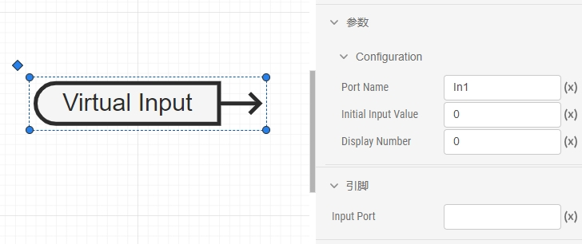
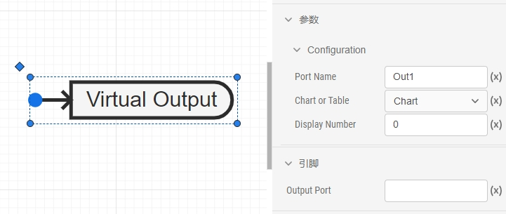

## 功能定义
本工具配合 CloudPSS 实时仿真计算方案使用，用于观测实时仿真算例的实时输出数据，或在线实时下发控制指令。

## 文档摘要

## 功能说明

### 软件接口  

CloudPSS Signal Monitor 相关元件可在 **CloudPSS-实时仿真工具** 模型库中找到，使用时拖入图纸并进行参数设置。

#### 虚拟输入端口

   

**虚拟输入端口**可以将 Signal Monitor 中设定的值下发到实时算例中，可用于在线修改算例中的参数或改变算例中一些元件的状态，如脉冲使能、控制切换、故障触发等。需要设置的参数有：  

- Port Name：虚拟输入端口的名称，也是在 Signal Monitor 中显示的名称，不可重复。  

- Initial Input Value：虚拟输入端口的初始值。  
- Display Number：数据在 Signal Monitor 中显示的序号。  

#### 虚拟输出端口  

   

**虚拟输出端口**可以将算例中的数据传到 Signal Monitor 观测或录波，需要设置的参数有：  

- Port Name：虚拟输出端口的名称，也是在 Signal Monitor 中显示的名称，不可重复。  

- Chart or Table：选择数据类型是曲线或者表格。  
- Display Number：数据在 Signal Monitor 中显示的序号。  

### 数据显示
实时数据显示有两种方式：一种是显示数值，一种是显示波形，如下图所示。  

   

   

### 数据下发
修改要下发的数据数值，并点击确认下发。  

   

### 数据录波
点击**开始录波**，所有通道的波形会进行录波，并通过点击相应通道名称查看。

   

### 数据保存

## 案例

import Tabs from '@theme/Tabs';
import TabItem from '@theme/TabItem';

<Tabs>
<TabItem value="case1" label="使用 Signal Monitor 观测实时仿真数据">
- 添加虚拟输入端口和虚拟输出端口
  
    **虚拟输入端口**用于控制，用法类似于离线仿真的**阶跃发生器**。**虚拟输出端口**用于观测，用法类似于离线仿真的**输出通道**。  

       

- 实时仿真方案设置
- 
    在**运行标签页**，添加实时仿真方案。  

    设置实时仿真的开始时间、结束时间和积分步长。**开始时间**默认为 `0`，**结束时间**可以设置为一个较大的值。  

    当与外部设备（如 Signal Hub）通信时，模式选择为**从模式**。当仅用于观测数据或作为主机时，模式选择为**主模式**。  

- 启动任务运行仿真
  
- 启动 Signal Monitor
    
    输入实时仿真器的 IP 地址。  

       

- 点击开始接收数据

</TabItem>
</Tabs>

## 常见问题
点击开始接收数据后，没有数据响应？
:   reload

点击下载录波数据后，没有响应？
:   

能否设置波形显示窗口长度或波形刷新频率？
:   