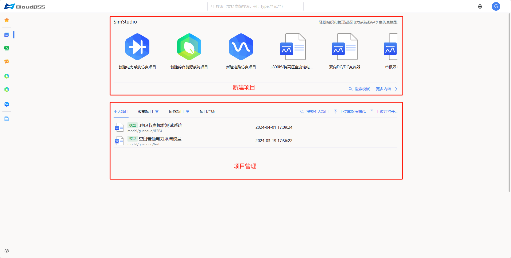
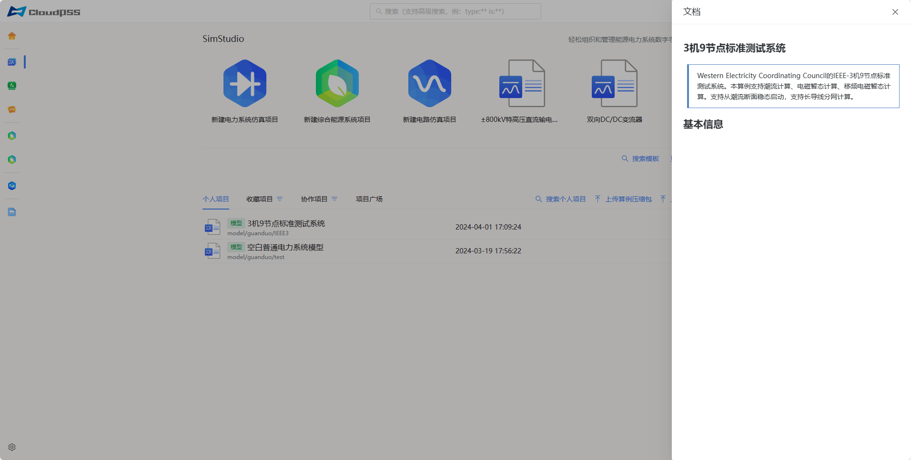
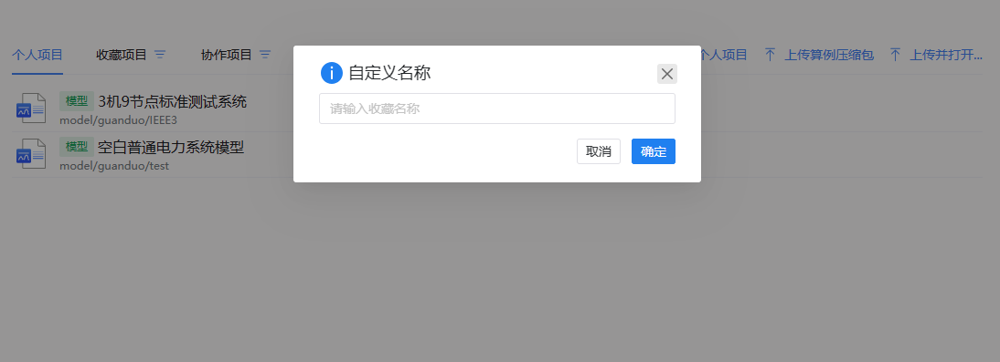
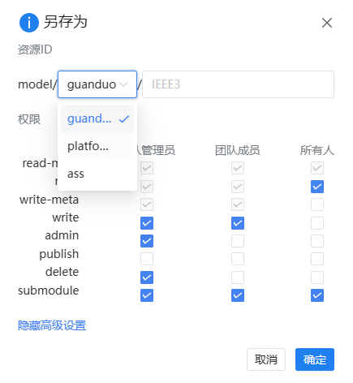
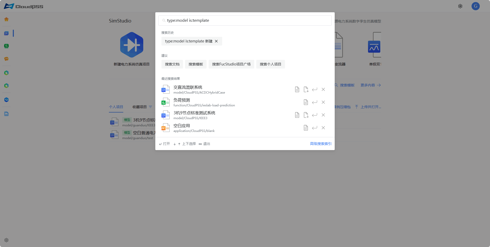

---

title: SimStudio 向导页
description: CloudPSS 个人中心 SimStudio 向导页介绍
sidebar_position: 10

tags: 
- 个人中心

---

本文档介绍 **个人中心** - **SimStudio 向导页** 的主要功能，包括 新建项目、项目管理、项目导入/导出等功能。 

## 页面功能

**SimStudio 向导页**是 SimStudio 模型工坊的项目管理页面，是进入 **SimStudio 工作台** 的入口。

用户首先需注册并登录 **CloudPSS 个人中心**。根据CloudPSS平台部署方式的不同，注册及登录方法略有区别，具体地，

+ **CloudPSS公网主站（`www.cloudpss.net`）** 的用户，可参见 [注册与登录功能（公网主站）](../../login/index.md "注册与登录功能（公网主站）")。
+ **CloudPSS Mini、CloudPSS Pro** 等私有部署平台的用户，可参见 [登录与重置密码功能（私有部署）](../../mini-login/index.md "注册与登录功能（公网主站）")。

成功登录后，在 **CloudPSS 个人中心** 点击 **SimStudio** 的图标后，页面将跳转至**SimStudio 向导页**。如图所示，该界面包含新建项目、项目管理两部分区域。

### 新建项目

**SimStudio 向导页** 提供了多种新建SimStudio项目的方法。

+ **从“模板案例”新建**：在新建项目区域包含了“新建电力系统仿真项目”、“新建综合能源系统项目”、“新建电路仿真项目”、“空白电力系统元件”等多种模型工坊项目模板。点击所选择的模板，进入工作台并自动以该模板为基础新建一个SimStudio项目。
+ **直接进入 SimStudio 工作台**：点击 **更多内容** 进入 **SimStudio工作台** 并自动打开 **新建向导**。用户可进一步基于 **新建向导** 新建SimStudio项目。
+ **搜索模板新建**：点击**搜索模板**，用户可直接输入关键词查询相关模板，点击查询结果，进入工作台并自动以该模板为基础新建一个SimStudio项目。搜索功能详情参见 [高级搜索功能](../../others/advanced-search/index.md "高级搜索功能") 帮助页。

补充一张搜索图。

### 项目管理

**SimStudio 向导页** 的项目管理区以 **个人项目**、**收藏项目**、**协作项目** 和 **项目广场** 四个标签分组显示不同权限的项目，按照修改时间降序（最新优先）排列。

+ **个人项目**：显示当前用户创建的全部项目。
+ **收藏项目/已固定**：仅显示收藏的**个人项目**。点击**收藏项目/已固定**标签右侧的按钮，可切换显示不同收藏标签下的项目。
+ **协作项目**：显示当前用户所加入**协作组织**的协作项目。点击**协作项目**标签右侧的按钮，可切换显示不同组织管理的项目。有关协作组织的建立，可参见 [组织管理](../../settings/organization/index.md "组织管理") 帮助页。
+ **项目广场**：显示权限为**公开**的全部项目，包含其他用户创建的项目。

:::tip
+ 项目列表中，每个项目的名称前存在**元件**、**模型**标签，方便用户区分当前项目的类别。
+ 在每个标签或分组列表的末尾，点击**加载更多**，可显示更多（早期创建的）项目。
+ 点击每个标签或分组列表下的**搜索个人项目/收藏项目/协作项目/项目广场**，可打开全局搜索，用于快速查找项目。**全局搜索** 功能详情参见 [高级搜索功能](../../others/advanced-search/index.md "高级搜索功能") 帮助页。
:::

## 项目管理功能

**SimStudio 向导页** 的项目管理区提供了项目打开、另存为、删除、收藏、查看文档、导入/导出、收藏等功能，方便用户高效管理大量模型项目。

### 项目基本操作

鼠标移至任一个项目文件，会显示 **打开** 和 **更多选项** 操作按钮。
+ 在项目文件上点击**打开**按钮，会跳转到工作台页面并打开该仿真项目。
+ 在项目列表中，任意点击一个项目，页面右侧会出现该项目的文档。项目文档可在 **SimStudio工作台** - **概览** 页面进行编辑。

+ 在项目文件上点击**更多选项**按钮，可对项目文件进行如下操作
    + **打开**：点击跳转到工作台页面并打开该仿真项目。
    + **收藏**：用于收藏该项目，**仅限个人项目**。
    + **取消收藏**：用于取消收藏该项目，**仅限已收藏的项目**。
    + **查看文档**：点击可快速查看该项目文档。
    + **删除**：点击可删除该项目，**仅限个人项目**。
    + **导出**：用于导出项目。
    + **另存为**：点击可将当前项目另存为新项目。

### 收藏项目

#### 收藏

在个人项目列表中选中某项目，点击 **更多选项** - **收藏** 按钮，会弹出**收藏至默认**、**收藏至XXX**（例如：测试分组、发布分组、展示分组等）、**收藏至新的分组**多个功能按钮。
+ 点击 **收藏至默认** 按钮，会把当前项目加入至 **默认分组**；
+ 点击 **收藏至XXX** 按钮（例如：测试分组、发布分组、展示分组等），会把当前项目文件加入名为“XXX”的收藏分组（该选项仅在当前用户下存在自定义收藏分组时可用）；
+ 点击 **收藏至新的分组**，弹出自定义名称对话框，输入分组名称，可创建新的收藏列表。

这两张图稍作修改。截图要包含已收藏的列表。

#### 取消收藏

在选中某个被收藏的项目，点击 **取消收藏** 按钮，即可将该项目移出收藏列表。

#### 收藏分组操作

收藏分组是否可以删除？重命名？

### 项目导出

在项目文件上点击**导出**按钮，导出一个包含当前项目文件全部信息的 **zip** 压缩文件。

### 项目导入

SimStudio 支持两种项目导入方法。
+ **上传算例压缩包**：用于上传本地已保存的算例压缩包( **zip** 格式)。
+ **上传并打开**：用于打开保存在本地的项目文件( **cmdl** 格式)。

需要详细介绍。

## 案例介绍

### 将个人项目另存为协作项目

协作项目是组织内成员间可共享的项目资源。以下案例以 **3 机 9 节点标准测试系统**为例：

1. 打开 **SimStudio**，找到并打开 **3 机 9 节点标准测试系统**算例。
2. 对算例进行所需修改后，选择**另存为**以保存修改。键盘快捷操作：**Ctrl + Shift + S**
3. 在保存过程中，选定**协作项目**选项。在资源 ID 的**所有者**一栏中选择您的**协作组织**（默认设置为个人账户）。完成选择后，点击**保存**。
4. 保存成功之后，您所在组织的其他成员便可以在协作项目中访问并查看此项目。

## 常见问题

### **SimStudio** 协作项目权限如何划分？

**SimStudio** 协作项目按人员权限划分为：

- **团队管理员**: admin

- **团队成员**: member

- **所有人（公开）**: everyone

**SimStudio** 协作项目按操作权限划分为：

+ **read-meta** 列出资源、读取元数据和权限数据

+ **read** 读取资源内容数据
  
+ **write-meta** 修改资源元数据
  
+ **write** 修改资源内容数据
  
+ **admin** 修改资源权限数据
  
+ **publish** 修改资源发布数据
  
+ **delete** 删除资源
  
+ **submodule** 读取模型接口信息，并作为子模块导入其他模型

