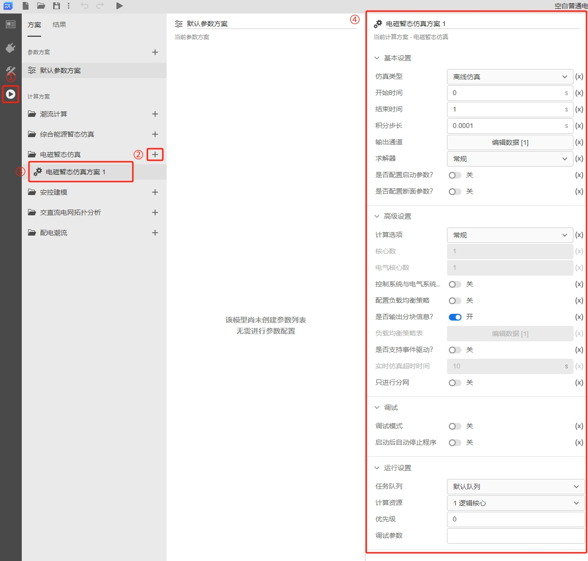
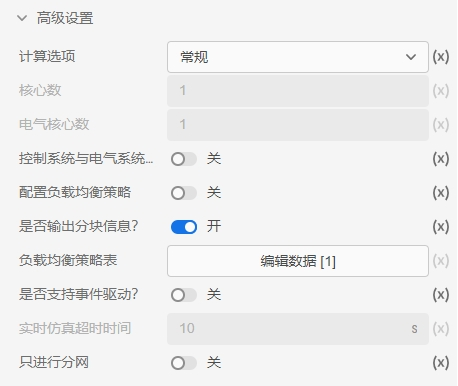
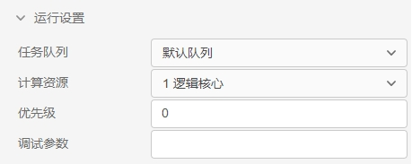
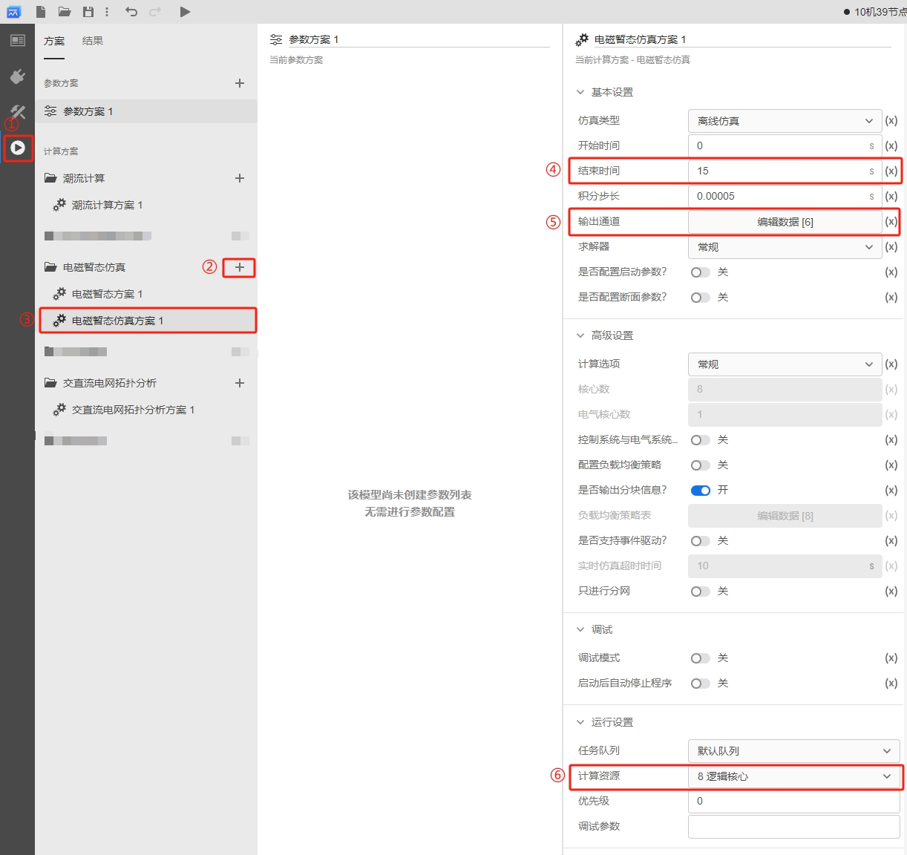
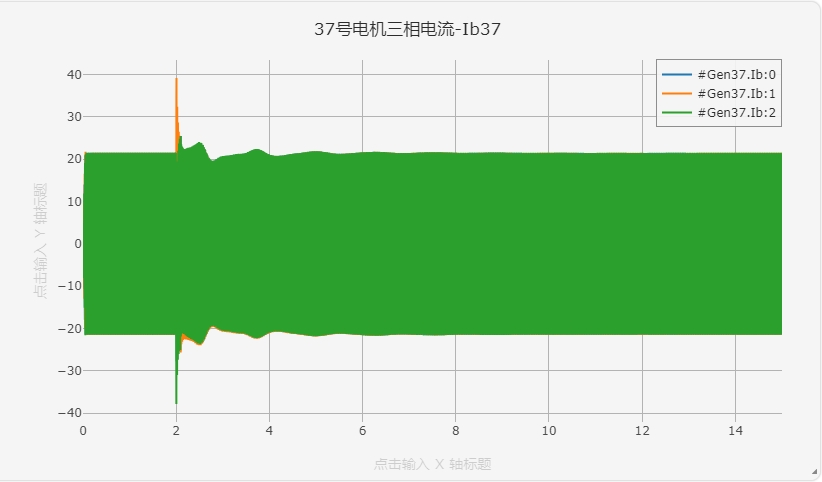

## 功能定义
EMTLab 提供的电磁暂态仿真计算方案设置功能。

## 文档摘要
本节首先介绍电磁暂态仿真计算方案配置，包括基础设置、高级设置和运行设置，然后以模板算例对计算方案配置进行演示。

## 功能说明
在**运行**标签页，选中计算方案中的**电磁暂态仿真方案**，可对电磁暂态仿真方案进行设置。以下分别对电磁暂态仿真方案的基础设置、高级设置和运行设置参数进行说明。

### 基本设置
电磁暂态仿真基本设置的参数如下图所示：

| 参数名 | 含义 | 说明 |
| :--- | :--- | :--- | 
| 仿真类型 | 电磁暂态仿真的仿真类型 | 可选择**离线仿真**、**实时仿真**或**组网仿真**，默认选择**离线仿真** | 
| 开始时间 | 电磁暂态仿真的开始时间 | 一般为0，仅在进行断面启动功能时该参数需要与断面参数进行配合选取。 |
| 结束时间 | 电磁暂态仿真的结束时间 | 当仿真时间达到该值时仿真停止。 |
| 积分步长 | 仿真运算的步长 | 积分步长越小仿真越精确，但仿真耗时越大，需结合实际情况进行选取。例如对于带电力电子的算例，仿真步长需要小于1/20倍的开关周期才能保证精确度。 |
| 输出通道 | 电磁暂态仿真的输出曲线配置 | 配置在结果页面显示的输出曲线，包括配置显示频率、显示方法、通道选择等内容。更多详细内容可查看 [量测及输出系统](../measure/index.md) 帮助文档。 |
| 求解器设置 | 求解器设置选项 | 包含**常规**和**开关/离散事件处理增强**两个选项，对于包含由分立开关元件的算例（例如IGBT、二极管、晶闸管等），必须选择为**开关/离散事件处理增强**，**常规**选项下系统仿真计算的效率更高。 |
| 是否配置启动参数 | 启动参数的开关 | 开启后，电磁暂态仿真可以从给定潮流断面启动，这种启动方式的说明可查看 潮流断面写回及初始化 帮助文档。|
| 是否配置断面参数 | 配置断面参数的开关 | 开启后，电磁暂态仿真可以从给定断面开始仿真，详细说明可查看 断面参数设置 帮助文档。 |

### 高级设置
电磁暂态仿真高级设置的参数如下图所示：

| 参数名 | 含义 | 说明 |
| :--- | :--- | :--- | 
| 计算选项 | 选择仿真计算加速方式 | 可选择**常规**、**分网并行**、 **CPU Turbo** 或 **CPU Super Turbo**，**常规**选项是利用单核CPU完成所有计算，**分网并行**选项是每个电网分区在一个 CPU 核心中完成计算，利用多核 CPU 加速仿真，**CPU Turbo** 选项是多核间执行自动负载均衡策略，**CPU Super Turbo** 选项是在 CPU Turbo 的基础上优化计算流程，进一步提升计算效率。更多并行计算相关内容可参考 电磁暂态仿真并行加速 帮助文档。 |
| 核心数 | 仿真使用的CPU核心数 | 计算选项选择**分网并行**、 **CPU Turbo** 或 **CPU Super Turbo** 时可设置，代表 CPU 核心数，默认值为1。 |
| 电气核心数 | 计算电气系统时使用的CPU核心数 | **控制系统与电气系统并行**开关开启时可设置，设置计算电气系统的CPU核心数, 如果**电气核心数** = **核心数**，代表控制系统与电气系统串行。 |
| 配置负载均衡策略 | 负载均衡策略配置开关 | 如果不开启，采用自动负载均衡策略；如果开启，可在负载均衡策略表进行配置。 |
| 是否输出分块信息 | 输出分块信息开关 | 在仿真过程中输出分块信息 |
| 负载均衡策略表 | 电气系统和控制系统仿真的负载均衡设置 | 使用该功能时，请先执行**交直流电网拓扑分析**，获取各个分区数据，并根据各个分区计算量和预估耗时，设计负载均衡策略，将分区编号对应填入“分区-核心”映射表。也可以在交直流电网拓扑分析结果页中写入负载均衡信息，将负载均衡策略表设置为拓扑分析后的默认值。 |
| 是否支持事件驱动 | 事件驱动开关 | 开启此选项后，可在仿真过程中添加异步事件。更多事件驱动相关内容可参考 事件驱动仿真 帮助文档。 |
| 只进行分网 | 分网选项 | 开启此选项后，仿真只进行初始化分网，不进行后续仿真。 |

### 运行设置
电磁暂态仿真运行设置的参数如下图所示：

| 参数名 | 含义 | 说明 |
| :--- | :--- | :--- | 
| 任务队列 | 任务运行使用的队列 | 默认设置为**默认队列** |
| 计算资源 | 任务运行使用的计算资源 | 默认设置为**1逻辑核心** |
| 优先级 | 任务运行的优先级 | 默认值为0，即最低优先级 |
| 调试参数 | 任务调试时使用的调试参数 | 默认为空 |

## 案例
### 常规运行与分网并行对比
本案例使用 IEEE 39 节点模板算例对比电磁暂态计算方案中常规计算和分网并行的仿真效率。
- 首先在 CloudPSS SimStudio 工作台，点击新建电力系统仿真项目。

- 点击左上角的新建图标，选中 IEEE 标准系统，再选择 10 机 39 节点标准测试系统，最后点击新建。

#### 电磁暂态仿真的常规运行方式

- 点击**运行**标签页，新建电磁暂态仿真计算方案，选中并开始设置仿真方案：首先将结束时间设置为 15s，输出通道按照下图进行设置，计算选项为默认的常规选项，最后选择计算资源为 8 逻辑核心。

- 点击运行按钮，在结果页面可显示出电磁暂态的仿真结果，可以看到 8 逻辑核心下 50μs 积分步长的 15s 电磁暂态仿真实际耗时 16.121s。

#### 电磁暂态仿真的分网并行
- 点击**运行**标签页，设置仿真方案：选择计算方式为分网并行，cpu 核心为 8 核

- 新建交直流电网拓扑分析方案，选择电磁暂态仿真方案1，点击运行。

- 在结果界面，设置传输线分网和分网结果。点击**实现**标签页，任意选择一条传输线，可以看到传输线类型为Bergeron Line Model，并且传输线被设置为分网路线。

- 回到**运行**标签页，点击方案，选中电磁暂态仿真方案1，点击运行。

- 从仿真结果可以看出，8 逻辑核心下 50μs 积分步长的 15s 电磁暂态仿真实际耗时 10.34785s，分网并行达到了加速仿真的目的。

## 常见问题 Q&A
### 为什么我的运行标签页没有交直流电网拓扑分析方案
交直流拓扑分析功能暂未在公网平台开放，现仅在 CloudPSS Mini 和 CloudPSS Pro 等产品中提供。

### 为什么选择了分网并行，计算效率和常规运行方式没区别
分网并行仿真前，需要进行交直流拓扑分析，并设置传输线分网。缺漏了该步骤所有的运算由单独的逻辑核心进行运算，与常规运行方式无区别。