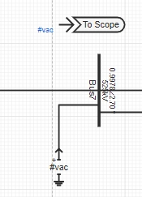
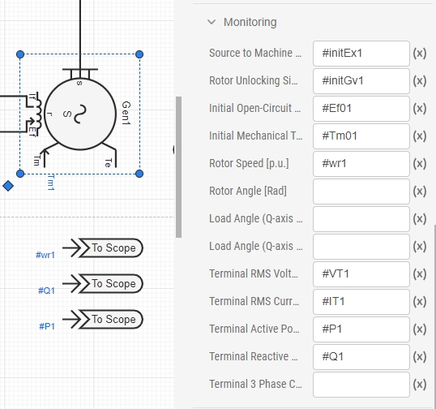
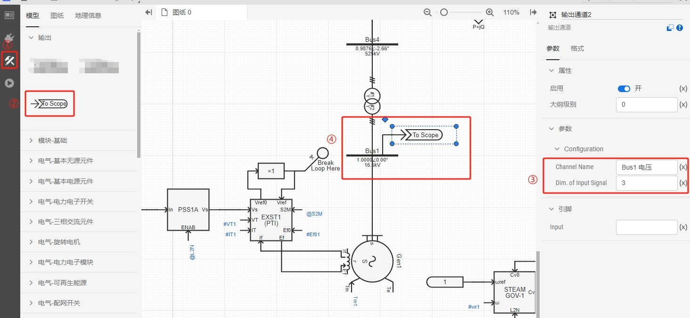
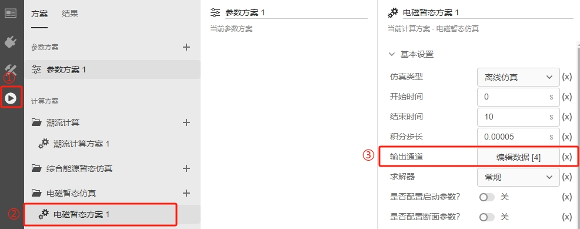
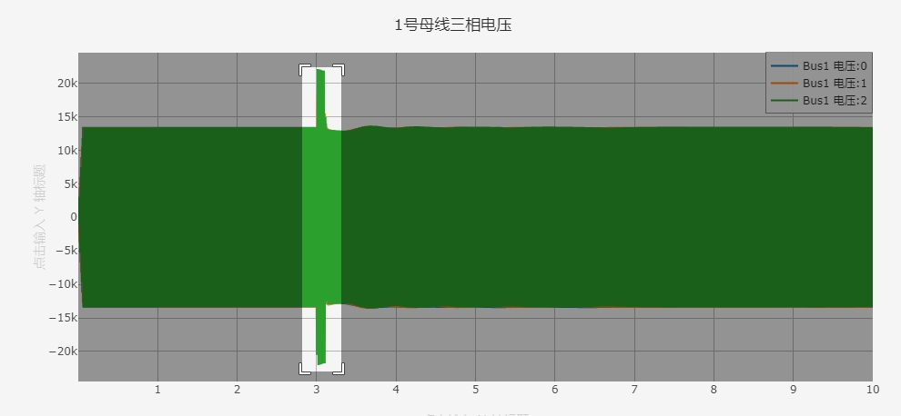
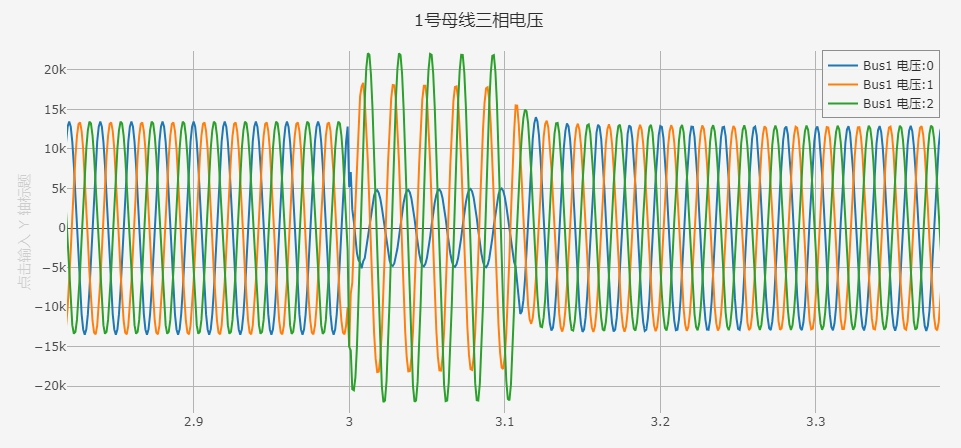

## 功能定义

电磁暂态仿真的量测和输出系统。

## 文档摘要
EMTLab 提供了灵活的量测方法及量测/输出元件供用户使用，本节首先介绍信号的量测和输出方法，然后介绍输出通道和输出窗口的设置，最后以模板算例进行演示。

## 功能说明

### 电气量量测方法
对于电气量(电压、电流、功率等)的量测主要有三种方法：
- 对于电气节点，可以直接测量其电压信号（单位为 V），将**输出通道**和电气节点直接相连即可。
- 利用量测元件(如电压表、电流表、功率表等)得到量测信号名称(以 # 号开头)或量测信号输出引脚。

- 利用元件参数设置中的 Monitoring 填写输出量测信号名称(以 # 号开头)。

### 信号输出
为实现对某一信号的输出显示，必须完成以下配置：
- 将需要输出的信号与一个输出通道相连，这里需要注意输出通道的维数应与待测信号一致。
- 将待输出的通道列入仿真的计算方案中。
  - 在**运行**标签页下，选中电磁暂态方案，点击**基本设置**下的**输出通道**选项，可弹出**输出通道**的可编辑表格。在该表格中可添加**输出窗口**、并将需要输出的**输出通道**添加到**示波器输出通道**栏中，如下图所示。

在一个仿真项目中，**输出通道**和**输出窗口**理论上可存在任意个，用户可根据待输出信号的类型、大小范围等合理设置**输出窗口**所选中的通道信号，便于仿真结果分析。

#### 输出窗口类型
CloudPSS提供了四种示波器窗口类型，用户可选择每个示波器的显示模式，如下图所示。

一共有四种模式可选，其含义分别如下：

1. Compressed Time Axis Window: 默认模式，时间坐标轴最大值随仿真时间变化，最小值为仿真开始时间不变，如下图所示。

2. Global Time Axis Window: 时间坐标轴最大值为仿真结束时间不变，最小值为仿真开始时间不变，如下图所示。

3. Moving Time Axis Window: 默认模式，时间坐标轴最大值随仿真时间变化，时间坐标轴范围为参数Window Width指示的值，如下图所示。

4. Oscilloscope Time Axis Window: 与示波器显示模式相近，仿真窗口时间轴范围为Window Width指示的值，如下图所示。

### 结果保存
完成信号输出的操作，在仿真结束后，可以在**运行**标签页的**结果**处查看到各输出窗口的结果。鼠标放在输出窗口上时，可在左上角显示输出窗口的操作按钮，从左到右依次是**缩放**、**平移**、**放大**、**缩小**、**自动缩放**、**重置轴**、**切换显示数据点辅助线**、**悬停时显示最近的数据**、**悬停时比较数据**、**下载图表为 CSV 格式**、**下载图表为 PNG 格式**和**在 chart studio 中编辑**。

如需保存窗口内的信号数据，可点击**下载图表为 CSV 格式**，导出的 CSV 数据格式如下，第一列为图表的 x 轴，即仿真时间，第二列为图表的 y 轴，即该仿真时间点的信号值。

## 案例
### 电气量的三种量测方法
本案例使用 IEEE 9 节点模板算例，演示量测方法以及输出系统的设置与使用。

- 首先在 CloudPSS SimStudio 工作台，点击新建电力系统仿真项目。  

- 点击左上角的新建图标，选中 IEEE 标准系统，再选择 3 机 9 节点标准测试系统，最后点击新建。
  

- 模板中使用了两种量测方法，分别是通过量测元件（电压表）获取量测信号，和通过元件内部量测获取量测信号。

 

- 在**实现**标签页，拖拽输出通道元件，将维数设置为 3 维，然后将输出通道与1号母线相连，测量1号母线电压信号。

- 在**运行**标签页，设置输出通道，将新增加的输出通道添加到输出窗口。

 

- 点击仿真按钮，在结果界面，可以查看到1号母线三相电压，选中 3 秒附近区域，可查看接地故障时 1 号母线三相电压波形。

 

## 常见问题 Q&A
### 假如有两个相似的算例，量测的信号相同，如何快速设置输出通道。
用户可以在一个算例设置好输出通道后，使用输出通道导出功能，将输出通道导出为 CSV 格式，然后在另一个算例中导入该 CSV 文件，即可快速获取到相同的输出通道。

### 如何量测多维信号的其中一维
某些元件的量测信号为多维信号，例如三相交流电压源元件 Monitoring 参数组中的 3 Phase Source Votage Vector 所对应的信号即为三维信号。用户若需要其中某一维的信号，如 A 相，则可利用多路信号分离元件进行信号拆分。同理，若要将多路信号合并为多维信号进行绘图，则可利用多路信号合并元件进行信号合并。

