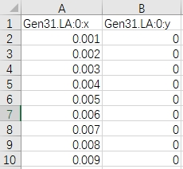

## 功能定义

电磁暂态仿真的量测和输出系统。

## 文档摘要
EMTLab 提供了灵活的量测方法及量测/输出元件供用户使用，本节首先介绍信号的量测和输出方法，然后介绍输出通道和输出窗口的设置，最后以模板算例进行演示。

## 功能说明

### 量测方法

#### 量测信号与输出通道

#### 电气量量测方法

#### 控制量量测方法

### 信号输出
为实现对某一信号的输出显示，必须完成以下配置：
- 将需要输出的信号与一个输出通道相连，这里需要注意输出通道的维数应与待测信号一致。
- 将待输出的通道列入仿真的计算方案中。
  - 在**运行**标签页下，选中电磁暂态方案，点击**基本设置**下的**输出通道**选项，可弹出**输出通道**的可编辑表格。在该表格中可添加**输出窗口**、并将需要输出的**输出通道**添加到**示波器输出通道**栏中，如下图所示。

在一个仿真项目中，**输出通道**和**输出窗口**理论上可存在任意个，用户可根据待输出信号的类型、大小范围等合理设置**输出窗口**所选中的通道信号，便于仿真结果分析。

#### 输出窗口类型
CloudPSS提供了四种示波器窗口类型，用户可选择每个示波器的显示模式，如下图所示。

一共有四种模式可选，其含义分别如下：

1. Compressed Time Axis Window: 默认模式，时间坐标轴最大值随仿真时间变化，最小值为仿真开始时间不变，如下图所示。

2. Global Time Axis Window: 时间坐标轴最大值为仿真结束时间不变，最小值为仿真开始时间不变，如下图所示。

3. Moving Time Axis Window: 默认模式，时间坐标轴最大值随仿真时间变化，时间坐标轴范围为参数Window Width指示的值，如下图所示。

4. Oscilloscope Time Axis Window: 与示波器显示模式相近，仿真窗口时间轴范围为Window Width指示的值，如下图所示。

### 结果保存
完成信号输出的操作，在仿真结束后，可以在**运行**标签页的**结果**处查看到各输出窗口的结果。鼠标放在输出窗口上时，可在左上角显示输出窗口的操作按钮，从左到右依次是**缩放**、**平移**、**放大**、**缩小**、**自动缩放**、**重置轴**、**切换显示数据点辅助线**、**悬停时显示最近的数据**、**悬停时比较数据**、**下载图表为 CSV 格式**、**下载图表为 PNG 格式**和**在 chart studio 中编辑**。

如需保存窗口内的信号数据，可点击**下载图表为 CSV 格式**，导出的 CSV 数据格式如下，第一列为图表的 x 轴，即仿真时间，第二列为图表的 y 轴，即该仿真时间点的信号值。

## 案例
import Tabs from '@theme/Tabs';
import TabItem from '@theme/TabItem';

<Tabs>
<TabItem value="case1" label="3 机 9 节点算例的量测和输出系统设置">

</TabItem>
</Tabs>

## 常见问题 Q&A
假如有两个相似的算例，量测的信号相同，如何快速设置输出通道。
:
  用户可以在一个算例设置好输出通道后，使用输出通道导出功能，将输出通道导出为 CSV 格式，然后在另一个算例中导入该 CSV 文件，即可快速获取到相同的输出通道。

如何量测多维信号的其中一维
:
  某些元件的量测信号为多维信号，例如三相交流电压源元件 Monitoring 参数组中的 3 Phase Source Votage Vector 所对应的信号即为三维信号。用户若需要其中某一维的信号，如 A 相，则可利用多路信号分离元件进行信号拆分。同理，若要将多路信号合并为多维信号进行绘图，则可利用多路信号合并元件进行信号合并。

