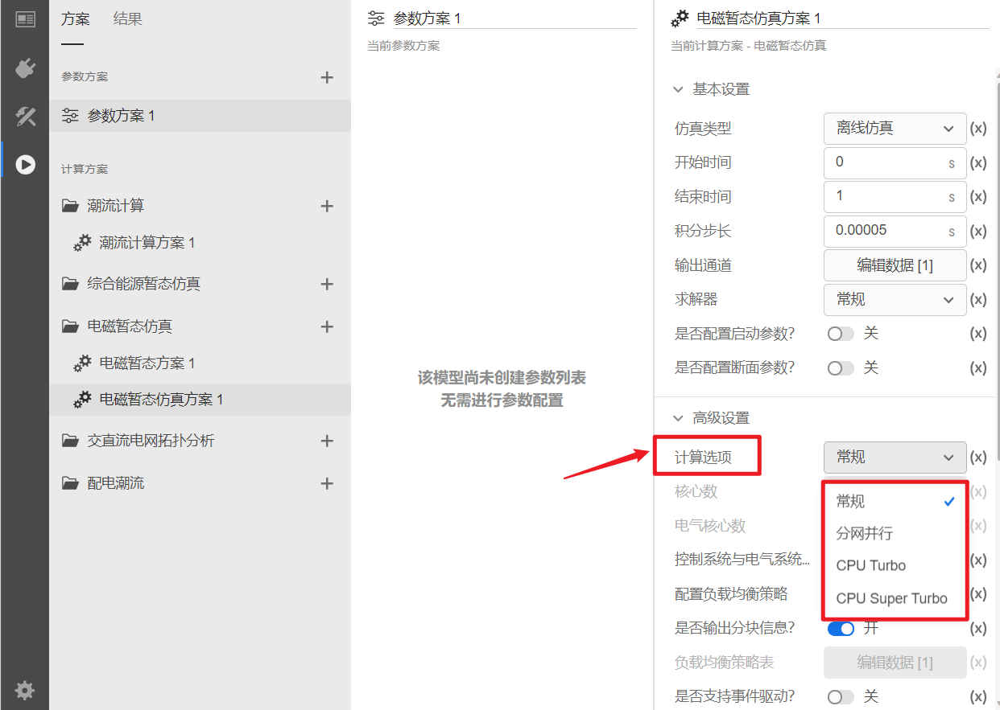
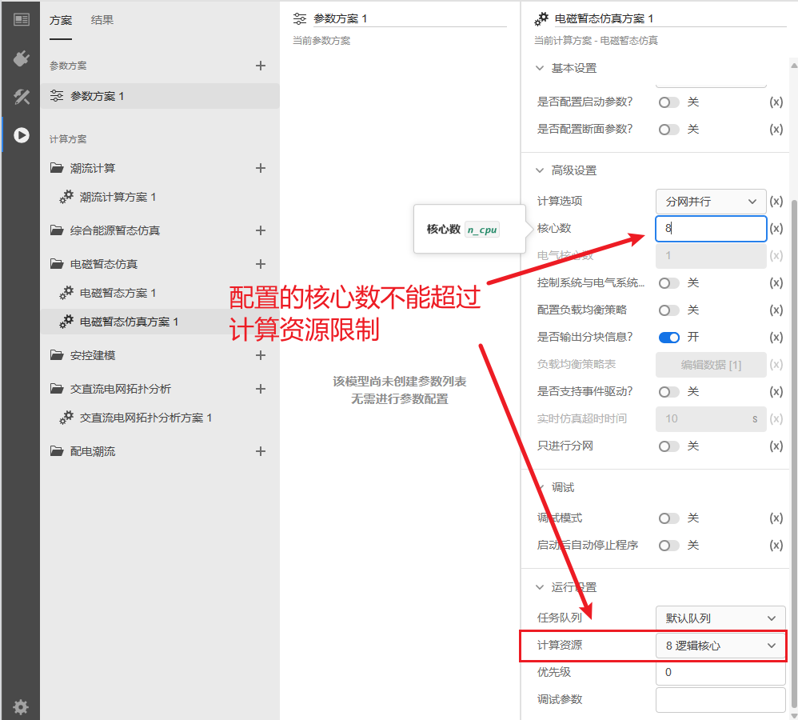
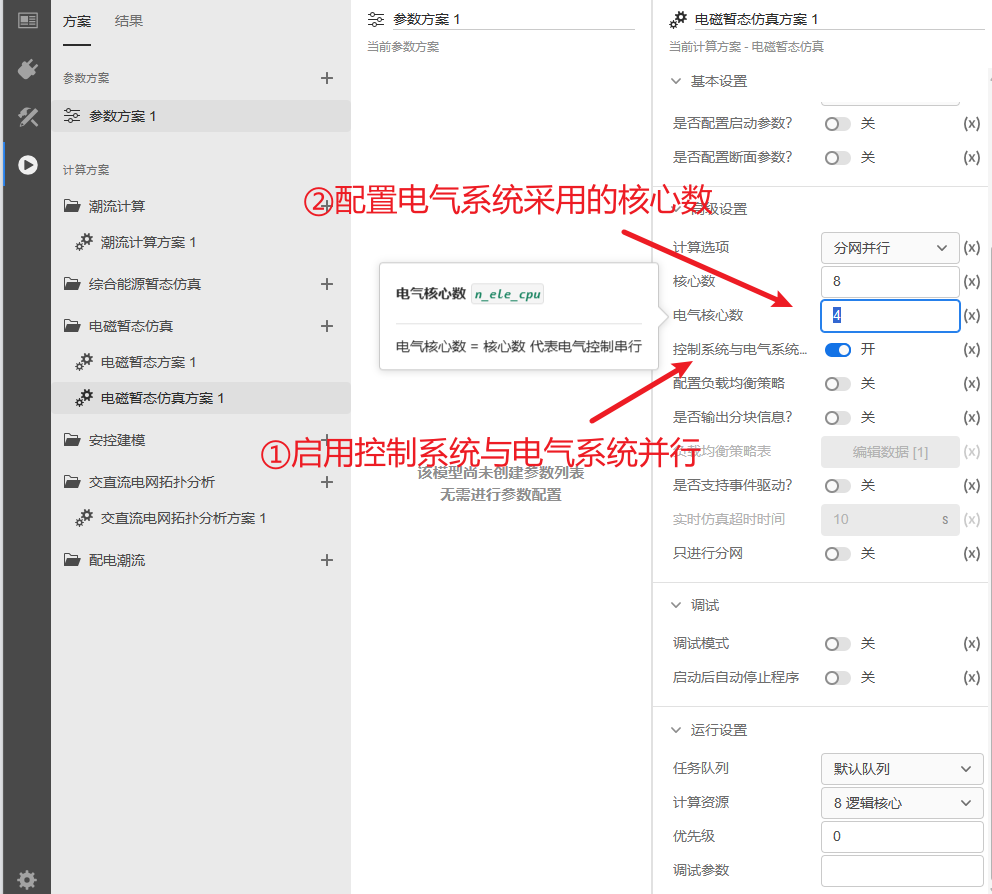
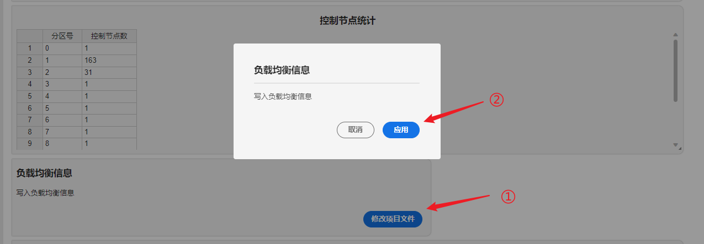
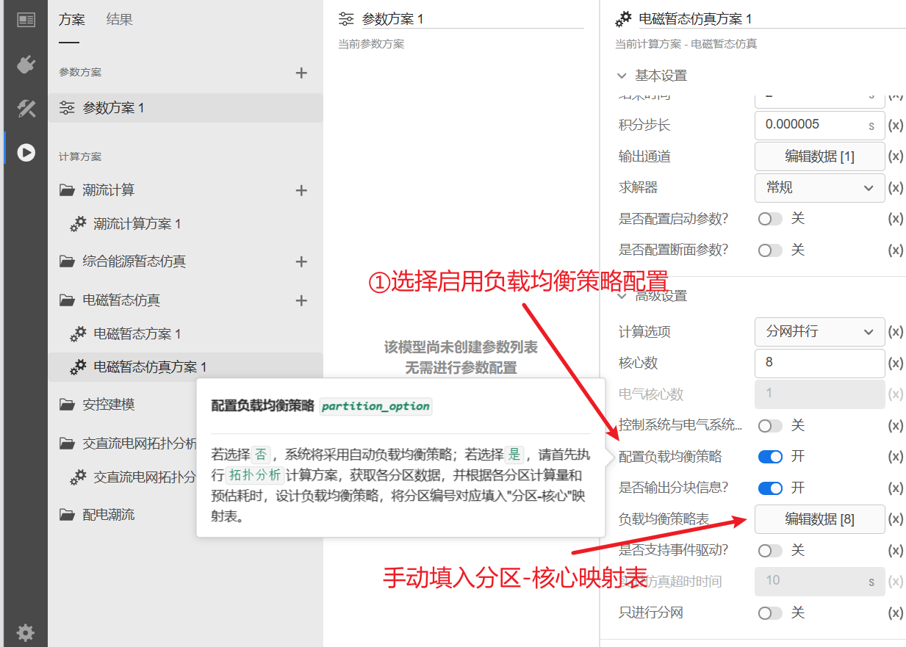
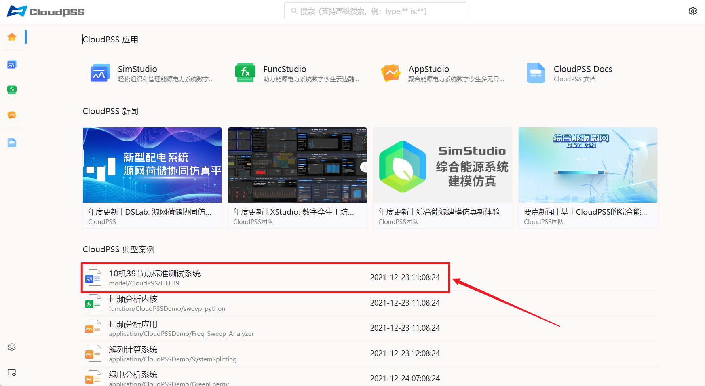

## 功能定义

EMTLab 提供的并行计算方案配置功能。

## 文档摘要

本节介绍电磁暂态仿真并行计算方案配置，并以 IEEE39 节点标准测试系统算例进行演示。目前并行计算功能仅在私有服务器上可用，公网暂未开放使用。

## 功能说明

### 计算选项与适用范围

针对用户不同仿真场景的使用需求，EMTLab 提供了**常规**、**分网并行**、 **CPU Turbo** 与 **CPU Super Turbo** 等4种计算选项。对于新能源单机模型、三机九节点算例等小规模算例，一般常规计算选项进行仿真；对于含长传输线的大规模系统（如省级电网模型），可以选择分网并行、 CPU Turbo 与 CPU Super Turbo 等三种采用计算选项进行加速；对于不具备分网条件的大规模系统（如只有较短传输线的新能源场站模型），可以选择 CPU Turbo 或 CPU Super Turbo 等2种计算选项进行加速。

<table>
<tr><th><b>计算选项</b></th><th><b>功能说明</b></th><th><b>适用场景</b></th><th><b>算例要求</b></th><th><b>（3机9节点算例）10s物理过程仿真耗时</b></th><th><b>（10机39节点算例）10s物理过程仿真耗时</b></th><th><b>（详细风电场模型）10s物理过程仿真耗时</b></th></tr>
<tr><td><b>常规</b></td><td>利用单核CPU完成所有计算</td><td>小规模算例</td><td>无</td><td>
单核：

2\.15s
</td><td>单核：83.43s</td><td>单核：385.22s</td></tr>
<tr><td><b>分网并行</b></td><td>每个电网分区在一个 CPU 核心中完成计算，利用多核 CPU 加速仿真</td><td>含长传输线的大规模电网（如省级电网）</td><td>需要长传输线进行解耦</td><td>/</td><td>分网：70.63s</td><td><b>分网：40.07s</b></td></tr>
<tr><td rowspan="2"><b>CPU Turbo</b></td><td rowspan="2">多核间执行自动负载均衡策略</td><td rowspan="2">含控制节点较多的大规模系统（如新能源场站）</td><td>无</td><td>不分网：1.74s</td><td><b>不分网：61.23s</b></td><td>不分网：62.56s</td></tr>
<tr><td>需要长传输线进行解耦</td><td>/</td><td>分网：65.25s</td><td><b>分网：38.54s</b></td></tr>
<tr><td rowspan="2"><b>CPU Super Turbo</b></td><td rowspan="2">在 CPU Turbo 的基础上优化计算流程，进一步提升计算效率</td><td rowspan="2">含控制节点较多的大规模系统（如新能源场站）</td><td>无</td><td>不分网：1.73s</td><td><b>不分网：58.63s</b></td><td>不分网：57.86s</td></tr>
<tr><td valign="top">需要长传输线进行解耦</td><td>/</td><td>分网：60.98s</td><td><b>分网：37.45s</b></td></tr>
</table>

### 计算选项配置

在高级设置中，CloudPSS提供了4种可选计算选项，包括**常规**、**分网并行**、 **CPU Turbo** 与 **CPU Super Turbo** 。系统默认配置为**常规**计算方案，即仅利用单核 CPU 完成全部计算。针对**大规模算例**，可选择**分网并行**、**CPU Turbo** 或 **CPU Super Turbo** 进行仿真加速。

:::tip

**常规**：利用单核CPU完成全部计算

**分网并行**：每个电网分区在一个CPU核心中完成计算，利用多核CPU加速仿真

**CPU Turbo**：多核间执行自动负载均衡策略

**CPU Super Turbo**：在CPU Turbo的基础上优化计算流程，进一步提升计算效率

:::

### 队列及逻辑核心设置

针对大规模算例选择**分网并行**、**CPU Turbo** 或 **CPU Super Turbo** 进行仿真加速时，需要选择队列并设置逻辑核心数。点击**运行设置**中**计算资源**选项，设置最大可用的逻辑核心数限制。

### 核心数配置

点击**高级设置**中**核心数**选项，根据仿真效率需求填写实际使用的CPU核数，核心数不能超过计算资源中配置的逻辑核心数限制。

### 控制系统与电气系统并行

点击**高级设置**中**控制系统与电气系统并行**按钮启用电磁暂态仿真中控制系统与电气系统并行计算，根据电气系统与控制系统规模合理配置电气核心数，电气核心数不能超过核心数。

### 配置负载均衡策略

使用该功能，需要先进行交直流电网拓扑分析，获取各个分区数据。详见[交直流电网拓扑分析](../../topology/basic-principle/index.md)帮助文档。

然后，在交直流电网拓扑分析结果页中写入负载均衡信息，自动将拓扑分析得到的负载均衡策略表写回到计算方案。详见[负载均衡配置](../../topology/load-average/index.md)帮助文档。

也可以在**高级设置**中启用**配置负载均衡策略**，根据各个分区计算量和预估耗时，设计负载均衡策略，将分区编号对应手动填入“分区-核心”映射表。**普通用户不建议使用，风险自负！**

### 输出分块信息

点击**高级设置**中**是否输出分块信息**按钮启用分块信息输出,即可在交直流电网拓扑分析中输出分块信息。详见[交直流电网拓扑分析](../../topology/basic-principle/index.md)帮助文档。

## 案例介绍

import Tabs from '@theme/Tabs';
import TabItem from '@theme/TabItem';

<Tabs>
<TabItem value="case1" label="10机39节点系统分网并行仿真加速">

- **新建算例与电磁暂态仿真方案**  
在 **CloudPSS Simstudio** 个人中心打开 **IEEE-39节点标准测试系统算例**。

选择**运行标签页**新建电磁暂态仿真方案进行参数配置。

- **并行计算方案配置**

- **拓扑分析**

- **电磁暂态仿真计算**

- **效率对比**

</TabItem>
<TabItem value="case2" label="10机39节点系统 CPU Turbo 仿真加速">

- **并行计算方案配置**

- **拓扑分析**

- **电磁暂态仿真计算**

- **效率对比**

</TabItem>
<TabItem value="case3" label="10机39节点系统 CPU Super Turbo 仿真加速">

- **并行计算方案配置**

- **拓扑分析**

- **电磁暂态仿真计算**

- **效率对比**

</TabItem>
</Tabs>

## 常见问题 Q&A

为什么我无法选择多个逻辑核心？
:   

为什么我在分网后仿真效率提升不大？
:

如何选取合适逻辑核心数量？
:   

在仿真时报错:"Error: +/- Seq. Travel Time is less than the integration time step. Decrease the time step or use Lumped π-Model instead."
:

交直流电网拓扑分析方案报错："选择一个电磁暂态仿真方案="args":"@debug":"","@priority":0,"@queue":1,"@tres":"cpu=1"。"
:

如何在拓扑中查看分网结果？
:
