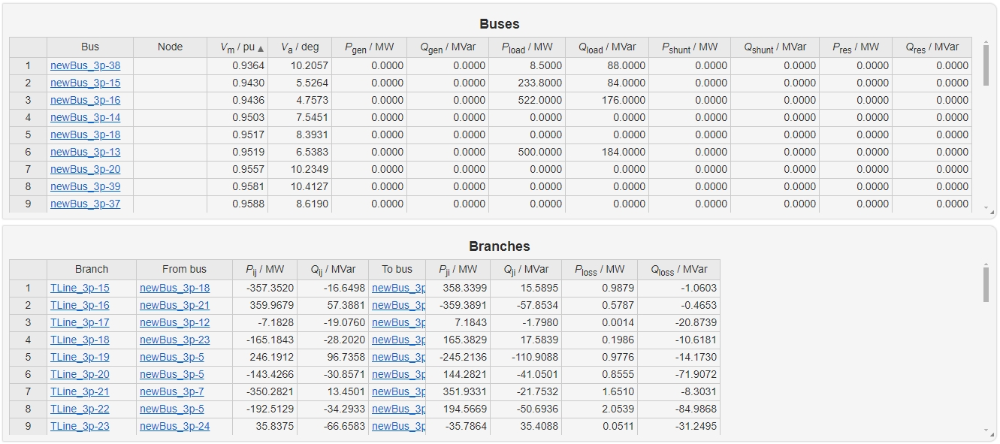

## 功能定义
EMTLab 的潮流结果写回及初始化功能。

## 文档摘要
本节介绍 EMTLab 的潮流结果写回及初始化的详细内容，以及从给定潮流断面直接启动需配置的参数。

## 功能说明
### 潮流数据说明
运行潮流计算后，结果页面会展示 Buses 和 Branches 两个潮流数据表格，以下分别对这两个表格的参数进行说明：

import Tabs from '@theme/Tabs';
import TabItem from '@theme/TabItem';

<Tabs>
<TabItem value="case1" label="Buses">
Buses 表格中的参数说明如下：

| 参数名 | 单位 | 说明 |
| :--- | :--- | :--- | 
| Bus |  | 母线名，点击母线名可链接到实现标签页的母线元件 |
| Node |  | 节点，为三相交流电压源或同步发电机，点击元件名可链接到实现标签页的具体元件处 |
| $ V_m $ | p.u. | 母线的电压幅值 |
| $ V_a $ | Deg | 母线的电压相角 |
| $ P_{gen} $ | MW | 发电机注入有功功率 |
| $ Q_{gen} $ | MVar | 发电机注入无功功率 |
| $ P_{load} $ | MW | 恒功率负载消耗有功功率 |
| $ Q_{load} $ | MVar | 恒功率负载消耗无功功率 |
| $ P_{shunt} $ | MW | 恒阻抗负载消耗有功功率 |
| $ Q_{shunt} $ | MVar | 恒阻抗负载消耗无功功率 |
| $ P_{res} $ | MW | 母线上的有功功率不平衡量 |
| $ Q_{res} $ | MVar | 母线上的无功功率不平衡量 |

:::info
Buses 表格中的复功率计算公式如下：
$$
S_{res} = S_{gen} - S_{load} - S_{shunt} - S_{branch}
$$
其中 $S_{branch}$ 表示母线连接支路上的流出复功率。对于计算收敛的潮流解，$P_{res}, Q_{res}$ 均为接近 0 的值。
:::
</TabItem>

<TabItem value="case2" label="Branches">
Branches 表格中的参数说明如下：

| 参数名 | 单位 | 说明 |
| :--- | :--- | :--- | 
| Branch |  | 支路名，点击支路名可链接到实现标签页的具体元件处 |
| From bus |  | 支路的起始母线，点击母线名可链接到实现标签页的母线元件 |
|  $ P_{ij} $ | MW | From bus 流出的有功功率 |
|  $ Q_{ij} $ | MVar | From bus 流出的无功功率 |
| To bus |  | 支路的终止母线，点击母线名可链接到实现标签页的母线元件 |
|  $ P_{ji} $ | MW | To bus 流出的有功功率 |
|  $ Q_{ji} $ | MVar | To bus 流出的无功功率 |
|  $ P_{loss} $ | MW | 支路上的有功功率损耗 |
|  $ Q_{loss} $ | MVar | 支路上的无功功率损耗 |
:::info
Branches 表格中的复功率计算公式如下：
$$
S_{loss} = S_{ij} + S_{ji}
$$
:::

</TabItem>
</Tabs>

### 潮流断面写回

### 潮流断面启动
#### 从零启动至任意潮流断面

#### 从给定潮流断面直接启动

## 常见问题 Q&A
从给定潮流断面启动需要对元件进行哪些配置？
:

启动参数有什么作用，开启后相关参数如何设置
: