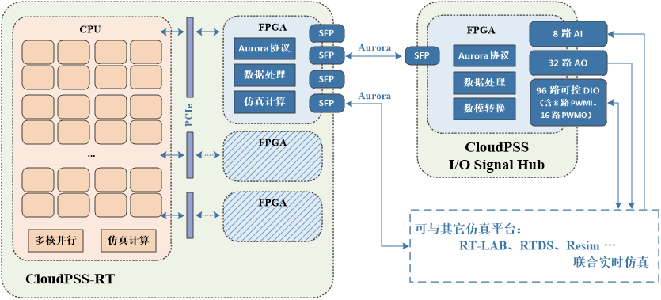
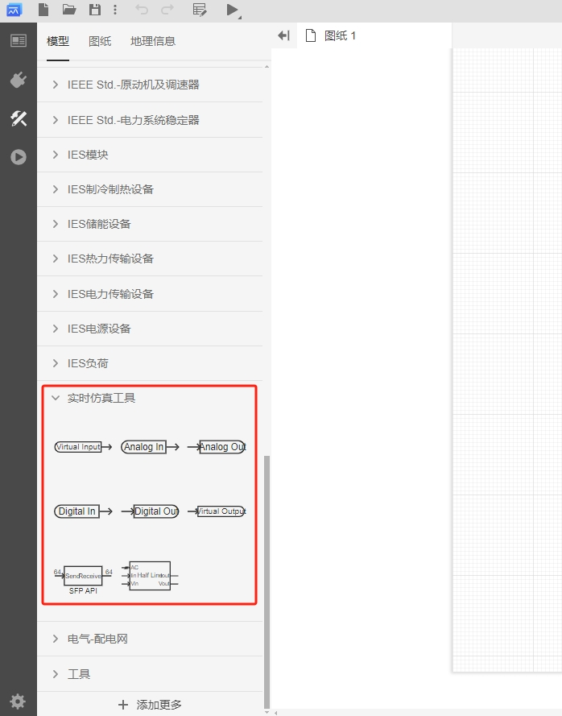

本文档主要介绍 CloudPSS EMTLab 在电磁暂态实时仿真中联合实时仿真的应用方法及案例。

## 功能定义

CloudPSS EMTLab 可凭借高性能实时仿真器 CloudPSS-RT 和数模转换枢纽 CloudPSS I/O Signal Hub，实现联合实时仿真的应用。

## 功能说明
### 硬件平台

联合实时仿真是指 CloudPSS-RT 仿真器与其它仿真平台的仿真器进行实时数据交互，以实现系统规模的扩展或平台功能的扩展。CloudPSS-RT 仿真器具备通用的 SFP 光纤接口和多路模拟量、数字量接口，可兼容多种其它仿真平台，实现联合实时仿真。CloudPSS-RT 的联合实时仿真硬件平台示意图如下所示。

CloudPSS-RT 可配置 1 - 3 块 FPGA 通信/计算卡，每块 FPGA 通信/计算卡具备 2 - 4 个 SFP 光纤接口。CloudPSS-RT 通过 SFP 接口与 Signal Hub 连接后，将具备 8 路模拟量输入和 32 路模拟量输出，并具备 96 路可控数字量输入/输出，其中含 8 路 PWM 输入和 16 路 PWM 输出，支持 1k - 100kHz 的 PWM 调制与解调。

通过上述数据交互接口，可实现与其它仿真平台的联合实时仿真。

### 通信协议

当使用 SFP 光纤接口与其它仿真平台的仿真器通信时，需要定制开发通信协议。  
    
CloudPSS-RT 的 SFP 光纤接口可采用 **Aurora** 通信协议。Aurora 协议是 Xilinx 公司提供的一个开放、免费的链路层协议，可进行点对点的串行数据传输，具有高效、稳定和简单易用的特点。Aurora 协议允许器件之间通过多个通道绑定进行通信。单个通道可实现 750Mbit/s - 6.5Gbit/s的通信传输，多个通道的组合可实现几十 Gbit/s 甚至上百 Gbit/s 的通信传输。Aurora 协议的链路结构如下图所示。

CloudPSS-RT 的 FPGA 通信/计算卡中已内置了一个 Aurora 协议，协议各参数如下表。

| **参数项** | **协议内容** |
| :------------: | :-----------: |
| 帧格式 | 32 位 Float |    
| 同步帧 | 1 通道，4 字节，0x12345678 |
| 有效帧 | 64 通道，256 字节，用户自定义 |
| 帧长度 | 共 65 通道，260 字节 |
| 光口速率 | 5Gbps |
| 解析方式 | 大端解析 |

若其它仿真平台的仿真器数据交互接口配置成相同的协议，即可与 CloudPSS-RT 通过该协议进行数据交互。

CloudPSS-RT 与 I/O Signal Hub 的数据交互也是通过 SFP 光纤接口进行，使用内置的 Aurora 通信协议实现。

### 主从式同步机制

为确保 SFP 光纤接口传输的数据正确、稳定、无丢包，CloudPSS-RT 的光纤通信采用主从式的同步机制。光纤两端的器件，一端作为主模式，按一定时间间隔（一般是仿真步长）发送数据；另一端作为从模式，按相同的时间间隔接收数据，并校验同步帧，默认同步帧之后的帧数据有效。

CloudPSS-RT 可在电磁暂态仿真方案中，设置实时仿真的类型后，选择设置为**主模式**或**从模式**，当选为主模式时，CloudPSS-RT 将会以设置的仿真积分步长为间隔，持续发送和接收数据，并且不会校验接收到的数据；当选为从模式时，CloudPSS-RT 将会以设置的仿真积分步长为间隔接收数据，并校验数据的同步帧，若同步帧匹配，则发送数据。以此实现光纤通信的时序同步和数据的正确、稳定交互。

CloudPSS-RT 与其它仿真平台的仿真器通过光纤通信时，通常设置为**从模式**，由 CloudPSS-RT 跟随其它仿真器的同步信号。

CloudPSS-RT 与 I/O Signal Hub 通信时需设置为**从模式**。

### 软件接口

EMTLab 提供了一套**实时仿真工具库**，包含了联合实时仿真的软件接口，可将模型中的数据通过 SFP 接口或 I/O Signal Hub 的模拟量、数字量接口输出，或接收 SFP 数据、模拟量信号、数字量信号，参与模型中的仿真计算。

- **SFP 接口元件**

    提供 SFP 接口功能，输入和输出引脚的维数均为 64，对应 CloudPSS-RT 内置 Aurora 协议的 64 通道有效帧，需配合**多路信号合并**和**多路信号分离**元件使用。协议中的同步帧 0x12345678 已隐藏在接口中作为帧头，无需用户设置。

    

- **虚拟端口元件**

    提供以太网接口交互功能，**虚拟输出端口**可将模型的数据从以太网接口输出，**虚拟输入端口**可接收以太网接口的输入到模型中。
    
    虚拟端口元件一般用于在实时仿真过程中，通过以太网将仿真结果数据传输到上位机观测，也可以接收上位机下发的数据指令。使用方法可参考 [软件工具 CloudPSS Signal Monitor](../../../../software-tools/monitor/index.md) 文档。
    
    若需要通过以太网接口与其它仿真平台的仿真器通信，需定制开发通信协议，并选定一些虚拟端口元件与待输出、待输入信号绑定。
    
    
    

- **模拟量接口元件**

    与 I/O Signal Hub 交互数据，实现**模拟量输出**、**模拟量输入**功能。一台 CloudPSS I/O Signal Hub 支持最多 32 路模拟量输出通道和 8 路模拟量输入通道，模拟量输出信号的幅值范围为 ±10V，模拟量输入信号的幅值范围为 ±5V，具体使用方法可参考 [硬件产品 CloudPSS I/O Signal Hub](../../../../hardware/signalhub/index.md) 文档。

    
    

- **数字量接口元件**

    与 I/O Signal Hub 交互数据，实现**数字量输出**、**数字量输入**功能。一台 CloudPSS I/O Signal Hub 支持最多 96 路数字量通道，每 8 路为 1 组，可按组为单位切换数字量方向，选择接口为数字量输出或数字量输入。数字量输出信号的低电平为 0V，高电平为 5V，数字量输入信号的高电平判断阈值为 2V。
    
    

    在 96 路通道的数字量接口中，有 16 路可设置为 PWM 输出接口，通过**调制波输出**元件将基波信号传输至 CloudPSS I/O Signal Hub，Signal Hub 根据用户设置的载波参数将基波调制为 1k - 100kHz 的 PWM 信号，并从对应的数字量接口输出。
    
    并且，还有 8 路可设置为 PWM 输入接口，CloudPSS I/O Signal Hub 将以 10MHz 的频率采样和接收 PWM 信号，并将其解调还原为基波，通过**调制波输入**元件将基波信号传输至模型中，支持解调的 PWM 频率范围为 1k - 100kHz。

    
    
    数字量接口元件的具体使用方法可参考 [硬件产品 CloudPSS I/O Signal Hub](../../../../hardware/signalhub/index.md) 文档。

## 案例

import Tabs from '@theme/Tabs';
import TabItem from '@theme/TabItem';

<Tabs>
<TabItem value="case1" label="储能并网的联合实时仿真">

**CloudPSS-RT 与 RT-LAB 的联合实时仿真**

- **案例介绍**

    该案例搭建了基于 CloudPSS-RT 与 RT-LAB 仿真器的储能并网联合实时仿真测试平台，被测设备为储能 PCS 控制器，完成了储能控制器在小步长硬件在环仿真的同时，在大规模区域电网中的并网、故障测试。

- **平台结构**
    
    平台结构如下图所示。

    

    在 CloudPSS-RT 中搭建大规模区域电网模型，基于长传输线解耦的原理将区域电网与储能并网系统解耦，通过 SFP 光纤接口与 RT-LAB 实现数据交互。RT-LAB 同时与储能 PCS 控制器进行小步长的模拟量、数字量交互，实现了储能 PCS 控制器在大规模区域电网中的并网和故障仿真测试。
  
- **系统规模**
    
    区域电网模型采用 10 机 39 节点标准测试算例模型，电磁暂态实时仿真步长 20us，系统模型含 180 个电气节点，737 个控制节点。

</TabItem>
</Tabs>

## 常见问题
仿真运行报错："start failed"
:   可复用

仿真运行报错："time out"
:   可复用

如何与其它更多仿真平台联合仿真？
:   