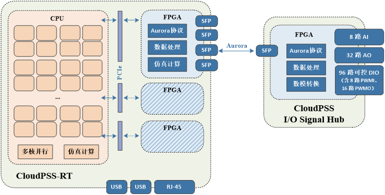

本文档主要介绍 CloudPSS EMTLab 在电磁暂态实时仿真中半实物硬件在环的应用方法及案例。

## 功能定义
CloudPSS EMTLab 可凭借高性能实时仿真器 CloudPSS-RT 和数模转换枢纽 CloudPSS I/O Signal Hub，实现硬件在环仿真的应用。

## 功能说明
### 硬件平台
硬件在环仿真需要仿真器与真实物理装置进行数据交互。CloudPSS-RT 仿真器具备多种数据交互接口，适用于多种硬件在环仿真应用场景。CloudPSS-RT 的硬件平台示意图如下所示。

CloudPSS-RT 具备 1 个 RJ-45 以太网接口（网口也可通过 USB 接口扩展），可配置 1 - 3 块 FPGA 通信/计算卡，每块 FPGA 通信/计算卡具备 2 - 4 个 SFP 光纤接口。CloudPSS-RT 通过 SFP 接口与 Signal Hub 连接后，将具备 8 路模拟量输入和 32 路模拟量输出，并具备 96 路可控数字量输入/输出，其中含 8 路 PWM 输入和 16 路 PWM 输出。

通过上述数据交互接口，可实现与物理装置的硬件在环仿真。

### 通信协议

当使用 SFP 光纤接口或以太网接口与真实物理装置通信时，需要定制开发通信协议。  

- **SFP 光纤接口通信协议**
    
    CloudPSS-RT 的 SFP 光纤接口可采用 **Aurora** 通信协议。Aurora 协议是 Xilinx 公司提供的一个开放、免费的链路层协议，可进行点对点的串行数据传输，具有高效、稳定和简单易用的特点。Aurora 协议允许器件之间通过多个通道绑定进行通信。单个通道可实现 750 Mbit/s - 6.5 Gbit/s的通信传输，多个通道的组合可实现几十 Gbit/s 甚至上百 Gbit/s 的通信传输。Aurora 协议的链路结构如下图所示。

    
    
    CloudPSS-RT 的 FPGA 通信/计算卡中已内置了一个 Aurora 协议，协议各参数如下表。
    | **参数项** | **协议内容** |
    | :------------: | :-----------: |
    | 帧格式 | 32 位 Float |    
    | 同步帧 | 1 通道，4 字节，0x12345678 |
    | 有效帧 | 64 通道，256 字节，用户自定义 |
    | 帧长度 | 共 65 通道，260 字节 |
    | 光速率 | 5 Gbps |
    | 解析方式 | 大端解析 |

    若真实物理装置的数据交互接口配置成相同的协议，即可与 CloudPSS-RT 通过该协议进行数据交互。

    
- **以太网接口通信协议**

    CloudPSS-RT 的以太网接口可采用 Modbus 通信协议。Modbus 是一种串行通信协议，是工业电子设备之间常用的连接方式。由于 Modbus 通信协议是通过以太网进行数据传输的，因此它的数据交互是**非实时**的，可用于传输一些对延迟要求不高的指令信号。

    CloudPSS-RT 中没有内置通用的 Modbus 协议，需要根据真实物理装置的具体需求定制开发。

### 主从式同步机制

Signal Hub 为主模式，CloudPSS-RT 为从模式

### 软件接口
实时仿真工具库
包含模拟量输出、模拟量输入、数字量输出、数字量输入、调制波输出、调制波输入、虚拟输出端口、虚拟输入端口等。
详细使用方法请参考 Signal Hub

## 案例

import Tabs from '@theme/Tabs';
import TabItem from '@theme/TabItem';

<Tabs>
<TabItem value="case1" label="模拟量自闭环测试">
- 构建实时仿真接口模型
  
- 实时仿真方案设置
  
- 硬件在环仿真硬件接线
  
- 硬件在环仿真启动时序
  
- 结果展示

</TabItem>
</Tabs>

## 常见问题

仿真运行报错："start failed"
:   

仿真运行报错："time out"
:   

为什么在硬件在环仿真过程中 Signal Hub 超时帧增加？
:   
