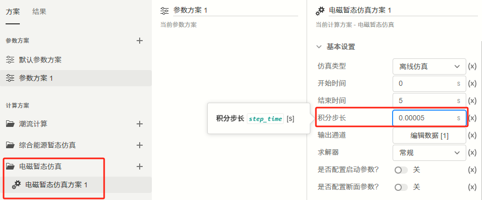

本节介绍拓扑分析功能的基本原理以及配置方法，并使用模板算例进行演示。

## 功能定义

拓扑分析功能主要用于交直流电网的电磁暂态仿真效率优化，包括分网功能、自动聚合母线、负载均衡三个功能。

其中，分网功能和负载均衡功能需结合[电磁暂态仿真并行加速](../../parallel/index.md)进行使用。

## 功能说明

### 分网功能

自动分网功能主要用于切分电网拓扑，以长传输线为解耦点，将大型输电网分解为若干分区。

分网功能为分网并行计算的前序处理，在完成了分网分区后，可将不同分区放置于不同的处理器核心中，加速仿真计算。

如果需要详细配置各处理器核心放置的分区，请参考[负载均衡配置](#负载均衡配置)部分。

#### 分网功能原理

基于Bergeron传输线接口的分网并行的原理请参考[并行仿真基础原理](../../parallel/basic-principle/index.md)。

值得注意的是，Bergeron传输线模型要求，波在传输线上的传输时间应**大于或等于仿真步长**，即：

$$
\tau=d\sqrt{LC}
$$
$$
\tau\geq\Delta t
$$

其中，$\tau$为波传输时间，$\Delta t$为仿真步长。

因此，当确认了电磁暂态的仿真步长$\Delta t$后，只有部分传输线满足Bergeron建模方式的条件，也只有部分传输线可以作为分网的接口。

这里的分网功能的目的就是找出这些传输线，并将其设置为Bergeron分网接口。

#### 分网功能参数配置

首先，在创建分网功能参数之前，应该先创建一个[电磁暂态仿真方案](../../emtp-calc/job/index.md)，并设置好```积分步长```。对于交直流电网的仿真，通常可将```积分步长```设为0.00005s。



然后，点击```交直流电网拓扑分析方案```处的```+```号，创建交直流电网拓扑分析方案：


### 自动聚合母线
自动聚合母线功能可将电网中的悬空母线进行聚合，可以进一步提高仿真效率。具体可参见[自动聚合母线](../gethering/index.md)

### 负载均衡配置
负载均衡配置功能可在分网拓扑分析的同时，生成```负载均衡配置策略表```。该策略表定义了每个计算逻辑核心中分配的元件分区，具体可参见[负载均衡配置](../load-average/index.md)

用户可进一步在并行仿真中修改该策略表，具体可见[并行计算方案配置](../../parallel/job/index.md#更多高级设置)。

## 案例
import Tabs from '@theme/Tabs';
import TabItem from '@theme/TabItem';

<Tabs>
<TabItem value="case1" label="10机39节点系统分网并行">


</TabItem>
</Tabs>


## 常见问题 Q&A
为什么在分网后，线路的模型没有发生改变？
:
    ** 线路参数问题，可能零序参数过低等 **

为什么在分网后，仿真效率没有提高？ 
:
    ** 核数配置 **