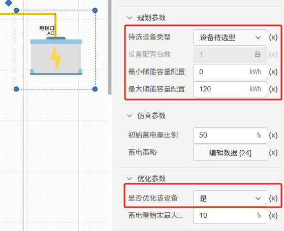

本节主要介绍综合能源系统的约束条件及相关设置方法，并通过常见问题答疑快速熟悉综合能源系统约束条件及设置方法。

## 功能定义

综合能源系统约束条件及设置方法。

## 约束条件

在对综合能源系统进行配置规划（设备选型定容）时，需要指定设备的型号和容量范围等`约束条件`。在规划设计中，目标函数的优化结果优劣主要受变量的取值范围等约束条件影响，约束函数可用等式或不等式描述，对于综合能源系统而言，等式约束主要是综合能源系统的潮流、水热力、网络方程等等式约束，是系统模型需要满足的基本物理规律，用户无需填写；而不等式约束则主要是设备型号容量以及运行过程需要满足的限制范围。对于综合能源系统规划来说，约束条件主要是设备容量范围、制冷制热范围、储能始末蓄电量偏差、柔性负荷范围等。

平台可以对综合能源系统进行规划设计和运行优化，可以根据具体用途调整参数设置。

### 设备型号容量待优化

`待选设备类型`选择`设备待选型`，并输入容量配置范围时，系统会从数据管理模块输入的待选型号中优化选择出合适的设备型号，并进行容量配置；形成配置方案后进行运行阶段的设备出力优化。

### 设备型号容量确定

`待选设备类型`选择数据管理模块输入的确定型号设备，并输入容量配置台数时，系统仅进行运行阶段的设备出力优化。

### 是否优化设备

`是否优化该设备`选择`否，使用仿真策略`，并输入系统运行仿真策略时，系统将不进行运行优化，而是安装运行仿真策略，模拟该设备出力。

选择`是`时，系统将进行运行优化，优化设备出力。

## 常见问题Q&A

1. 可以不设置约束条件吗？  
   不可用，只有设置约束条件后系统才能够进行规划设计。

2. 约束条件设置错了怎么办？  
   约束条件的设置存在一定门槛，需要对规划和系统运行有一定的基础知识。系统会按照设定的约束条件进行仿真模拟，如约束条件设置不对，那么系统的规划配置结果和运行优化结果则有误，可以检查优化结果判断约束条件是否有误。后续 IESLab 也将增加更多错误提升，提升用户友好度。