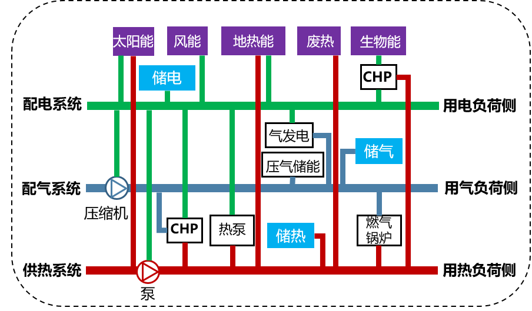

## 平台介绍

IESLab 建模仿真平台主要面向**区域电能、热能、太阳能、风能、电池与储能**等多种能源相耦合的综合能源系统，通过建模仿真技术分析系统运行特性。

平台由**数据管理**、**拓扑建模**、**仿真模拟**和**运行优化**模块构成，**数据管理模块**可以对多种类型的基础数据进行录入和管理，**拓扑建模**模块用于系统拓扑结构的搭建以及边界条件设置，**仿真模拟**模块用于仿真参数设置和计算结果的展示，**运行优化**模块用于优化参数设置和计算结果的展示。

## 综合能源系统

综合能源系统 (Integrated Energy Systems, IES) 又叫多能源系统，是指化石能源、可再生新能源、地热、生物能等**多种异质能源**通过能量的**转化、存储与传输**来满足电、冷、热、气**多种用能需求**，多能源系统**协调供能**和**互补耦合**的能源系统。

综合能源系统示意图如下：

综合能源系统的主要特点有：

**耦合**：多种异质能源系统存在耦合关系复杂  
**互补**：间歇性新能源与可调能源、清洁能源与高排放能源互补，满足电冷热气多种用能需求  
**协同**：多种能源在规划、生产、转换、存储、调度和消费等全生命周期的多时空协同  
**高效**：不同品味梯级利用，优化能源转换形式和能源结构，提升能源利用效率  
**低碳**：充分消纳可再生能源，分布式减少输运损耗，引导低碳用能

## 应用场景

CloudPSS IESLab 建模仿真平台主要面向**楼宇级**、**园区级**和**区域级**的电能、热能、太阳能、风能、电池与储能、天然气等**多种能源系统**，实现多能源系统的不同方案之间的建模仿真、运行优化与评估分析。

CloudPSS IESLab 建模仿真平台在用户输入项目基础参数、搭建系统拓扑、设置仿真策略后，根据**确定的边界条件**，通过模拟系统运行，得到运行输出结果，帮助用户更好地了解**系统运行结果和状态**，并对该运行方式进行分析评价，主要用于回答特定场景下的“假设系统这样运行，会出现什么结果的问题”，主要运用在综合能源项目落地后的实际运行过程中，进行系统仿真设计、状态模拟、仿真策略分析、校验等。
