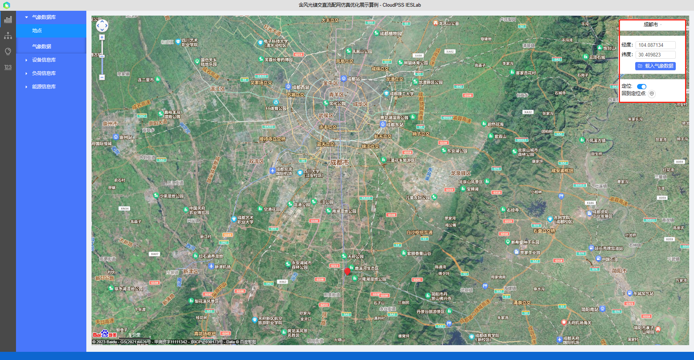
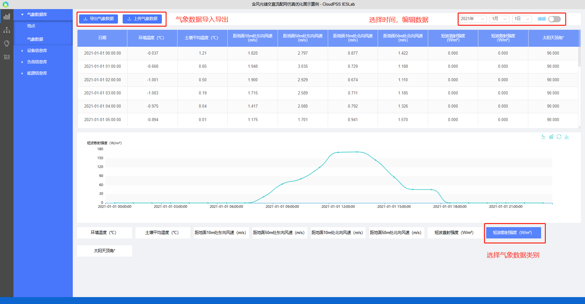
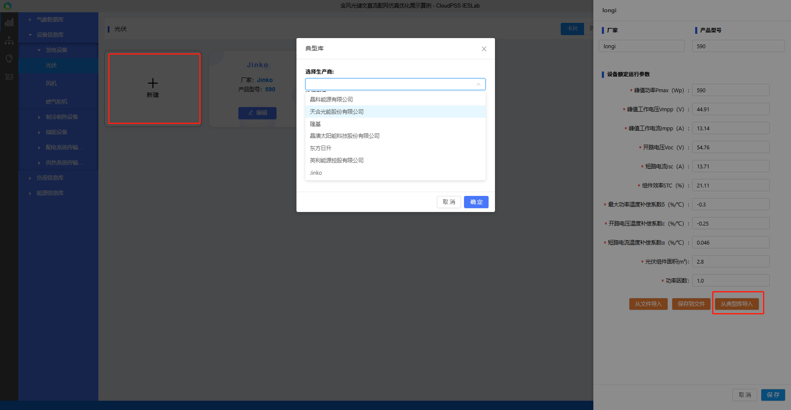
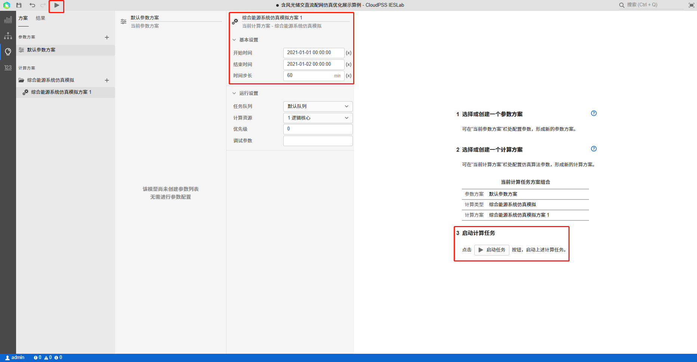
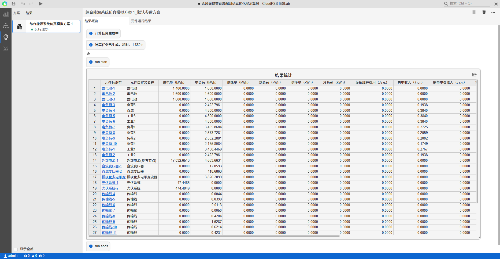
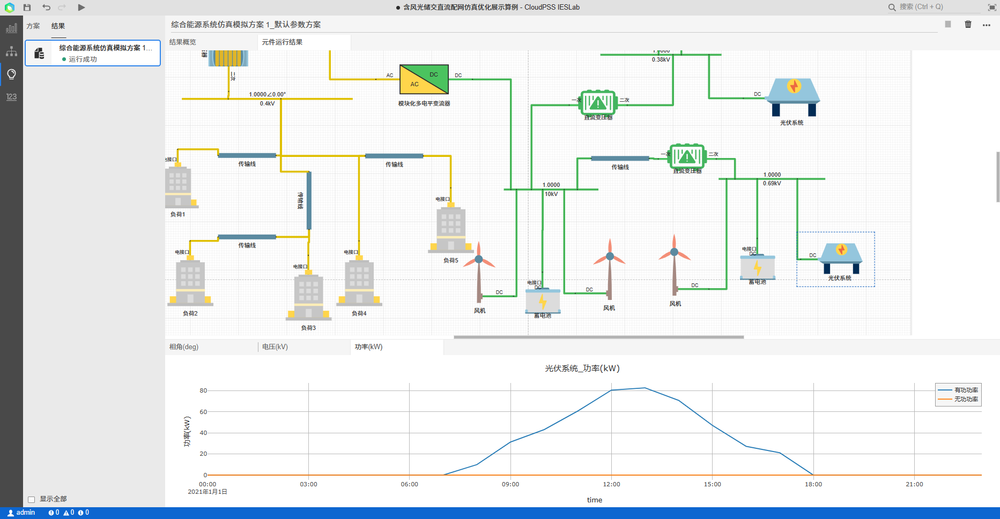

本节以含风光储交直流配网仿真优化展示项目为例，介绍IESLab 建模仿真平台综合能源系统项目的建模仿真和分析方法。

## 建模仿真步骤：
> 1.	登录 CloudPSS 平台，进入 CloudPSS IESLab 建模仿真平台
> 2.	建立项目并打开
> 3.	数据管理模块：录入编辑项目基础参数
> 4.	拓扑编辑模块：搭建拓扑，设置仿真参数
> 5.	开始计算：仿真模拟或运行优化
> 6.	查看、导出及分析计算结果

## 新建项目

新建项目组后 ，新建项目，选择**从模板创建新项目**,选择**含风光储交直流配网仿真优化展示项目**，打开该项目。

## 数据管理模块

打开项目后，首先进入数据管理模块，可在该模块输入项目资料和相关参数信息。

### 气象数据

通过输入项目地 GPS 经纬度坐标、城市搜索、地图选点定位等方式选择项目地点，利用地图插件可查看项目位置信息，点击**载入气象数据**按钮载。

载入气象数据后，可以选择类别查看。

### 录入项目参数

接下来录入综合能源项目所需数据参数，如**源-网-荷-储**设备参数、**电/冷/热**负荷曲线、电价信息等，平台内置典型参数库，可从典型库导入。

## 搭建拓扑，输入仿真边界条件

在左侧导航栏中，切换到**拓扑编辑**模块，从工作区左侧**模型**中选择元件拖拽至工作区并连接拓扑，在工作区左下角查看拓扑连接情况

选中元件并录入**仿真边界条件**，如绑定在**数据管理**模块录入的数据，输入仿真策略等。

## 仿真模拟，检查结果

拓扑连接无误并录入仿真边界条件后，切换到**仿真模拟**模块，在**方案**页面设定仿真参数，并点击**启动任务**启动计算。

计算开始后，平台自动跳转到**结果**页面，可在**结果概率**页面查看计算过程及相关统计指标

在**元件运行结果**页面，选择设备及参数，检查分析计算结果。

