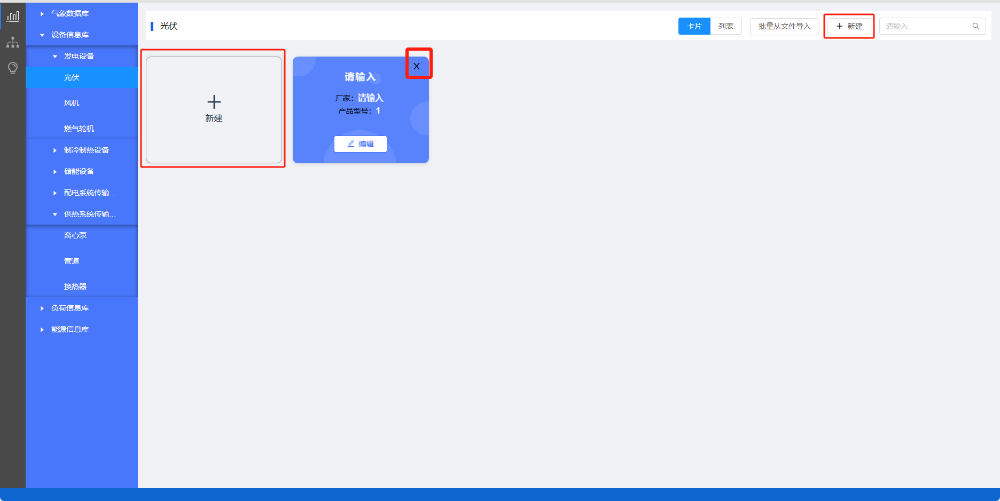
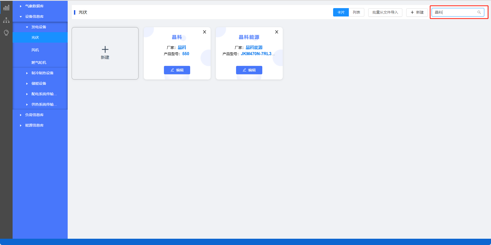
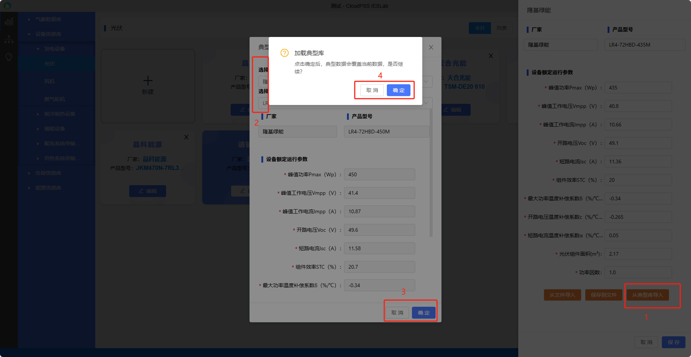
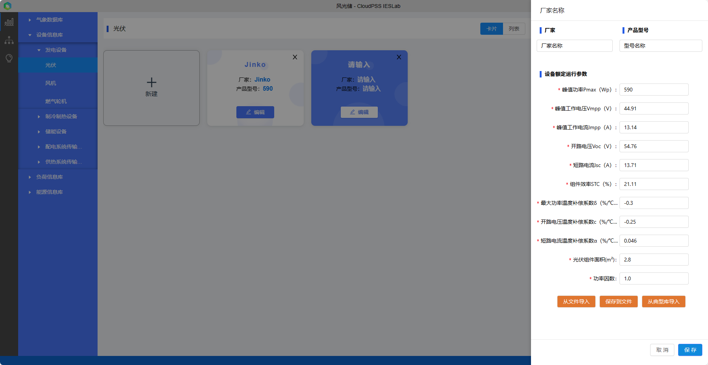
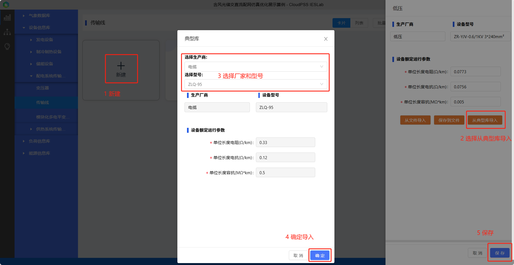

本节主要介绍设备信息库的设备参数录入、编辑、导入及导出等功能使用方法，并通过常见问题答疑快速熟悉设备信息库的基本使用方法。

## 功能定义

用户可以将设备参数录入到**设备信息库**中进行管理，录入后可在**拓扑编辑模块**选择对应设备并自动关联该设备所对应的参数。
平台设备模型均为**稳态模型**，支持建立**多挡位**的变工况设备模型，以更好地模拟设备启停及复杂运行工况。

### 设备模型
平台设备主要分为发电设备、制冷制热设备、储能设备、配电系统传输设备和供热系统传输设备5类：

**发电设备**有风机、光伏、燃气轮机；

**制冷制热设备**有燃气锅炉、热泵、热管式太阳能集热器、电压缩制冷机、吸收式制冷机；

**储能设备**有储热水罐和蓄电池；

**配电系统传输设备**有变压器、模块化多电平换流器MMC、传输线；

**供热系统传输设备**有离心泵与管道。

### 设备模型说明

平台设备模型均包含主要主辅机设备，以下是设备的相关主辅机说明：

**发电设备**  
1. 风机：主要包含风力发电机组（轮毂、叶片、塔架、控制系统等）、整流器（变流器）、变压器、外送线路等；
 2. 光伏系统：主要包含光伏组件、支架、跟踪系统、汇流箱、逆变器、变压器、外送线路等；
2. 燃气轮机为 CHP (combined heat and power) 机组：包含压气机（compressor）、燃烧室（combustor）、燃气透平（turbine）、余热锅炉、供热水系统和冷却系统等，其输入为燃料，输出为电能和热能（热水）；

**制冷制热设备**  
燃气锅炉、热泵、热管式太阳能集热器、电压缩制冷机、吸收式制冷机的工质均为水，其辅机主要有：燃料系统、控制系统、循环水系统、冷却水系统等；

**储能设备**  
蓄电池系统主要包含：蓄电池组、电池管理系统（BMS）、能量管理系统（EMS）、储能变流器（PCS）以及其他电气设备等；

### 设备参数

设备需要录入的参数主要包括厂家型号基础信息、额定运行参数、设备运行约束。设备模型详见[元件库](../../7_comp/index.md)  

厂家型号基础信息如下：

| 参数名 | 键值 (key) | 单位 | 备注 | 类型 | 描述 |
| :--- | :--- | :--- | :--: | :--- | :--- |
| 生产厂商 | `manufacturer` |  | 生产厂商 | 文本 | 生产厂商 |
| 设备型号 | `equipType` |  | 设备型号 | 文本 | 设备型号 |

## 功能说明

### 设备管理

#### 新建与删除

打开设备信息库并选择设备类型及种类后，进入设备管理页面，设备显示模式默认为**卡片**模式。点击卡片**新建**或右上方的**新建**快捷键，会自动创建一个新的设备卡片，初始化设备的各项参数并弹出编辑区域，默认值可以不用修改即可使用，点击左侧空白阴影处可以隐藏编辑区域；也可修改设备参数名称，并点击**保存**。
点击卡片右上角的“**×**”，可以删除此设备。

切换到**列表**模式时，需点击右上方的**新建**快捷键进行新建操作。点击设备项目右侧的**删除**，可以删除此设备。

#### 设备搜索与筛选

在页面右上方的**搜索输入框**，在输入框中输入厂家、型号等任意关键字，点击放大镜**🔍**或回车确定，即可进行模糊搜索或筛选（关键字不区分大小写）。清空输入框后，点击放大镜**🔍**或回车确定可显示所有设备。

### 设备参数编辑

在卡片模式下，点击设备所在的卡片或**编辑**；在列表模式下设备所在的行或**编辑**，即可编辑设备参数信息。修改成功后，点击**保存**完成修改并保存；点击**取消**放弃修改。若修改后点击非编辑区域的左侧空白阴影区域，则会弹出告警框，可选择**保存**、**不保存**或**返回**编辑区域。当用户未修改参数，左侧空白阴影区域则会隐藏编辑区域。

#### 导出与导入
在编辑区域下方有**从文件导入**、**保存到文件**和**从典型库导入**快捷键，当展示内容较多时，可使用鼠标滚轮向下滑动或选中编辑区域右侧的滑块下拉即可看到。

点击**保存到文件**会将该设备相关参数另存为excel文件，文件格式如下所示：

点击**从文件导入**将会弹出文件选择框，选择相应类别及种类的设备参数excel文件后，平台将会自动校验文件格式，若格式无误会覆盖原设备参数；若格式有误将会提示**表格格式不正确!**。用户可以先**保存到文件**，参照导出文件的格式进行修改，再进行**从文件导入**。

#### 从典型库导入
点击编辑区域下方的**从典型库导入**快捷键，在弹出的**典型库**选择框中，选择厂商和型号后会自动显示设备参数信息，点击**确定**后，在弹出的**加载典型库**框中选择**确定**，将会**覆盖**当前设备参数，点击编辑区域下方的**保存**完成典型库导入。

## 案例

import Tabs from '@theme/Tabs';
import TabItem from '@theme/TabItem';

<Tabs>
<TabItem value="js" label="案例1">

以典型项目**含风光储交直流配网综合能源系统**中电源设备的**光伏系统**为例，说明设备信息库的用法。

1. 点击“新建”后，输入**厂家和产品型号**名称。

2. 录入设备额定参数
录入最关键的**设备额定运行参数**，额定参数作为设备模型最重要的参数，参与设备出力计算，直接影响设备的性能及系统运行。您可以联系厂家提供相关参数。
对于光伏系统来说，主要参数有：  
峰值功率Pmax（Wp）  
峰值工作电压Vmpp（V）  
峰值工作电流Impp（A）  
开路电压Voc（V）  
短路电流Isc（A）  
组件效率STC（%）  
开路电压温度补偿系数c（%/℃）  
短路电流温度补偿系数α（%/℃）  

根据设备参数和具体的工况参数，就可以计算光伏系统的理想出力了。

3. 保存

</TabItem>
<TabItem value="py" label="案例2">

以典型项目**含风光储交直流配网综合能源系统**中热源设备的**热泵**为例，说明建立变工况设备的方法。

1. 点击“新建”后，输入**厂家和产品型号**名称。

2. 录入设备额定参数
   热泵是一种利用电能驱动将**低温热源的热能转移到高温热源**的装置，从而实现制热或制冷。其功能复杂，能够适应较多工况。其设备参数一般为**一系列性能曲线构成的曲线簇**，平台通过将曲线**分段线性化**的方法，用户可以录入典型工况的设备特征参数，通过**多工况的稳态模型**实现复杂设备的**非稳态过程的近似仿真**。
   

3. 保存
</TabItem>
<TabItem value="c" label="案例3">

以典型项目**含风光储交直流配网综合能源系统**中配电系统传输设备的**传输线**为例，说明从典型库导入设备的方法。

1. 点击“新建”，创建新的设备卡片。

2. 从典型库导入
   参数编辑区域右下角选择**从典型库导入**，在弹出框中选择**厂家和型号**，检查参数无误后点击**确定**，覆盖当前设备参数。
   

3. 保存
</TabItem>
</Tabs>

## 常见问题

设备参数从哪里可以找到呢？  
:    IESLab 平台元件采用主流的稳态简化模型，其设备参数可以从设备厂家官网查找，若设备实际参数过多较为复杂，可进行适当简化以匹配平台模型参数。

平台支持辅机设备吗？  
:    IESLab 平台均采用为简化后的设备模型，包含主辅机系统，一般无需另外建立辅机模型。

能否支持暂态模型？  
:    对于综合能源系统来说，其热力系统的**稳态过程较长**，达到准稳态的时间尺度为分钟级，一般约15-60min，因此平台主要聚焦**综合能源稳态过程**，设备模型为**稳态变工况**模型，可通过运行在不同挡位来模拟能量转换的动态过程。

平台模型具备通用吗，支持子类设备模型吗？  
:    综合能源系统设备模型建模方式多种多样，设备本身的特性也纷繁复杂。IESLab 平台的设备主要关注**能量流的变化和转换**过程，主要建立能量转换的**通用简化模型**。暂未按照其子特征建立详细的子类模型，如热泵和吸收式制冷机等均为通用的模型，并未按照其热源（驱动源）分类，因此土壤源热泵、水源热泵、空气源热泵均采用通用的热泵模型，均未根据其热源不同，建立不同的换热模型；烟气型溴化锂机组、热水型溴化锂机组、蒸汽型溴化锂机组和烟气热水型溴化锂机组均采用通用的冷热能量转换的吸收式制冷机组模型，并未建立不同工质的物料及换热模型。

能否支持常见的控制元件及控制模型？  
:    平台暂无控制系统及控制元件，其仿真策略等边界条件为常量，需用户录入，无法实现元件仿真模拟过程中运行策略的自动控制。暂无开关、阀门等实体控制元件，无P、I、D、非线性控制等过程控制函数。

能否支持流程过程模型？  
:    平台基于综合能源稳态能量流仿真内核设计，并不关心能量生产的工艺过程、流动流程和能量转换过程，无分离器、反应器、冷却塔等流程过程组件。

能否自定义元件模型？  
:     IESLab 平台自定义元件功能仍在开发中，敬请期待。

平台模型不符合我的需求，如何修改平台模型？
:    IESLab平台暂不支持修改平台模型。若平台提供的模型无法满足您的需求，您目前可以利用平台的数据管理模块、拓扑编辑模块进行数据管理和拓扑搭建展示，利用**IESLab SDK**编写元件模型和能量流求解器进行仿真计算和结果分析。此时，IESLab 平台主要做数据录入和系统展示等基础功能，无法利用平台原生稳态能量流仿真内核计算及结果展示。
    
能否修改设备典型库？  
:   CloudPSS IESLab 官网的典型库不支持修改，对于服务器版本，管理员账户可以修改典型库，修改后该服务器下所有用户即可导入。