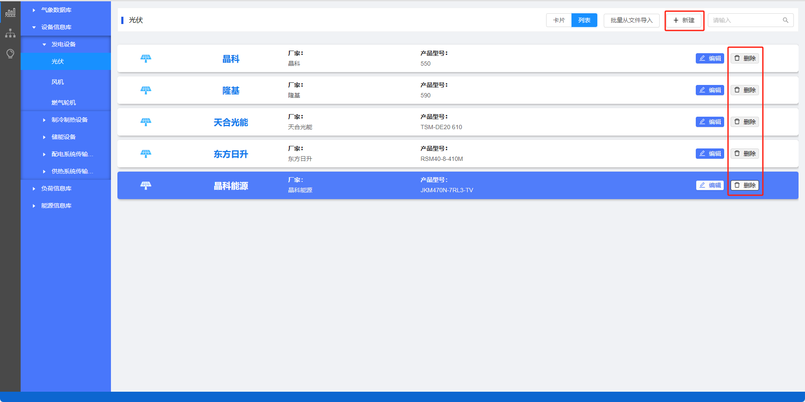
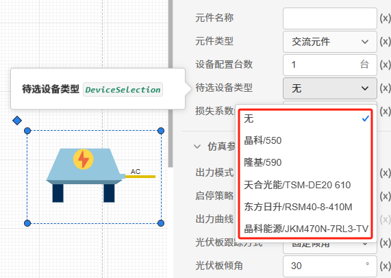
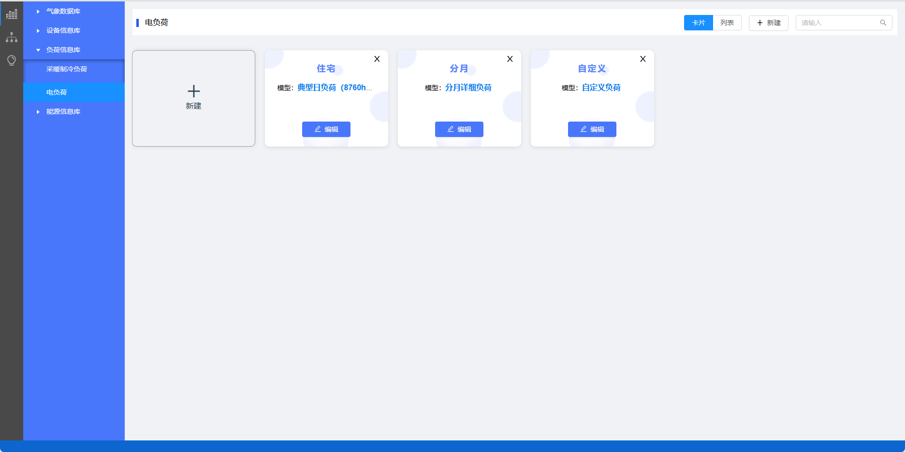
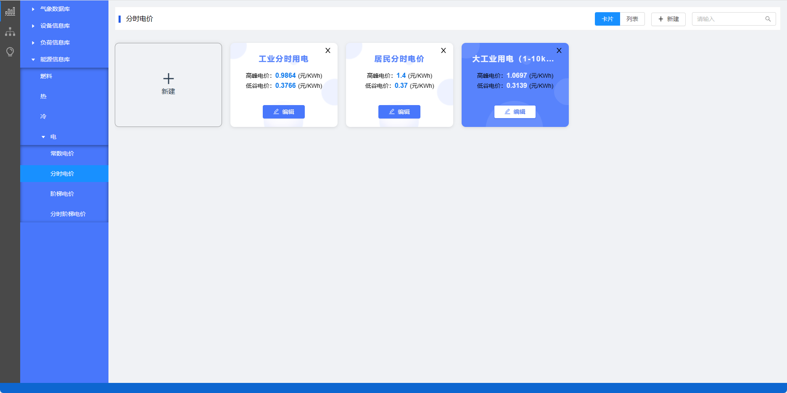
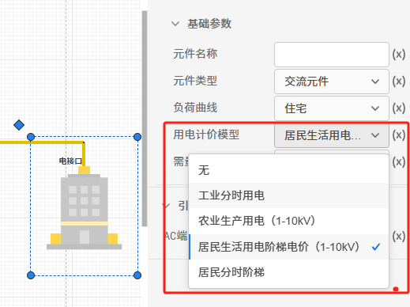
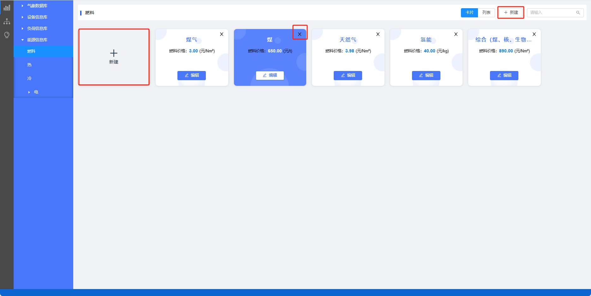
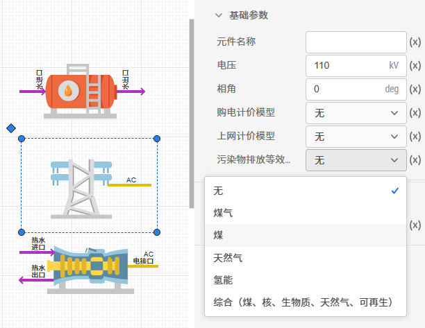

本节主要介绍了拓扑编辑模块绑定数据管理模块参数的方法，并通过常见问题答疑快速熟悉方法。

## 功能定义

在数据管理模块输入的**设备、负荷、能源信息**等基础参数，可以在拓扑编辑模块进行绑定。

## 功能说明

### 设备参数绑定

在数据管理模块输入的源网荷储设备的基础参数后，拓扑模块搭建的元件可以绑定，用于仿真模拟设备的运行状态。

数据管理模块录入设备：

拓扑编辑模块绑定设备参数：

### 负荷绑定

负荷作为仿真模拟重要的边界条件，平台提供了**典型日负荷（8760h）**、**分月详细负荷**和**自定义负荷**三种模型供选择，在数据管理模块建立**电/冷/热**负荷模型后后，拓扑模块拖拽出来的负荷元件可以进行绑定。

数据管理模块建立负荷模型：

拓扑编辑模块绑定设备负荷：

### 电价绑定

平台搭建的在综合能源系统主要承担投资建设运营者的角色，运营商首先需要从外部购买一次能源，因此在外部电源（如火电厂）、燃气锅炉和燃气轮机等处需要付费支出，运营商通过建设**高能效**的综合能源系统，向多能用户提供多种能源，对负荷收取对应的电费及冷热费用；因此在**电冷热负荷处有收入**。

在数据管理模块建立**电/冷/热**价格模型后后，拓扑模块拖拽出来的外部电源、电冷热负荷元件可以绑定。

数据管理模块建立价格模型：

在元件参数的**计价模型**处，若选择**无**，则该元件不计算其**收入和支出**。

对于**外部电源**元件，**购电计价**模型主要用于计算从外部电网购电所需的费用，为**项目支出**；**上网计价**模型主要用于计算光伏风机等新能源向外部电网反送电的收益，为**项目收入**。

对于**电冷热负荷**元件，**用电计价**模型主要用于计算综合能源系统将能源供给给**电冷热负荷**的收益，为**项目收入**。

拓扑编辑模块绑定计价模型：

### 燃料绑定

燃料主要为煤制品等化石燃料，外部电源（如火电厂）、燃气锅炉和燃气轮机等将一次能源转换为二次能源。

在数据管理模块建立**燃料**模型后后，拓扑模块的**外部电源、燃气锅炉和燃气轮机**元件可以进行绑定。其中，**燃料热值**用于计算燃料的消耗量；**燃料价格**用于计算购买燃料的费用，为项目支出；**污染物释放系数**用于计算消耗燃料时排放的污染物，计算其环保性指标。

数据管理模块建立燃料模型：

拓扑编辑模块绑定设备燃料：

## 常见问题Q&A

1. 可以不用绑定参数吗？哪些元件需要绑定参数？  
   部分元件必须绑定参数，如对于设备和负荷，必须绑定参数；对于能源和计价模型，不绑定则不会计算对应技经指标。

2. 数据管理模块输入参数后，为什么拓扑编辑模块找不到？  
   您可以尝试： 1. 刷新页面或重新登录； 2. 检查数据管理模块是否保存成功。