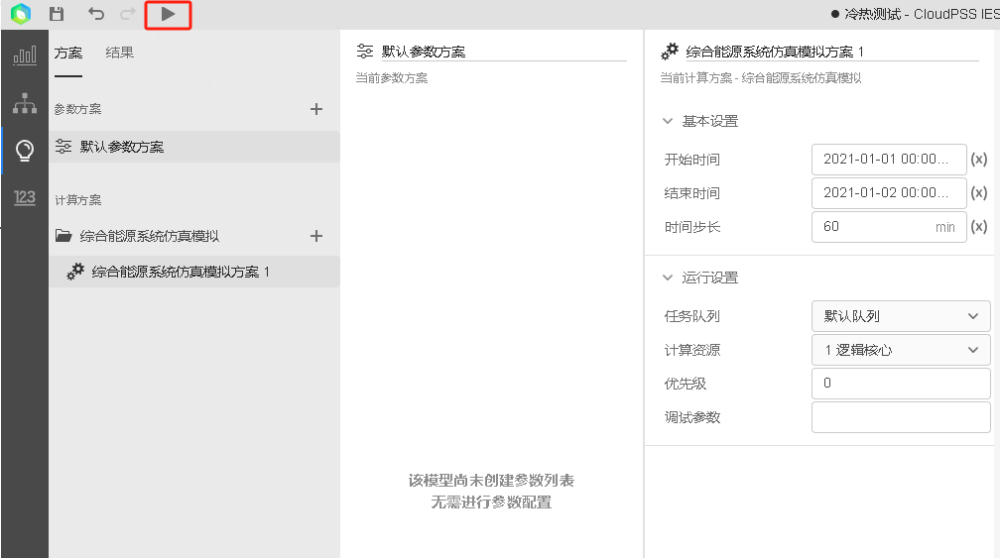
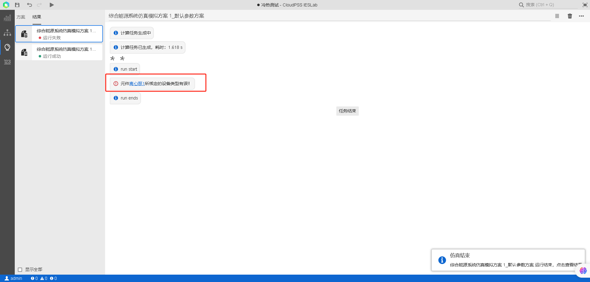
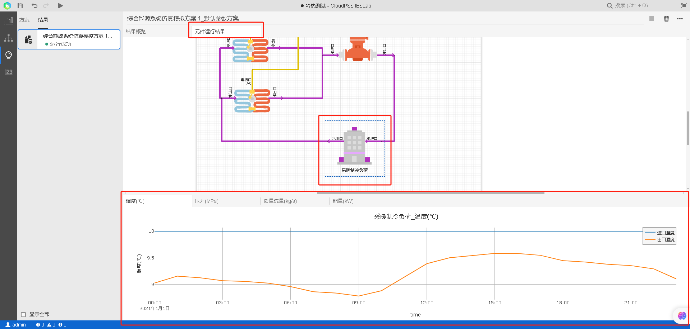
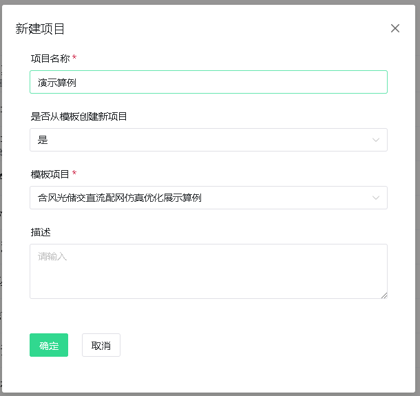
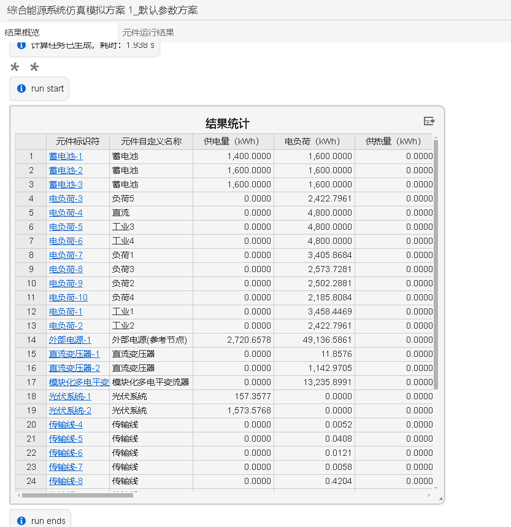
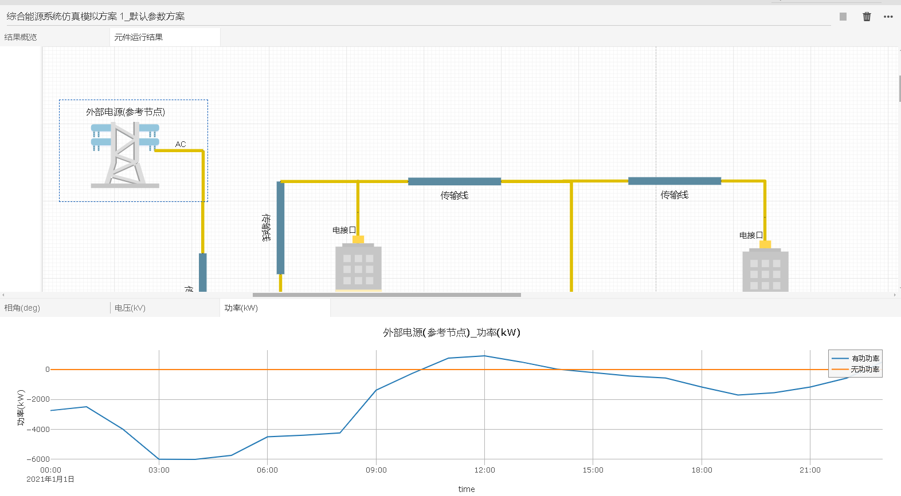
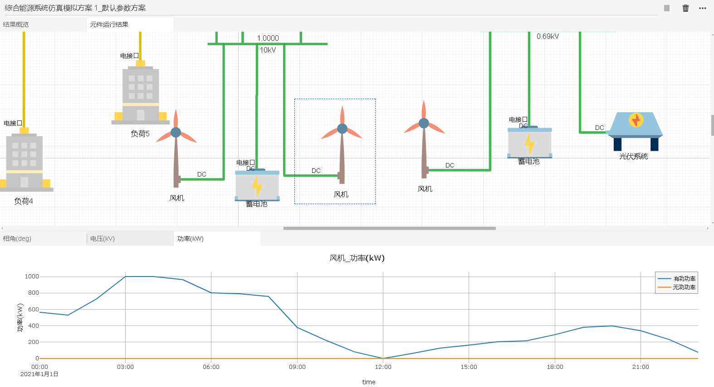
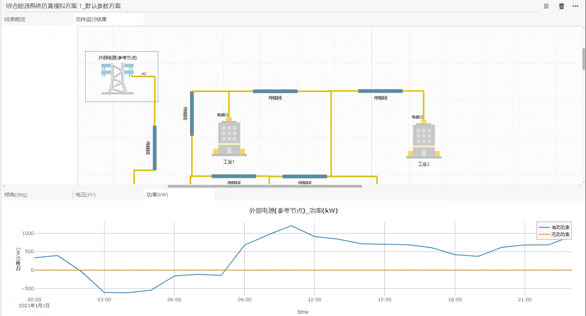

本节主要介绍 IESLab 建模仿真平台进行综合能源仿真计算时查看计算结果的方法，包括统计性指标表格、元件时序运行结果等。

## 功能定义

用于展示 IESLab 仿真计算的结果。

## 功能说明

### 启动仿真

通过点击菜单栏中的**启动任务**按钮能够执行当前计算方案下的综合能源系统仿真。

### 结果概览

在计算完成后，结果页面的**结果概览**选项卡下会显示在当前仿真周期内的系统各项指标统计表，包括能量指标统计、经济指标统计以及环保指标统计。

此外，结果概览页面还用于展示一些日志信息，如上图中的 **run start** 和 **run ends** 代表程序执行的开始和结束。当用户设置的参数有误时，会在此页面出现一些警告或者报错日志，如下图所示。

### 元件运行结果

在计算完成后，结果页面的**元件运行结果**选项卡下会显示当前系统拓扑，用户可以通过点击目标元件，在下方的图标栏中查看该元件不同运行参数的时序曲线。对于部分元件的计算结果，时序曲线会根据结果类型进行分组，比如图中的温度、压力、质量流量和能量，用户可以通过切换选项卡查看不同分组下的数据曲线。

## 案例

下面以典型项目**含风光储交直流配网仿真优化展示算例**为例介绍结果页面查看和分析计算结果的方法。首先用户在个人中心主页进入**IESLab建模仿真**平台的项目空间，然后从模板算例创建**含风光储交直流配网仿真优化展示算例**，详细的项目及项目组创建说明可以参考[个人中心](/docs/software/ieslab/sim/center/)帮助。

接下来用户需要在[数据管理模块](/docs/software/ieslab/sim/data/)和[拓扑编辑模块](/docs/software/ieslab/sim/topo/)中设置相关参数，本节略过不讲。当用户完成基础参数录入和拓扑模型搭建以后，就可以进入**仿真模拟模块**启动计算并查看结果。

在本案例中，设置仿真周期时长为1天，仿真时间步长为60min，如下图所示。

点击按钮开始计算，稍等片刻后便能得到计算结果。通过**结果概览**界面的结果统计表格，可以知道在仿真的1天内，整个系统的新能源发电量为**94.4MWh**，电负荷总量为**33.3MWh**，上网电量为**49.1MWh**，购电量只有**2.7MWh**，这些数据说明了新能源装机量远大于电负荷，如果要实现本地消纳的话需要减少新能源装机总量。

再进入**元件运行结果**页面，选中**外部电源元件**查看其在24h内的功率曲线，可以发现在夜间返送电的现象非常严重，经过分析发现是风机夜间出力较大，而储能容量不足以消纳风机的出力，因此可以通过减少风机配置的台数，来尽可能达到新能源本地消纳的目标。

当将风机装机容量减少到原来的三分之一左右后，再次进行仿真计算，从新得到的外部电源功率曲线可以看出系统上网电量明显减少，基本上实现了新能源的消纳。

## 常见问题

运行计算提示报错“元件 XXX 所绑定的设备类型有误！”，是什么原因？
:   这通常是因为该元件的**待选型设备参数**没有或者绑定了不存在的元件类型。当用户绑定元件的设备类型后又删除了数据管理模块中的数据项，也会导致此问题的发生。

运行计算提示报错“拓扑中存在没有设置母线的电气子网！”，是什么原因？
:   在IESLab综合能源系统拓扑建模时，需要保证每个电压等级的电气子网内需要存在至少1个电气母线元件。所谓电气子网代表同一电压等级并且相互连通的网络，如下图所示的红框中的子网，虽然电压等级相同，却不直接连通，因此分别是一个电气子网，所以需要各设置一个母线元件。

