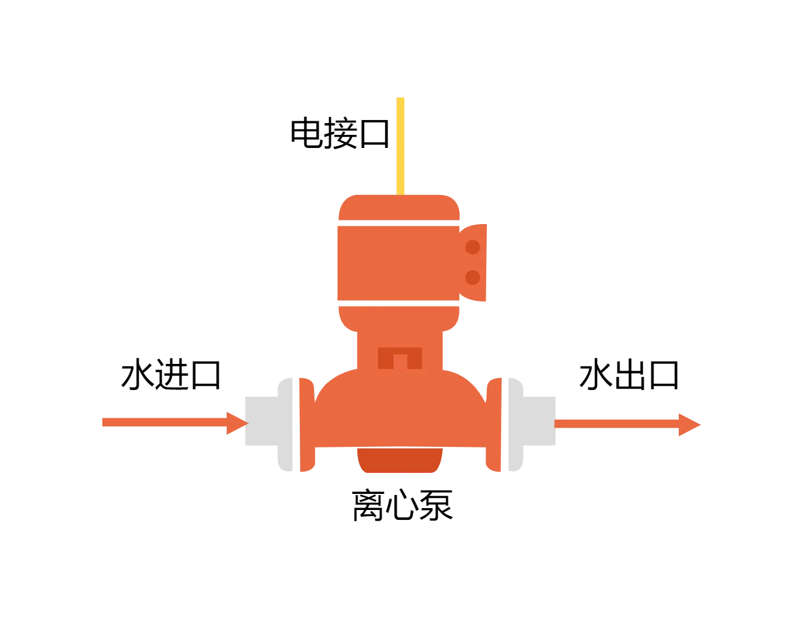

## 元件定义

该元件指离心泵的设备设施泵将电能转换为机械能，输送流体在管网中完成水力循环。泵可以通过调节转速和阀门开度控制质量流量和流速。泵工作在变速模式下时，根据**相似定律**，从额定模式外推扬程和泵功率的数学模型，其中系数可通过使用历史运行数据进行曲线拟合获得.

 额定转速下：
$$
H_{r} = a_{p}m_{p}^{2} + b_{p}m_{p} + c_{p}
$$
根据相似定律推导变工况特性：
 $$
 H = a_{0}Q^{2} + a_{1}Q\frac{n_{p}}{n_{rp}} + a_{2}\frac{n_{p}^{2}}{n_{rp}^{2}}
 $$
$$
P = b_{0}Q^{2}\frac{n_{p}}{n_{rp}} + b_{1}Q\frac{n_{p}^{2}}{n_{rp}^{2}} + b_{2}\frac{n_{p}^{3}}{n_{rp}^{3}}
$$

## 元件说明

元件参数标签页包括**属性**、**参数**、**引脚**三类参数，下面对每类参数进行详细说明。

### 属性

CloudPSS 提供了一套统一的元件属性功能，关于元件属性参数的配置，详见[元件属性配置](/docs/docs/software/xstudio/simstudio/basic/moduleEncapsulation/index.md)页面。

### 引脚
水入口和水出口，可以在引脚处填写相同的字符使得两个元件相连。

### 参数

#### 基础参数

| 参数名 | 键值 (key) | 单位 | 备注 | 类型 | 描述 |
| :--- | :--- | :--- | :--: | :--- | :--- |
| 元件名称 | `CompName` |  | 元件名称 | 文本 | 元件名称 |
| 元件类型 | `CompType` |  | 选择元件类型 | 选择 | 选择**交流元件**时为交流电，选择**直流元件**时为直流电|
| 待选设备类型 | `DeviceSelection` |  | 从设备库中选择设备类型 | 选择 | **选择数据管理模块录入的设备型号**，将自动绑定对应设备的厂家、产品型号和额定运行参数。|

#### 仿真参数

在仿真参数中编辑元件的仿真边界条件，有**泵转速曲线**。

| 参数名 | 键值 (key)  | 单位 | 备注 | 类型 | 描述 |
| :--- | :--- | :--- | :--: | :--- | :--- |
| 泵转速 | `PumpSpeed` |  | 配置离心泵在不同时刻的设备运行策略 | 表格 | 在表格中录入**各个时间段对应的泵转速运行策略**。 **开始时刻**对应每个仿真时刻，泵转速单位为 rpm , 即每分钟转数。|

#### 优化参数

在优化参数中编辑元件的优化条件。

| 参数名 | 键值 (key)  | 单位 | 备注 | 类型 | 描述 |
| :--- | :--- | :--- | :--: | :--- | :--- |
| 是否优化该设备 | `OptimizationChoice` |  | 是否对元件的运行方式进行优化 | 选择 | 选择**是**，则设备的运行策略由系统优化得到，不读取仿真参数中设置的运行策略；选择**否**，则系统按照仿真参数的运行策略运行，此时优化计算量非常大，不建议对转速进行优化。|

### 引脚

元件有**水接口**和**电接口**引脚，用于与其他电设备连接，支持**线连接**和**信号名**的连接方式。

引脚的**名称、键值、维度、定义描述**的详细说明如下表所示。

| 引脚名 | 键值 (key)  | 维度 | 描述 |
| :--- | :--: | :--- | :--- |
| 电接口 | `DC/AC` | 1×1 | 可以在引脚处输入相同的字符使得元件与其他元件相连，当基础参数**元件类型**项是**直流元件**时，键值为**DC**；**元件类型**项是**交流元件**时，键值为**AC**。|
| 水入口 | `waterInlet` | 1×1 | 可以在引脚处输入相同的字符使得元件与其他元件相连|
| 水出口 | `waterOutlet` | 1×1 | 可以在引脚处输入相同的字符使得元件与其他元件相连|

## 常见问题Q&A

元件模型是否具有代表性？

:   IESLab 平台的设备主要关注**能量流的变化和转换**过程，主要建立能量转换的**通用简化模型**。平台离心泵为提供工质循环动力的泵，暂未按照其子特征建立详细的子类模型。不论是卧式泵还是立式泵，不论是清水泵、污水泵还是海水淡化泵，均可以使用该通用模型。

拓扑中能否不添加离心泵？
:   可以，不过此时流体缺乏循环动力，计算结果可能不正确。

是否考虑了转速等运行约束？
:   不考虑，平台暂不支持运行约束校验。

离心泵特性曲线要输入多少？
:   仅需输入额定转速下的特性曲线即可，一般而言，离心泵特性曲线为抛物线，3 个点即可进行拟合。

为什么计算结果显示流量为负？
:   一般而言，离心泵特性曲线为抛物线，很可能该转速下，流量正好计算为负值，请调整运行策略。

如何调整离心泵转速曲线？
:   若您没有离心泵转速曲线，需要进行离心泵的水力计算，但过程较为复杂；也可不断调试离心泵转速，使得流量正常。

为什么优化计算时间这么长？
:   可能是离心泵选择了优化转速。离心泵转速优化需要不断进行水力计算，非常耗时，不建议您优化离心泵转速曲线。

元件的交直流元件有什么区别？

:   选择交流时为交流电，选择直流时为直流电
    在能量流计算过程中均为 PQ 节点。

    注意，交流元件和直流元件不能直接相连。