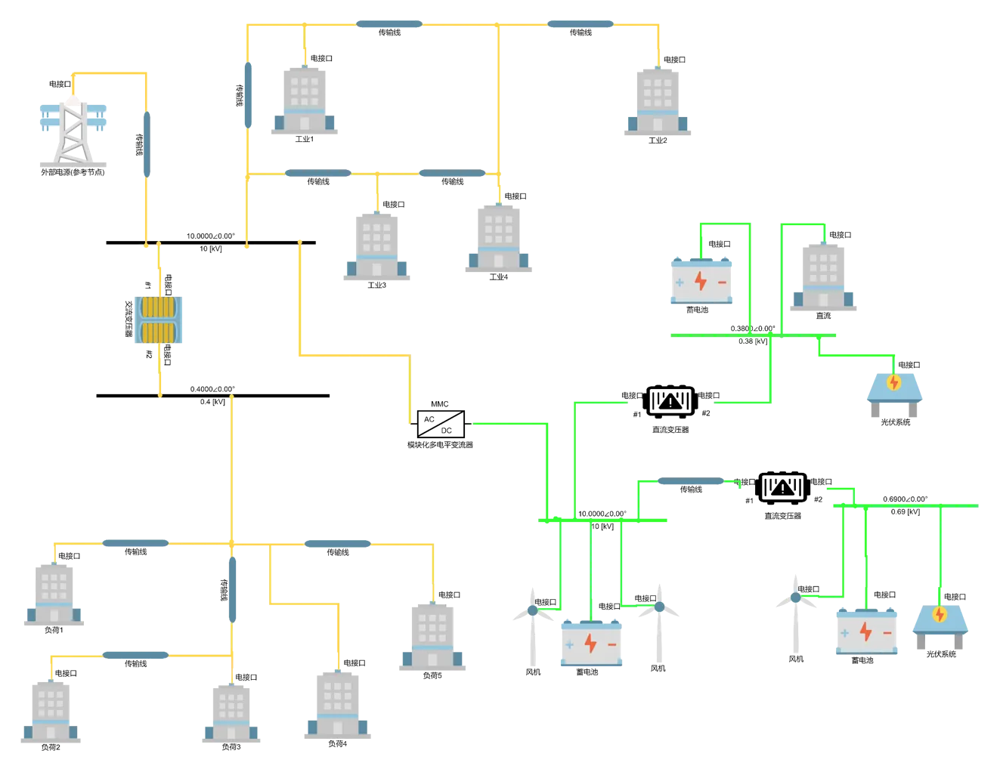
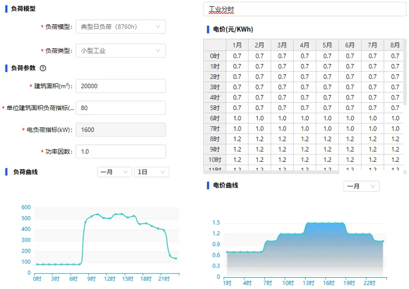
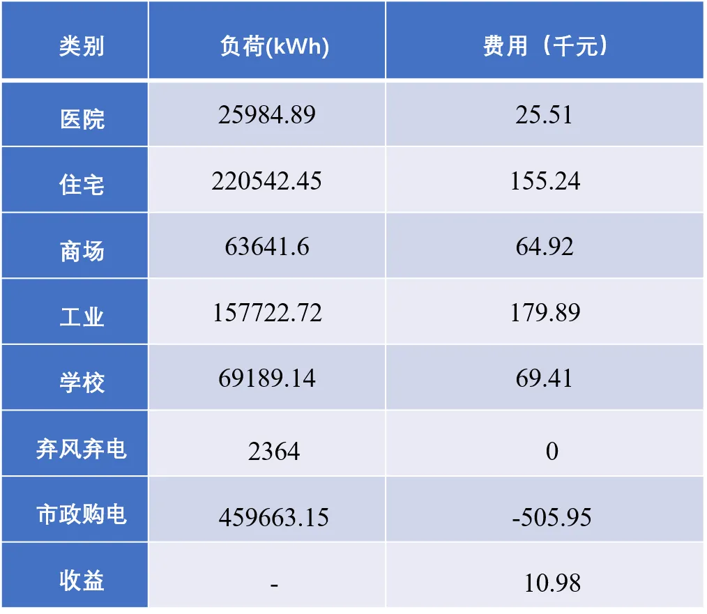
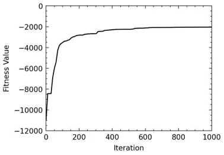
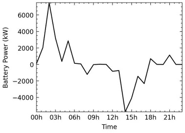

本文主要介绍了含风光储交直流配网综合能源系统项目的项目背景、搭建方法和结果分析。

## 模型描述

**项目简介**：项目是一个微电网系统，位于中国西北部，占地165 平方公里。用电负荷分为10 kV的工业用电负荷和低压（小于 1kV）用电负荷，工业用户主要是一些工厂，采用环形连接供电，低压民用负荷包括一些住宅社区、医院、商业中心和学校，采用星型连接供电。该地平均总用电负荷约为15～24MW，不同月份的峰值负荷高达19～30MW，系统从市电购电，通过配电系统供电。

**资源禀赋**：该地区风光资源丰富，其太阳辐射强，其年水平面总辐照量达到了1700kWh/㎡，光伏发电年利用小时数达到了1700h，该地且晴天多,阴雨天少。气候干燥湿度低。空气洁净,灰尘少，非常利于光伏发电站的建设。该地风能密度约200/m2，大于等于3 m/s的风速全年有5000h以上，有利于风力发电系统建设。近年来，该地区建设了一个新能源发电基地，包括风力发电机和光伏系统。

**储能系统**：由于该地“弃风弃电” 现象严重，为尽可能消纳更多新能源，该地近年建造了储能电站。同时，由于执行分时电价，拟对储能电站进行日前优化，利用峰谷电价差提高经济收益。

*模型拓扑结构图如下：*

## 负荷及分时电价

该项目地区执行分时电价，主要负1kV以下一般工商业和10kV工业负荷及其分时电价如下:

*1kV以下一般工商业*

*10kV工业*

## 仿真模拟及运行优化

### 仿真结果统计

*储能策略*

 *仿真结果*

### 运行优化及结果

*迭代过程*

*储能优化*

优化结果

## 结果分析

主要结论：

1. 电费支出减少到2k元，节约8k元

2. 建议放电时间为13:00～17:00，最佳充电时间为1:00～5:00，主要是利用**峰谷电价差**

3. 对于多余的随机波动性风光发电量，储能可以**提高可再生能源的消纳比例**，**减少弃风弃电**量

4. 通过储能的“削峰填谷”，可以提高经济收益

5. 目前优化采用**智能启发算法**，在可接受的计算时间和空间内可以给出合理的可行解，但非全局最优。