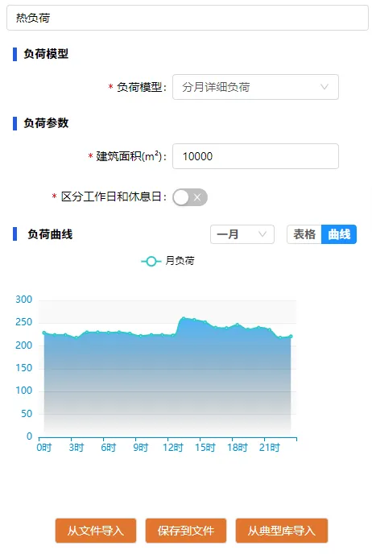
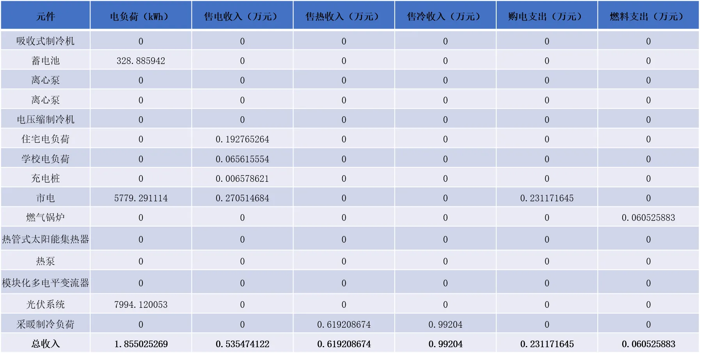

本文主要介绍了综合能源系展示项目项目的项目背景、搭建方法和结果分析。

## 模型描述

**背景**：**多能耦合、协同互补**的综合能源系统是未来多能源利用的方向，涵盖了各种形式和特点的多能源，目前将供气系统、供热系统与电力系统等集成的综合能源园区因应用广泛发展迅速，既实现电力、燃气、供热等一体化多能互补，又实现源网荷储全环节高度协调与灵活互动、集中化与分布式相互结合。以某典型楼宇型综合光储能源园区为例，搭建开展综合能源系统模型并仿真。

**项目简介**：项目是一个典型的楼宇型综合能源系统，某学校及其宿舍住宅楼拟通过建设综合智慧楼宇实现“降碳、降耗、降费、舒适”的目标。学校及住宅楼顶拟安装屋顶光，由于市电执行分时电价，拟建设储能系统，对储能电站进行日前优化，利用峰谷电价差提高经济收益，随着电动车的大力发展，拟建设电动车充放电站。

**能源站**：为满足日常供冷供热的需求，拟建设分布式能源站，能源站通过多能互补进行“**制热、制冷、储能**”实现一举三得，提高能源利用率，实现节能减排。能源站中，由燃气锅炉、空气源热泵和太阳能管式集热器协同供热，由热水驱动型溴化锂吸收式制冷机组和压缩式制冷机联合供冷，其中多余的冷热由储能水罐存储，水罐通过对电量和热量进行分时段调节，对实时能源负荷进行调峰，提升经济收益。能源站通过冷热转换实现**能量的梯级利用**，可以大幅提升能源利用效率，同时建设储能系统打破**冷热电的刚性连接**关系，实现**削峰填谷**，并提升经济收益。

**楼宇型综合能源**：作为最常见应用最广泛的综合能源系统，一般通过建设分布式新能源、储能系统和冷热系统，通过优化运行控制，实现系统能效提升，帮助用户实现节能、增效、降本。

**园区设备**：电源设备有：燃气轮机、外部电源、光伏组件；储能设备包含蓄电池和储水罐；主要负荷包括电负荷、冷水负荷、热水负荷，其冷热源设备包括：电压缩制冷机、吸收式制冷机、燃气锅炉；输变电系统设备包括母线、传输线和变压器。

*模型拓扑结构图如下：*

## 主要供能设备

**吸收式制冷系统**

制冷剂液态在蒸发器中吸热蒸发，所形成的蒸气被吸收剂所吸收，在此之后，吸收了制冷剂蒸气的吸收剂由溶液泵送至发生器，在发生器中被加热，而分离出制冷剂蒸气，该蒸气在冷凝器中被冷凝成液体，再经节流后进入蒸发器。

**热泵**

热泵是一种将低温热源的热能转移到高温热源的装置，从而达到制热和制冷的目的。根据外界热源的不同，热泵可以分为空气源热泵，水源热泵，地源热泵等。对于不同的热泵，都是通过消耗电能提供热能。

*充电桩直流负荷：*

*热负荷：*

## 结果统计

## 结果分析

>1. 相比从外部能源站供能，自建能源站一方面减少支出，另一方面大幅提升了能源利用率，通过**能量梯级利用和储能系统协**同配合，**能源效率高达80%**
>2. 相比传统方式设定的仿真策略，优化后的综合能源系统总**收入提升了24%**，主要原因在于供热系统，传统供热主要依赖于燃气锅炉，而优化后则采用能效比高的热泵，利用能量梯级利用和储能系统协同。提升效率，大幅降低了燃料购置费用；另一方面，畜电池利用**峰谷电价**差进行调峰。
>3. 综合能源能效高，灵活性好，大幅降低碳排放，助力实现**双碳目标**

