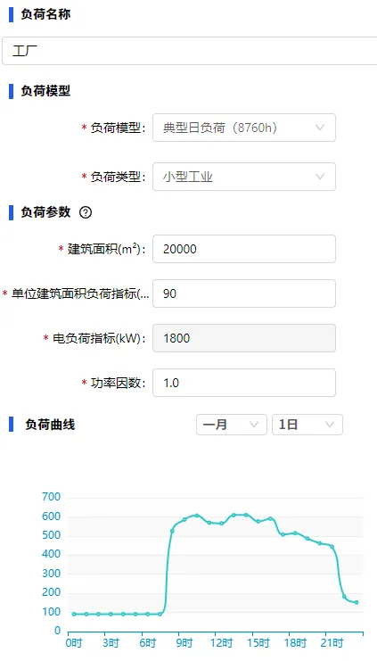
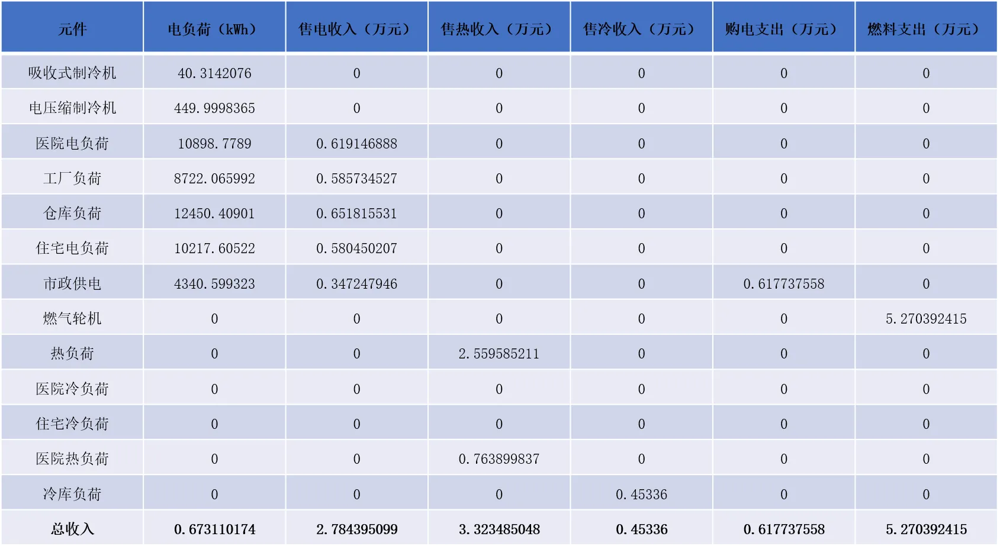

本文主要介绍了冷热电三联供综合能源系统项目的项目背景、搭建方法和结果分析。

## 模型描述

**项目简介**：项目是一个典型的冷热电三联供综合能源系统，某工厂、仓库及配套医院住宅区域的供电、供冷和供热需求面积约100000㎡。目前的燃气锅炉和地源热泵供能系统运行年限较久，设备腐蚀严重，设备效率低，维护检修成本高且频率高，急需升级改造。由于离能源站较远，难以直接购买利用，且工厂耗电量较大，其工业用电较贵。根据项目实际情况进行调研分析测算后拟建设三联供系统，采用**燃气发电机组、热水溴化锂机组和电制冷机组**组合供能的方案。

**冷热电三联供**：作为分布式能源的一种，具有节约能源、改善环境，增加电力供应等综合效益。以燃气为能源，通过对其产生的热水和高温废气的利用，以达到冷-热-电需求的一个能源供应系统，通常由发电机组、溴化锂制冷装置、热交换装置组成，三联供使得燃气的热能被充分利用，大大**提高了能源的综合利用率**，实现**节能减排**。

**三联供综合能源**：一般由燃气公司及大型工商业建筑园区建设，通过能量梯级利用提升能效，同时大幅减小占地面积，通过多能协同优化，帮助企业实现节能、增效、降本。

**系统设备**:包括蓄电池、燃气轮机、吸收式制冷机、电压缩制冷机、变压器、输电线路，并和公共电网连通。系统结构拓扑如下图所示：

*模型拓扑结构图如下：*

**负荷参数**

系统负荷主要有电负荷、冬季供暖负荷和夏季制冷负荷。

## 主要设备

**溴化锂吸收式制冷机**

热水型溴化锂吸收式制冷机组与燃气发电机组直接对接利用其余热，该燃气轮机组排放的400℃高温烟气热量经换热器提升热水温度，与90℃的高温缸套水作为溴化锂机组的热源驱动。对于热负荷，由燃气轮机提供的热水供热，供热不足时也可利用溴化锂机组的热源的60℃ 回水。对于冷负荷，则由溴化锂机组和电制冷机组联合供冷。

**燃气轮机**

燃气轮机的排气温度高，一般与余热回收装置一起作为热电联供机组，有“以电定热”和“以热定电”等工作模式。高能效的机组其发电和供热效率均达到40%以上，综合能源效率达80%+。即每立方天然气发电4kWh +，同时产生4kWh+的热量。不同于大型燃气轮机组主要用于发电，微、小型燃气轮机的功率小，一般用于工厂提升综合能效。

## 结果统计

## 结果分析

>1. 相比原来的供能系统，三联供的综合能源系统大幅**提升了能源利用率**，通过**能量梯级利用**，综合能源**效率超过80%**
>2. 相比传统方式设定的仿真策略，优化后的综合能源系统**总收入提升约40%**，主要原因在于燃气轮机为了满足热负荷需求，且采用“并网不上网”的工作方式，其发电主要用于工厂及附近用电负荷，并不能上网发电，工作在“以热定电”模式，其发电量依赖于热负荷及冷负荷，通过优化运行模式，使得溴化锂机组和电制冷机组更好地配合，使得燃气轮机组工作在高能效工况，同时减少电冷热浪费。**提升能效和经济收益**。