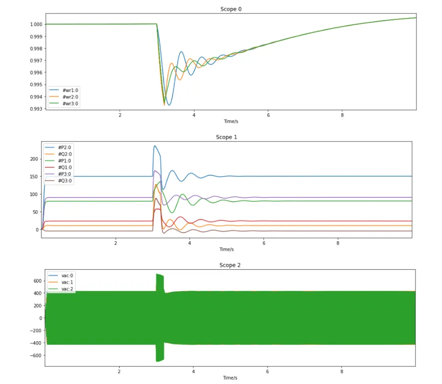
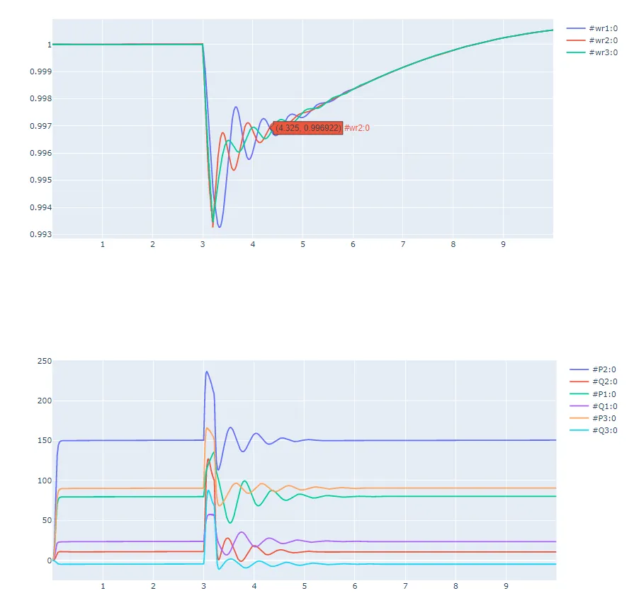

使用 matplotlib 库或 plotly 库绘制结果曲线，以**电磁暂态仿真**结果为例：

## 使用 matplotlib 绘制曲线

```python
import matplotlib.pyplot as plt
import sys,os
import cloudpss
import json
import time

if __name__ == '__main__':
    
     # 填写token
    cloudpss.setToken('{token}')

    # 设置访问的地址
    os.environ['CLOUDPSS_API_URL'] = 'https://cloudpss.net/'
    
    # 选择算例，获取指定算例rid 的项目
    model = cloudpss.Model.fetch('model/CloudPSS/IEEE3')
    
    # 选择参数方案，若未设置，则默认用model的第一个config（参数方案）
    config = model.configs[0]

    # 选择计算方案，若未设置，则默认用model的第一个job（计算方案）。此处选择model.jobs[1]，为电磁暂态计算方案
    job = model.jobs[1]

    runner = model.run(job,config) # 运行算例
    while not runner.status(): 
        logs = runner.result.getLogs() # 获得运行日志
        for log in logs: 
            print(log) #输出日志
        time.sleep(1)
    print('end') # 运行结束
    
    # 打印结果
    plots = runner.result.getPlots() #获取全部输出通道

    for it in range(0,len(plots)):
        legend = runner.result.getPlotChannelNames(it)
        print('示波器分组',it,':',legend)
        plt.figure('示波器分组'+str(it),figsize = (15,4))
        for jt in range(0,len(legend)):
            plot = runner.result.getPlotChannelData(it,legend[jt])
            plt.plot(plot['x'],plot['y'])
            plt.title('Scope '+str(it))
            plt.xlim([min(plot['x']),max(plot['x'])])
            plt.legend(legend)
            plt.xlabel('Time/s')
```



## 使用 plotly 绘制曲线

```python
import plotly.graph_objects as go
import sys,os
import cloudpss
import json
import time

if __name__ == '__main__':

     # 填写token
    cloudpss.setToken('{token}')

    # 设置访问的地址
    os.environ['CLOUDPSS_API_URL'] = 'https://cloudpss.net/'
    
    # 选择算例，获取指定算例rid 的项目
    model = cloudpss.Model.fetch('model/CloudPSS/IEEE3')
    
    # 选择参数方案，若未设置，则默认用model的第一个config（参数方案）
    config = model.configs[0]

    # 选择计算方案，若未设置，则默认用model的第一个job（计算方案）。此处选择model.jobs[1]，为电磁暂态计算方案
    job = model.jobs[1]

    runner = model.run(job,config) # 运行算例
    while not runner.status(): 
        logs = runner.result.getLogs() # 获得运行日志
        for log in logs: 
            print(log) #输出日志
        time.sleep(1)
    print('end') # 运行结束

    # 打印结果
    plots = runner.result.getPlots() #获取全部输出通道
    
    for i in range(len(plots)):
        fig = go.Figure()
        channels= runner.result.getPlotChannelNames(i)
        for val in channels:
            channel=runner.result.getPlotChannelData(i,val)
            fig.add_trace(go.Scatter(channel))
        fig.show()
```



