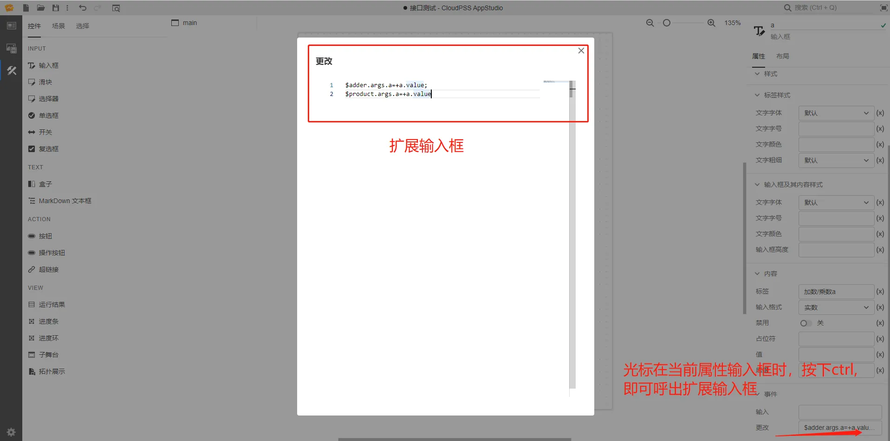
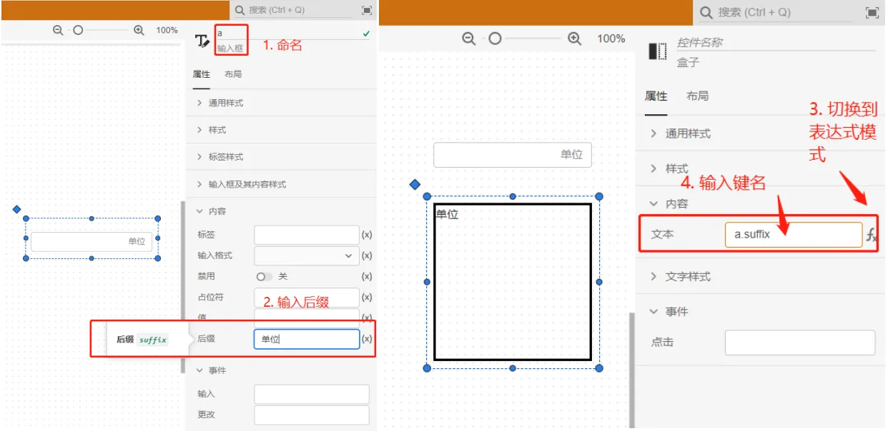
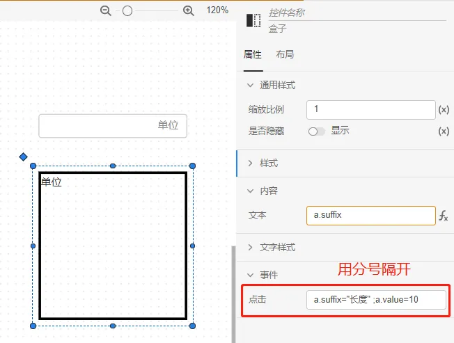

## 表达式计算

AppStudio 场景标签页内控件的属性有两种输入模式，一种是`(x)`值模式，另一种是`f(x)`表达式模式。
值模式是通过在属性框内直接输入文本来修改属性值，表达式模式则是在属性框内输入由变量/函数资源键名、控件属性键名构成的表达式，通过 mathjs 的表达式解析器计算出表达式的值来修改属性值。

在表达式输入模式下，选中属性栏的输入框后，按`Ctrl`可呼出属性栏输入框的扩展编辑界面。在扩展编辑界面中，支持输入和编辑多行复杂表达式。

### 引用资源

引用资源标签页中的变量和函数资源时需要在表达式前面添加`$`符号。

AppStudio 目前提供的变量资源引用表达式有：`$变量名称.value`→获取变量的值。

函数资源引用表达式有：

`$函数名称.value`→获取函数运行后的结果

`$函数名称. args.参数键名`→获取函数的参数值

`$函数名称. running`→判断函数的是否在运行中

`$函数名称. progress`→获取函数的执行进度

`$函数名称. status`→获取函数运行结状态(waiting/resolved/rejected)

`$函数名称.job.id`→获取函数的任务id

`$函数名称.start()`→开始执行函数

`$函数名称.terminate()`→终止函数的执行

### 引用控件

引用场景标签页中控件属性时不需要在表达式前面添加`$`符号。

AppStudio 目前提供的控件属性引用表达式为：

`$控件名称.属性键名`→获取控件属性的值。

:::tip

将鼠标悬停在控件属性栏上，属性的键名会自动显示在左侧，通过这种方式可以查找到控件所有属性的键名。

以输入框控件的后缀属性（键名为.suffix）为例”，通过表达式将其引用到盒子控件的文本属性中，如下图所示。

:::

:::tip

切换到表达式模式下属性栏的边框会变成黄色，边框为黄色的属性栏只能输入表达式。

从表达式模式切换回值模式时原本输入的表达式会丢失。

表达式模式会自动检查当前属性栏内表达式的状态，若表达式输入有误，选中属性栏后，会在最右侧出现报错提示，鼠标悬浮到上面会显示报错信息；若表达式输入正确，会在最右侧自动计算出表达式的当前值。
:::

## 事件触发机制

控件的属性主要有**样式**、**内容**、**事件**三部分，其中**事件**是指对控件操作后产生的效果，事件触发使用 HTML 元素事件触发的回调函数结合 math.js 的表达式解析器进行控件属性或者资源的调用。通过执行事件栏内的操作表达式, 实现控件赋值、回调资源数据、切换场景等操作。

控件的事件包括四种类型：输入、更改、点击、切换。

其中**输入**和**更改**是 **INPUT** 类控件的事件类型，**输入**是指当输入时触发事件，而**更改**是指当输入结束时触发事件。

**点击**主要是 **ACTION** 类控件的事件类型，是指当点击控件时触发事件。

**切换**是 **操作按钮** 控件的事件类型，是指操作按钮选中状态切换后触发事件。

:::tip

可以同时触发多个事件，多个事件的操作表达式之间用分号隔开。

:::

