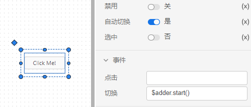
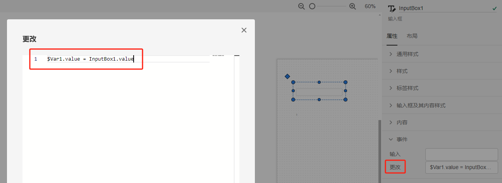
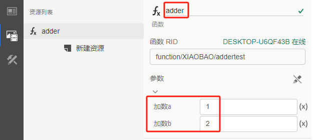
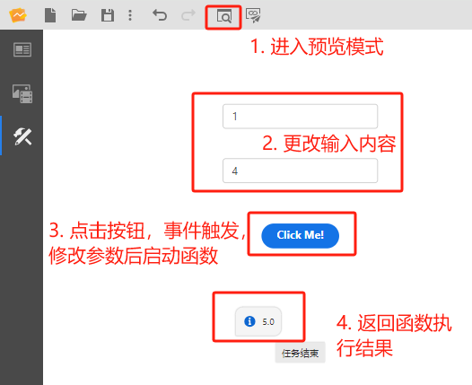

本节介绍 AppStudio 的事件触发机制。

## 功能定义

事件是指控件支持的可交互操作，AppStudio 的 INPUT、CONTENT、ACTION 类控件支持输入、点击、更改、切换等事件，当这些事件触发后，开始执行事件属性栏内的表达式，实现控件赋值、回调资源数据等功能。

## 功能说明

### 事件类型

### 输入

输入框控件支持的事件类型，当用户进行输入操作时就会触发的事件，只要在输入框内输入了内容，就会触发，开始执行事件属性栏里的表达式。

### 更改

INPUT 类型控件支持的事件类型，当内容更改，并且控件失去焦点后触发的事件，例如选择器的更改事件，当选项更改并且焦点移除后（或按 Enter键），就会触发，开始执行事件属性栏里的表达式。

### 点击

ACTION 类型控件支持的事件类型，当用户点击控件时就会触发的事件，例如按钮的点击事件，当点击按钮后，就会触发，开始执行事件属性栏里的表达式。

### 切换

操作按钮控件支持的事件类型，当操作按钮选中状态发送变化后触发的事件，使用时要开启自动切换。

### 利用事件触发机制实现的功能

#### 控件赋值

在事件属性栏内输入给控件属性赋值的表达式，控件的样式、内容、事件属性都可以通过表达式来赋值。

例如，通过更改输入框的值，实现 MarkDown 文本框值的更新。

首先，在场景标签页中的控件列表中选择一个输入框控件和一个 MarkDown 文本框控件放置到场景中，并分别命名为 `InputBox1` 和`MarkDownBox1`；

然后，在输入框的更改事件属性栏中输入`MarkDownBox1.srcdoc = InputBox1.value`的表达式，表示更改事件触发后将输入框的当前值赋给 MarkDown 文本框；

最后，进入预览模式，在输入框中输入内容，当输入内容更改后， MarkDown 文本框的内容也相应发生变化。

#### 变量资源赋值 

- 修改变量资源值
  
在事件属性栏内输入修改变量资源值的表达式。

例如，通过更改输入框的值，实现变量资源的更新。

首先，在资源标签中添加一个名为`Var1`值为 `1` 的变量资源;

然后，在场景标签页中的控件列表中选择一个输入框控件和一个 MarkDown 文本框控件放置到场景中，并分别命名为 `InputBox1` 和`MarkDownBox1`；

接着，在 MarkDown 文本框的值属性栏中输入`MarkDownBox1.scrdoc = $Var1.value`的表达式，表示将变量资源当前值赋给 MarkDown 文本框；

并且，在输入框的更改事件属性栏中输入`$Var1.value = InputBox1.value`的表达式，表示更改事件触发后将输入框的当前值赋给变量资源；

最后，进入预览模式，在输入框中输入内容，当输入内容更改后， 变量资源的值发生变化导致MarkDown 文本框的内容也相应发生变化。

#### 函数资源回调 

- 启动或结束函数资源
  
在事件属性栏内修改函数资源输入参数的表达式。

`$函数名称.start()`→启动函数任务

`$函数名称.terminate()`→终止函数任务

- 函数资源参数方案赋值
  
在事件属性栏内修改函数资源输入参数的表达式。

例如，通过更改输入框的值，修改函数资源的参数方案并启动函数。

首先，在资源标签中添加一个名为`adder`有两个输入参数键为`a`和`b`的加法函数资源;

然后，在场景标签页中的控件列表中选择两个输入框控件，并分别命名为 `InputBox1` 和`InputBox2`，同时添加一个按钮控件和一个运行结果控件，在运行结果控件的**结果ID**属性中输入`$adder.job.id`的表达式，用于展示函数资源的输出结果。

接着，按钮的**点击**事件属性栏中依次输入`$adder.args.a = InputBox1.value`、`$adder.args.b = InputBox2.value`和`$adder.start()`这三个表达式；表示点击事件触发后将输入框的当前值赋给函数资源的输入参数，然后启动函数；

:::info

事件属性栏支持输入多条表达式，表达式之间用分号隔开。

:::

最后，进入预览模式，在输入框中输入内容，当输入内容更改后， 函数的输参数发生变化，点击按钮后启动函数，运行结果控件中会返回当前参数下函数的执行结果。

## 常见问题

事件属性中的多条表达式同时执行的吗？

:  不是，是按先后顺序依次执行的。