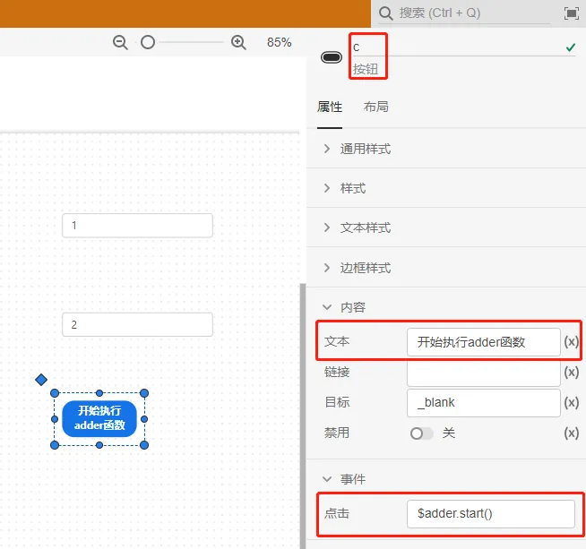
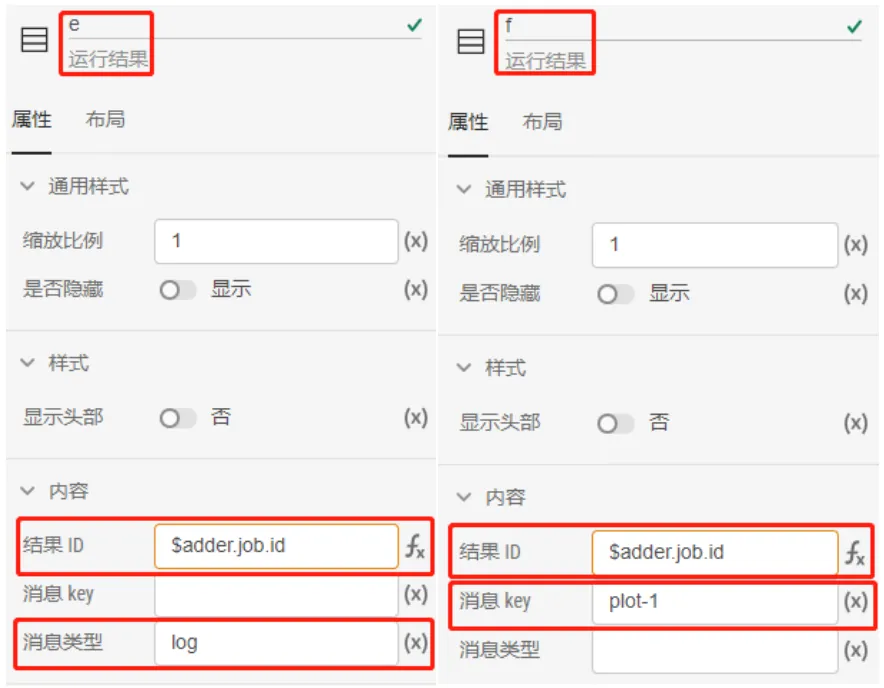

本节主要介绍在AppStudio的搭建简单应用舞台的过程。以一个加法器应用为例。

利用 FuncStudio 的资源函数来实现加法器应用场景的搭建，首先新建一个 AppStudio 空白项目。

## 创建函数

在 FuncStudio 创建一个加法器函数，创建方法详见[FuncStudio入门案例](../../../funcstudio/guide/rumen/index.md)的介绍。

## 添加函数资源

点击左侧的**资源**按钮，进入**资源**标签页，在资源创建区点击**新建资源**，选择**函数**。

选中该函数，给函数命名为**adder**，并在**函数 RID**栏中输入上述在 FuncStudio 上创建一个加法器函数的 RID，输入正确的话会被自动识别出并加载该函数的参数列表。

:::tip

在AppStudio中使用FuncStudio函数时需要保证该函数的执行器在线。

:::

## 搭建场景

放置两个**输入框**控件，分别命名为**a**和**b**，默认值设置为**1**和**2**，并在**事件**/**更改**属性栏内分别输入**$adder.args.a=a.value**和**$adder.args.b=b.value**的表达式，添加一个当输入框值变更时触发的事件，对函数资源的参数进行赋值，即通过更改输入框的值对函数资源的两个参数进行赋值。其中**$adder.args.a**表示**资源**标签页中函数资源**adder**的参数**a**的键；**a.value**表示**场景**标签页中输入框控件**a**的值。

接着放置一个**按钮**元素，命名为**c**，在**内容**/**文本**栏内输入提示，并在**事件**/**点击**栏内输入**$adder.start()**的表达式，添加一个点击按钮时触发的事件，即通过点击该按钮对函数资源进行操作。其中**$adder.start()**表示开始执行**adder**函数。

进一步放置一个 **MarkDown 文本框**控件，命名为**d**，在**d**的**值**栏内输入**$adder.status**的表达式，来获取**adder**函数的运行状态。

此外，在控件列表区选择两个**运行结果**控件，命名为**e**和**f**，在**内容**/**结果ID**栏内都输入**$adder.job.id**的表达式，将其绑定为**adder**函数的任务id；不同的是在运行结果**e**的**内容**/**消息类型**栏内输入**log**，让运行结果**e**仅识别并显示type为**log**的运行结果（也就是message函数的结果）；在运行结果**f**的**内容**/**消息key**栏内输入**plot-1**，让运行结果**g**仅识别并显示key为**plot-1**的运行结果。

### 效果预览

在搭建好上述舞台场景后，点击工具栏的**预览**快捷按钮，在预览模式下点击按钮，开始执行函数，在MarkDown文本框和运行结果中即可看到相应的计算结果，并且可以通过修改输入框的值来多次执行函数，查看运行结果的变化情况。

