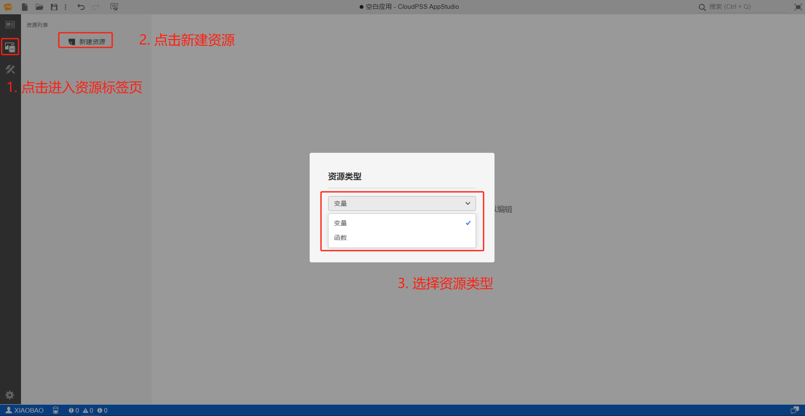

本节介绍 AppStudio 工作台功能区第二个资源标签页的功能。

## 功能定义

资源标签页用于添加构建应用时需要使用的资源，包括静态资源和函数资源。

## 页面功能

### 新建资源

首先在资源创建区点击**新建资源**按钮；然后在资源类型对话框中选择新建的资源类型，可以添加两种资源，一种为静态变量资源，一种为 FuncStudio 中的函数资源；选择好资源类型后，点击确定添加相应的资源。

<!--  -->

### 配置资源

点击创建好的资源，可以对该资源的名称、值、函数 RID 等信息进行配置。

#### 变量资源配置

变量资源作为全局变量在场景标签页的控件属性中被引用，用户可以配置变量名称和变量的值。

<!--  -->

:::warning

采用`$变量名称.value`形式的表达式对变量的值进行引用和修改。

<!--  -->

:::

#### 函数资源配置

函数资源配置主要用于给应用添加 FuncStudio 中的函数项目，方便用户将函数的输入输出数据与 AppStudio 交互面板上的控件数据和事件绑定，调用函数资源获取计算结果。

用户可以配置函数名称并选择需要绑定的函数资源，选择好后会自动加载出该函数的在线状态和参数列表。除了可以选择自己的函数项目外，还可以选择当前平台中所有权限为可执行的函数。

<!--  -->

:::warning

- 只有在线的函数才能被调用，在线的函数能看到其执行位置的信息。

:::

#### 函数资源的引用

可采用如下表达式对函数资源进行操作：

- `$函数名称.value`获取函数运行后的结果

- `$函数名称.args`获取函数的输入参数

- `$函数名称.running`获取函数的运行状态

- `$函数名称.progress`发送函数执行进度

- `$函数名称.status`获取函数上次运行状态

- `$函数名称.job.id`获取函数当前执行任务的`id`

- `$函数名称.start()`开始执行函数

- `$函数名称.terminate()`终止函数的执行

