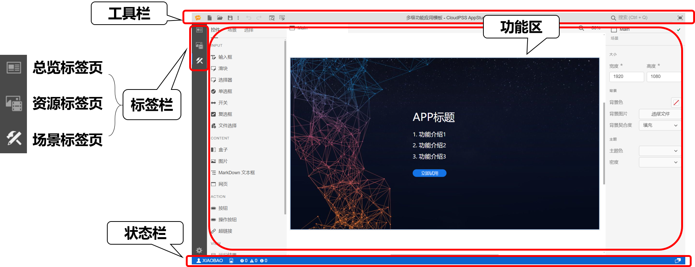
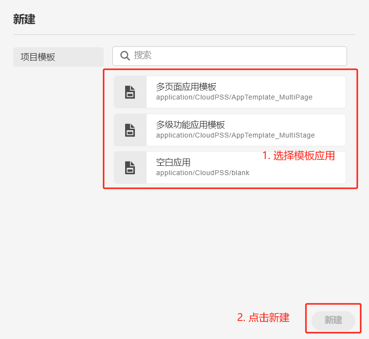
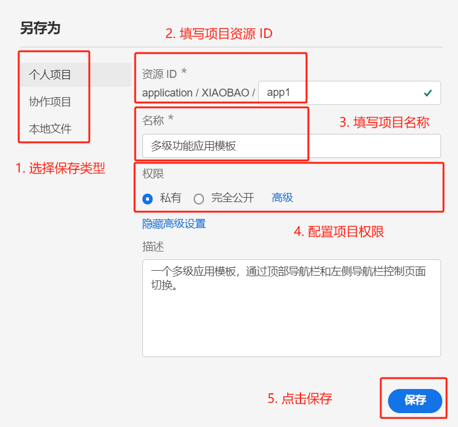

AppStudio 工作台和 FuncStudio、SimStudio 的布局基本类似，也分为四个个区域：上方的工具栏、左侧的标签栏、中间的功能区、以及下方的状态栏。其中标签栏用于切换功能区显示的标签页，包括总览、资源、场景三个标签页，本节主要介绍工具栏的功能。

<!--  -->

## 页面功能

工具栏包括 AppStudio 工作台的通用工具：新建、打开、保存、另存为、撤销、重做、搜索、全屏。以及特殊工具：场景标签页下的**预览**、**发布**工具。

## 功能说明

### 新建

点击工作栏左上侧**新建**按钮，会弹出新建窗口，用户可以选择已有应用模板，点击**新建**进行场景搭建，也可以点击窗口外任意空白处关闭该窗口。

新建项目窗口中有 CloudPSS AppStudio 平台预置的应用模板，包含空白应用模板、多页面应用模板，多级功能应用模板，为用户搭建应用提供参考。

- 空白应用模板：需要用户自己搭建场景、添加资源和空间、配置输入输出面板；
- 多页面应用模板：提供了一个多页面的基础应用模板，可以通过顶部导航栏控制应用页面切换，用户可在此基础上自己继续搭建场景、添加资源和空间、配置输入输出面板；
- 多级功能应用模板：提供了一个多级应用模板，可以通过顶部导航栏和左侧导航栏控制应用页面切换，用户可在此基础上自己继续搭建场景、添加资源和空间、配置输入输出面板。

<!--  -->

### 打开

点击工作栏左上侧**打开**按钮，会弹出打开窗口，用户可分别从**个人仿真**、**协作项目**、**仿真广场**以及**本地文件**打开所需的应用项目。

<!--  -->

:::info

**个人仿真**是用户创建和保存在云空间的个人私有仿真项目。

**协作项目**是组织内合作的项目。

**仿真广场**中存储的是所有用户保存在云空间且选择公开的仿真项目。

**本地文件**是用户保存在本地设备的仿真项目文件，通过拖放文件或点击文件选择对话框选择文件，然后打开仿真项目。

:::

### 保存/另存为

点击工作栏左上侧**保存**按钮、或右边**更多**弹出的**另存为**按钮后，会弹出另存为窗口，选择保存为云空间的**个人项目**、**协作项目**、或者**本地文件**。选择保存在云空间中，须填入资源 ID 和名称，权限、描述选填，点击保存按钮即可实现项目文件的保存。

<!--  -->

:::warning

项目权限选择**私有**，项目将会保存在个人仿真中，仅自己可见。

项目权限选择**完全公开**，项目会同步到仿真广场中，所有用户可见。

:::

关于**高级权限**配置详见[高级权限配置](../../center/index.md)。

### 撤销/重

点击工作栏左上侧**撤销**按钮，撤回上一步操作。

点击工作栏左上侧**重做**按钮，返回上一步操作。

### 预览

当功能区切换到**场景标签页**时，工具栏会出现**预览**工具，点击预览按钮，应用会从编辑模式进入预览模式，在预览模式中用户可以对所构建的应用界面、数据绑定关系和数据可视化效果进行调试。

<!--  -->

### 发布

当功能区切换到**场景标签页**时，工具栏会出现**发布**工具，点击发布按钮，会将项目发布为一个`Web`端的应用，用户点击右下角的发布成功提示栏或在浏览器地址栏中粘贴复制好的链接，即可打开应用。

<!--  -->

:::info
一般的，首先需要保证应用在预览模式下调试通过，然后再将应用发布。
:::

### 全屏

点击工作栏右上角的**全屏**按钮，AppStudio 工作台将进入全屏模式，全屏模式下再次点击该按钮将退出全屏。

:::info

在预览模式或发布的应用中也可使用全屏功能。

:::

