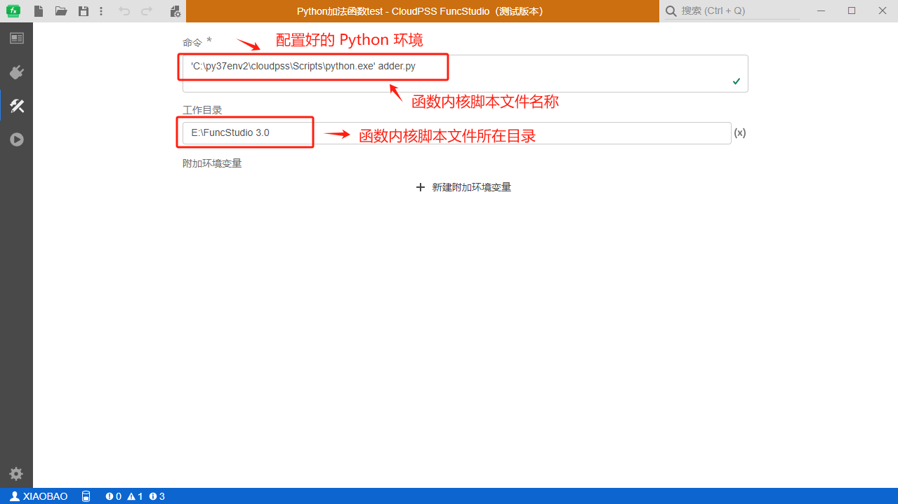

FuncStudio 目前支持以下两种函数内核接入方式：

- 对于用户在自己本地计算资源（个人电脑）上开发和执行的自定义算法内核，提供本地执行、远程调用的接入方式；

- 对于用户自己开发但希望在 CloudPSS 云端服务器中执行的算法内核，提供云端执行、云端调用的接入方式。

本节主要介绍本地执行、远程调用的内核接入方式。

## 主要用途

将用户在自己本地计算资源（个人电脑）上开发和执行的自定义算法内核接入 FuncStudio 本地执行器，目前支持 Python 和Matlab 语言编写的算法内核接入。

## 函数内核的接入流程

### 自定义算法内核的封装

首先，需要借助 FuncStudio-SDK 给用户自定义算法内核**封装输入输出接口**，使其能够获取 FuncStudio 的参数方案并能将计算结果在 FuncStudio 的结果标签页中显示。

import Tabs from '@theme/Tabs';
import TabItem from '@theme/TabItem';

<Tabs>
<!-- 分割线------ -->
<TabItem value="python" label="Python 内核">

####  1. 获取参数方案

新建一个 Python 脚本，写入如下获取参数方案的代码：

- 导入 CloudPSS-SDK 的包
  
```py showLineNumbers
import cloudpss
```

- 通过`cloudpss.currentJob()`类来获取函数任务实例
  
```py showLineNumbers
import cloudpss
if __name__ == '__main__': 
    job = cloudpss.currentJob() #获取函数在当前参数方案下的计算任务实例
```
:::info

在 2023 年 3.31 号更新的 SDK 里面，我们在 CloudPSS 命名空间下新增加`cloudpss.currentJob()`方法，来代替之前版本的`cloudpss.function.currentJob()`方法获取当前的任务实例，目前这两个接口都可以用。

:::

- 利用 args 方法获取当前任务的参数方案
  
```py showLineNumbers
import cloudpss  #导入安装好的CloudPSS-SDK
if __name__ == '__main__': 
    job = cloudpss.currentJob() #获取函数在当前参数方案下的计算任务实例
    a = job.args.a #利用 SDK 提供的 args 方法获取键为 a 的参数在当前方案下的值
    b = job.args.b #获取键为 b 在当前参数方案下的值
```

####  2. 接入自定义算法内核

获取参数方案后，在上述代码后面接入自己的算法内核，将这些参数值传入自定义算法内核，参与计算，例如加法函数的算法程序就是简单的计算 a+b 两个加数的和。

```py showLineNumbers
import cloudpss  #导入安装好的CloudPSS-SDK
if __name__ == '__main__': 
    job = cloudpss.currentJob() #获取函数在当前参数方案下的计算任务实例
    a = job.args.a #利用 SDK 提供的 args 方法获取键为 a 的参数在当前方案下的值
    b = job.args.b #获取键为 b 在当前参数方案下的值
    c = a + b # 接入用户编写的自定义算法内核
```

####  3. 格式化输出计算结果

自定义算法内核计算出结果后，添加格式化输出计算结果的代码，将结果发送到 FuncStudio 运行标签页的结果栏中显示。

目前 FuncStudio SDK 提供了 log、plot、table 三种计算结果的格式化输出方法，详见[函数结果格式化输出](../result/index.md)。

例如：在加法函数中，我们希望输出两个加数相加后的结果 c，可以使用 log 方法。

```py showLineNumbers
import cloudpss  #导入安装好的CloudPSS-SDK
if __name__ == '__main__': 
    job = cloudpss.currentJob() #获取函数在当前参数方案下的计算任务实例
    a = job.args.a #利用 SDK 提供的 args 方法获取键为 a 的参数在当前方案下的值
    b = job.args.b #获取键为 b 在当前参数方案下的值
    c = a + b # 接入用户编写的自定义算法内核
    job.log(c) #利用 SDK 提供的 log 方法向 FuncStudio 发送文本结果
```

</TabItem>
<!-- 分割线------ -->
<TabItem value="matlab" label="Matlab 内核">

####  1. 获取参数方案

新建一个 Matlab 脚本，写入如下获取参数方案的代码：

- 同步环境变量，导入 CloudPSS-SDK 的包
  
```matlab showLineNumbers
cloudpss.utils.syncenv; %同步环境变量
cloudpssMod = py.importlib.import_module('cloudpss'); %加载 CloudPSS-SDK
```

- 通过`cloudpss.currentJob()`类来获取函数任务实例；
  
```matlab showLineNumbers
cloudpss.utils.syncenv; %同步环境变量
cloudpssMod = py.importlib.import_module('cloudpss'); %加载 CloudPSS-SDK
job = cloudpssMod.currentJob(); %获取函数在当前参数方案下的计算任务实例
```

:::info

在 2023 年 3.31 号更新的 SDK 里面，我们在 CloudPSS 命名空间下新增加`cloudpss.currentJob()`方法，来代替之前版本的`cloudpss.function.currentJob()`方法获取当前的任务实例，目前这两个接口都可以用。

:::

- 利用 args 方法获取当前任务的参数方案
  
```matlab showLineNumbers
cloudpss.utils.syncenv; %同步环境变量
cloudpssMod = py.importlib.import_module('cloudpss'); %加载 CloudPSS-SDK
job = cloudpssMod.currentJob(); %获取函数在当前参数方案下的计算任务实例
a = job.args{'a'}; %利用 SDK 提供的 args 方法根据键名获取乘数 a 在当前参数方案下的值
b = job.args{'b'}; %获取乘数 b 在当前参数方案下的值
a = cloudpss.utils.loadpydata(a); %使用 CloudPSS 提供的工具将 Python 数据格式转换为 Matlab 数据格式
b = cloudpss.utils.loadpydata(b); %使用 CloudPSS 提供的工具将 Python 数据格式转换为 Matlab 数据格式
```
:::warning

args 方法获取的参数是 Python 格式的数据，不能直接用于自己的 Matlab 算法，需要使用 cloudpss 提供的**loadpydata**方法转换为 Matlab 的数据格式。

:::

####  2. 接入自定义算法内核

获取参数方案后，在上述代码后面接入自己的算法内核，将这些参数值传入自定义算法内核，参与计算，例如乘法函数的算法程序就是简单的计算 a+b 两个加数的和。

```matlab title="product.m" showLineNumbers
cloudpss.utils.syncenv; %同步环境变量
cloudpssMod = py.importlib.import_module('cloudpss'); %加载 CloudPSS-SDK
job = cloudpssMod.currentJob(); %获取函数在当前参数方案下的计算任务实例
a = job.args{'a'}; %利用 SDK 提供的 args 方法根据键名获取乘数 a 在当前参数方案下的值
b = job.args{'b'}; %获取乘数 b 在当前参数方案下的值
a = cloudpss.utils.loadpydata(a); %使用 CloudPSS 提供的工具将 Python 数据格式转换为 Matlab 数据格式
b = cloudpss.utils.loadpydata(b); %使用 CloudPSS 提供的工具将 Python 数据格式转换为 Matlab 数据格式
c= a*b; %接入用户编写的自定义算法内核
```
####  3. 格式化输出计算结果

自定义算法内核计算出结果后，可以通过 FuncStudio 提供的格式化输出方法将结果发送到运行标签页的结果栏中显示。

目前 FuncStudio SDK 提供了 log、plot、table 三种计算结果的格式化输出方法，详见[函数结果格式化输出](../result/index.md)

例如：在乘法函数中，我们希望输出两个加数相加后的结果 c，可以使用 log 方法

```matlab title="product.m" showLineNumbers
cloudpss.utils.syncenv; %同步环境变量
cloudpssMod = py.importlib.import_module('cloudpss'); %加载 CloudPSS-SDK
job = cloudpssMod.currentJob(); %获取函数在当前参数方案下的计算任务实例
a = job.args{'a'}; %利用 SDK 提供的 args 方法根据键名获取乘数 a 在当前参数方案下的值
b = job.args{'b'}; %获取乘数 b 在当前参数方案下的值
a = cloudpss.utils.loadpydata(a); %使用 CloudPSS 提供的工具将 Python 数据格式转换为 Matlab 数据格式
b = cloudpss.utils.loadpydata(b); %使用 CloudPSS 提供的工具将 Python 数据格式转换为 Matlab 数据格式
c= a*b; %接入用户编写的自定义算法内核
job.log(c,'info','false','log-1') %利用 SDK 提供的 log 方法向 FuncStudio 发送文本结果
```

:::warning
Matlab 语法里，要给 log 方法添加 key 参数的时候，前面的 level 参数、html 参数都不能省略，位置也不能变动，此时可以使用这些参数的默认值来占位。
:::

</TabItem>
</Tabs>

### 配置函数内核在本地执行命令行语句

保存上述接入用户自定义算法内核的脚本文件，在执行器实现标签页的命令窗口中输入执行该文件的**命令行语句**，在工作目录中输入该文件所在的目录，即可完成内核的接入。

<Tabs>
<TabItem value="py" label="Python 内核">



</TabItem>
<TabItem value="Matlab" label="Matlab 内核">


</TabItem>
</Tabs>

