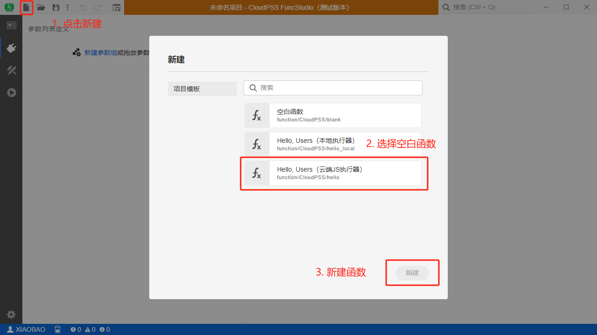
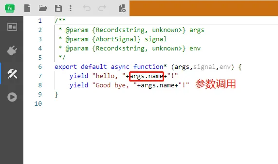

除了将在本地计算执行的内核接入 FuncStudio 外，还可以将用户自己开发的代码提交到 CloudPSS 云端服务器，使用服务器的资源执行自己的代码。

我们称之为云端：JavaScripts 模块实现类型的函数，实现目前只支持接入执行**JavaScript**。

本节以一个简单的入门案例介绍如何将用户自己开发的 JavaScript 代码接入 FuncStudio。

### 创建函数项目

首先打开下载好的 FuncStudio 本地执行器，或者进入网页版 FuncStudio 的工作台，点击新建**云端JS执行器**，创建一个空白的云端：JavaScripts 模块实现类型的函数项目。



### 定义函数输入参数

在**接口**标签页配置函数的参数列表，即定义函数输入参数。

例如，点击**新建参数组**，新建一个参数组；接着点击**新建参数**，在该参数组内添加一个**Name**参数，如下图所示。


:::warning
参数的键是必须配置的，且是唯一的。
:::

### 实现函数内核

在**实现标签页面**的代码编辑区中编写代码，例如：

```JavaScript
 /**
 * @param {Record<string, unknown>} args
 * @param {AbortSignal} signal
 * @param {Record<string, unknown>} env
 */
export default async function* (args,signal,env) {
    yield "hello, "+args.name+"!" // #利用 SDK 提供的 args 方法根据键名获取输入参数在当前参数方案下的值
    yield "Good bye, "+args.name+"!"
}  
```



### 函数执行

保存项目后，在运行标签页点击启动任务，函数执行结果如下所示：

