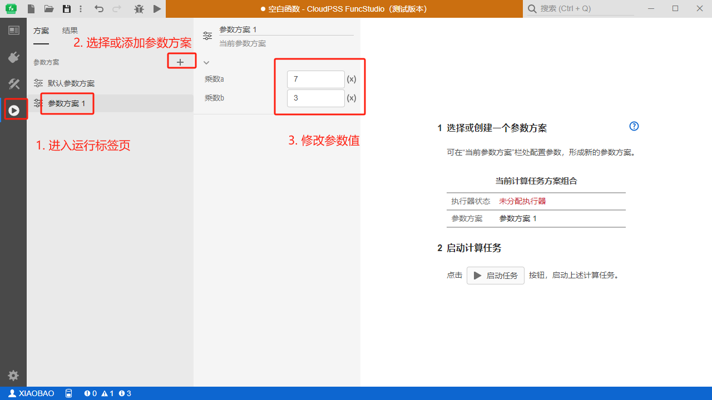
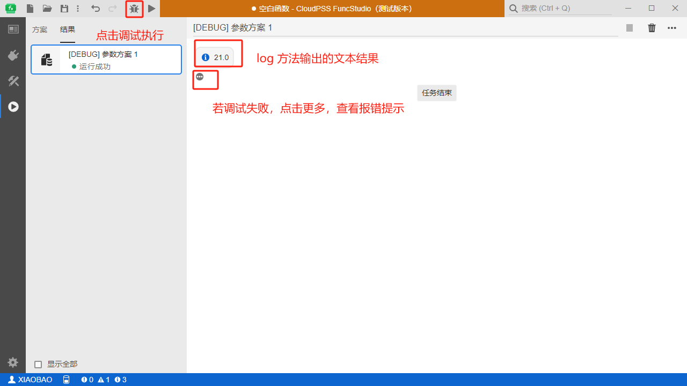
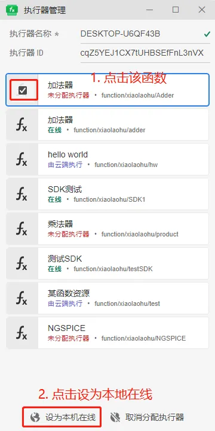
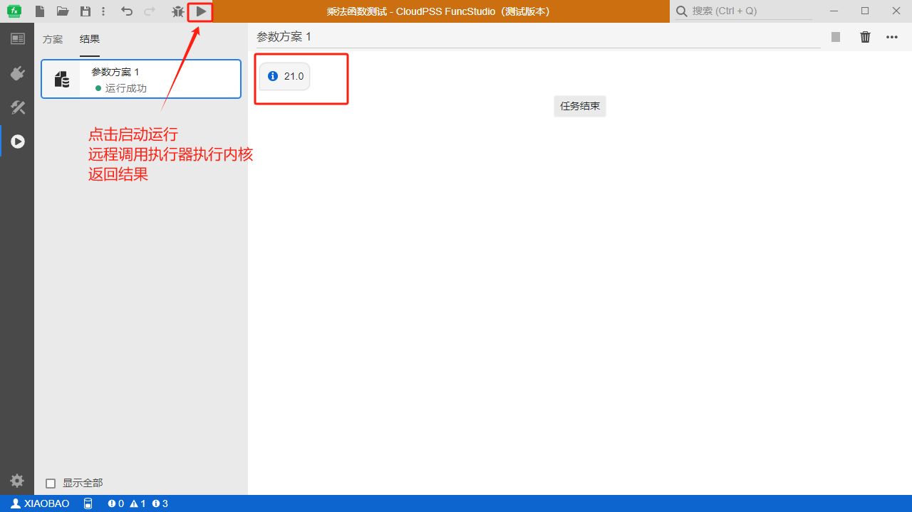

本节以一个简单的入门案例介绍如何将用户在自己本地计算资源上开发和执行的**Matlab**算法内核接入执行器。

### 创建函数项目

首先打开下载好的 FuncStudio 本地执行器，点击**新建空白项目**，创建一个空白函数项目。


### 定义函数输入参数

在**接口**标签页配置函数的参数列表，即定义函数输入参数。以一个简单**乘法器内核**为例，输入参数可简单抽象为两个参数：**乘数 a 和 b**，现在我们就需要将这两个参数在列表中定义。

具体的，点击**新建参数组**，新建一个名称为**乘法参数组**的参数组；接着点击**新建参数**，在该参数组内添加两个表示**乘数 a**、**乘数 b**的参数，如下图所示。


:::warning
- 参数的键是必须配置的，且是唯一的。
:::

### 实现函数内核

在完成函数的输入参数配置后，需要借助 FuncStudio-SDK 给算法程序封装输入输出接口后，接入执行器。

#### 配置 Matlab 环境

首先，需要在本地计算资源中配置 Matlab 环境来安装 CloudPSS-SDK，详见[Matlab 环境配置](../../../envir/matlab/index.md)。

#### 给算法程序封装输入输出接口

安装好 SDK 后，需要利用 SDK 给用户自定义的算法函数封装输入输出接口，即获取函数输入参数值以及格式化输出计算结果。

以一个乘法程序为例，封装之后形成了一个可接入 FuncStudio 的函数内核，名为 product.m 的 Matlab 文件。

具体代码如下所示：

```matlab title="product.m" showLineNumbers
cloudpss.utils.syncenv; %同步环境变量
cloudpssMod = py.importlib.import_module('cloudpss'); %加载 CloudPSS-SDK
job = cloudpssMod.currentJob(); %获取函数在当前参数方案下的计算任务实例
a = job.args{'a'}; %利用 SDK 提供的 args 方法根据键名获取乘数 a 在当前参数方案下的值
b = job.args{'b'}; %获取乘数 b 在当前参数方案下的值
a = cloudpss.utils.loadpydata(a); %使用 CloudPSS 提供的工具将 Python 数据格式转换为 Matlab 数据格式
b = cloudpss.utils.loadpydata(b); %使用 CloudPSS 提供的工具将 Python 数据格式转换为 Matlab 数据格式
c= a*b; %乘法程序（用户自定义的算法）
job.log(c,'info','false','log-1') %利用 SDK 提供的 log 方法向 FuncStudio 发送文本结果
```

#### 指定内核在本地执行的命令行语句

以上两个准备工作完成后，就可以在执行器中指定内核在本地执行的命令行语句。

具体的，在执行器实现标签页面的命令窗口内输入执行 product.m 文件的命令，在工作目录内指定 product.m 文件所在的本地目录，同时也是 Matlab-SDK 所在的目录。

执行语句格式固定为：

**'指定的执行算法内核的虚拟 Python 环境' + 空格 + run.py + 空格 + "Matlab 内核文件名称"**

即用指定的 Python 环境执行 Matlab-SDK 中的 run.py 文件，用 run.py 文件启动 Matlab 来执行内核。


### 配置 Matlab 实例

指定好内核在本地执行的命令行语句后，还需要配置一个可以执行 Matlab 内核的实例，这样做的好处在于：

能够使用当前启动的 Matlab 实例运行由执行器下发的任务，来消除每次下发任务后需要重新启动 Matlab 的耗时，并具备断点调试功能。

具体的，打开 Matlab ，在命令窗口内运行 ** matlab.engine.shareEngine ** 命令，就可以将当前打开的 Matlab 配置为执行脚本文件的实例。

接着可以通过运行 **matlab.engine.isEngineShared** 命令，来查看当前Matlab实例是否已经共享，


最后，将打开的 Matlab 的工作目录切换到product.m文件所在目录。

:::tip
- 需要注意的是，在运行 matlab.engine.shareEngine 后，即使我们关闭了当前的 Matlab 实例，也可以在执行器内调用这个matlab实例执行计算内核；

- 关闭 Matlab 后会增加一段启动 Matlab 的时间，因此实际操作中不建议关闭 Matlab。
:::

### 调试函数

走完以上步骤后，即可在执行器中对函数内核进行调试执行了。

具体的，进入**运行标签页**，添加多个参数方案，



通过修改参数，对函数内核进行调试执行，可以点击`···`号查看更多的调试信息（提示/报错），调试执行只在FuncStudio本地执行器里有，网页版没有。



### 保存函数

调试完成后即可对函数进行远程调用，在远程调用之前需要把函数集成到 CloudPSS 云服务框架中。

点击工具栏的保存按钮，输入函数资源 ID 和函数名称将该函数保存到个人中心。如下图所示：


### 配置执行器

在远程调用之前还需要对函数的执行器进行配置。右击系统状态栏中 FuncStudio 执行器的小图标，选择菜单中的执行器管理打开执行器管理界面。


对于刚保存的在本地执行的函数当前状态为'未分配执行器'，需要手动选中后设置为**设为本机在线**。



### 远程调用函数

选择一个配置好参数方案，点击工具栏的**启动任务**按钮，在该参数方案下远程调用函数，得到相应的输出结果。

此时，用户也可在网页版 FuncStudio 中点击**启动任务**来远程调用执行器执行该函数获取计算结果。

