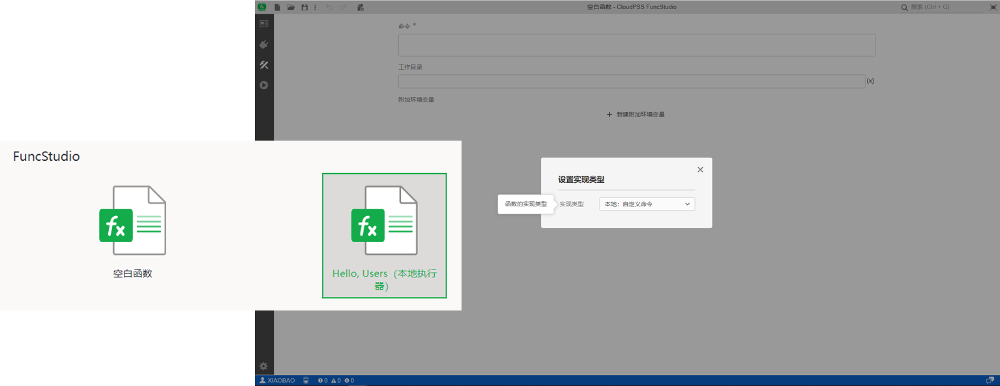
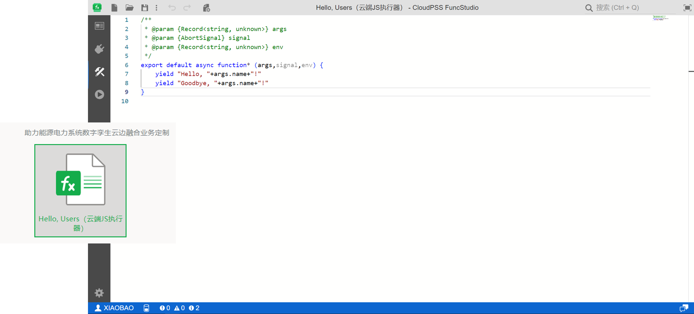
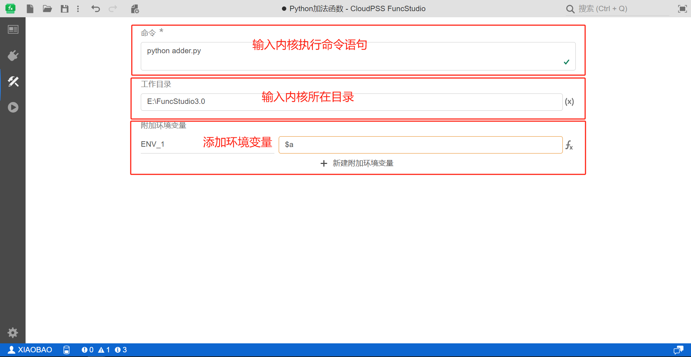

本节介绍功能区第三个实现标签页的使用方法。

## 页面功能

实现标签页用于配置函数内核的实现方式，不同实现类型的函数项目有不同的实现标签页。FuncStudio 目前提供有**云端：JavaScript 模块**和**本地：自定义命令**两种实现方式。用户可以在新建项目的时候选择不同实现类型的项目。空白函数项目和本地执行器项目的实现类型是**本地：自定义命令**。

云端 JS 执行器项目的实现类型是**云端：JavaScript 模块**，用户也可以在云端 JS 执行器项目实现标签页下点击工具栏的**更改实现类型**按钮，将实现类型切换为**本地：自定义命令**。

## 功能说明

### 云端：JavaScript 模块

对于**云端：JavaScript 模块**类型的云端 JS 执行器项目，实现标签页为 JS 代码编辑区，用于接入云端执行代码。

用户只需在代码编辑区中接入内核代码，FuncStudio 会将代码提交到 CloudPSS 云端服务器，使用云端服务器资源运行代码，该实现类型目前只支持JavaScript 代码。

详见[云端JavaScript 模块帮助](../design/cloud/index.md)。

### 本地：自定义命令

对于**本地：自定义命令**类型的本地执行器项目，实现标签页用于指定本地内核的命令行执行语句,由三部分组成上面的**命令行输入窗口**、下面的**工作目录输入窗口**，以及**附加环境变量添加区**。

用户只需在命令窗口输入执行内核的命令行语句，在工作目录输入内核所在的目录，如有需要还可以添加内核的附加环境变量，FuncStudio 本地执行器会在本地执行内核。

详见[本地自定义命令帮助](../design/local/index.md)。

