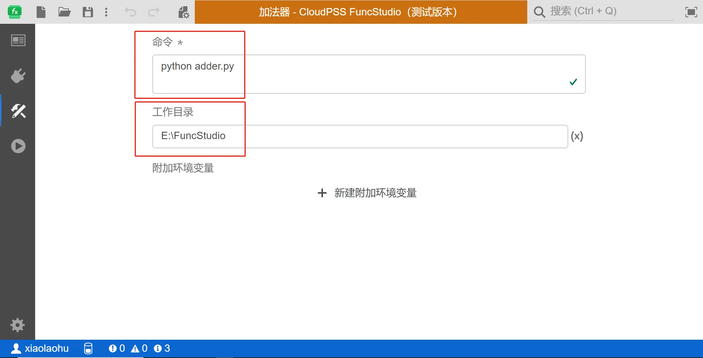

本节主要介绍如何在本地实现函数的算法内核，即如何编写函数的算法内核、函数算法内核如何获取配置好的外部接口参数以及如何格式化输出函数的计算结果。


由两部分组成：上面的命令行输入窗口和下面的工作目录输入窗口。

在**本地：自定义命令**实现页面的**命令窗口**内输入执行本地内核文件的命令，在**工作目录**内指定本地内核文件所在的目录。

### Python 内核的本地实现格式

执行语句的标准格式为：

**'指定执行计算内核的python环境' + 空格 + 需要接入的计算内核的文件名称**

:::tip

- 若本地只有一个 python 环境，确认安装好 SDK 后，在命令窗口内直接输入 python XXX.py 即可执行该函数；

- 若本地有多个 python 环境，则需要指定安装有 SDK 的 python 环境来执行。

:::





### Matlab 内核的本地实现格式

需要注意的是Matlab接口和Python接口的命令行执行语句在格式上是有所不同的，这是因为FuncStudio 接入 Matlab 计算内核的本质是在 Matlab 脚本中调用Python SDK。

因此在实现标签页的命令窗口内就要输入如下固定的执行语句格式，用指定的python地址执行run.py文件，用run.py文件启动Matlab来执行Matlab脚本。

**'指定执行计算内核的python环境' + 空格 + 需要接入的计算内核的文件名称**

:::tip

以执行乘法函数的计算内核为例，先指定之前新建的虚拟python环境 加 run.py，最后加上product这个需要执行的Matlab脚本名称。
工作目录就是我们存放product.m文件的位置，也就是matlab sdk 所在的位置。

:::


:::info
Funcstuio 为什么叫执行器，就是因为它是一个帮助用户在终端执行计算内核的工具

本质上相当于在本地打开命令窗口，执行以下命令:

```py
cd E:\FuncStudio
'C:\py37env1\cloudpss\Scripts\python.exe' adder.py
```

先cd 到计算内核所在的工作目录，再执行命令窗口里面的语句。
:::

