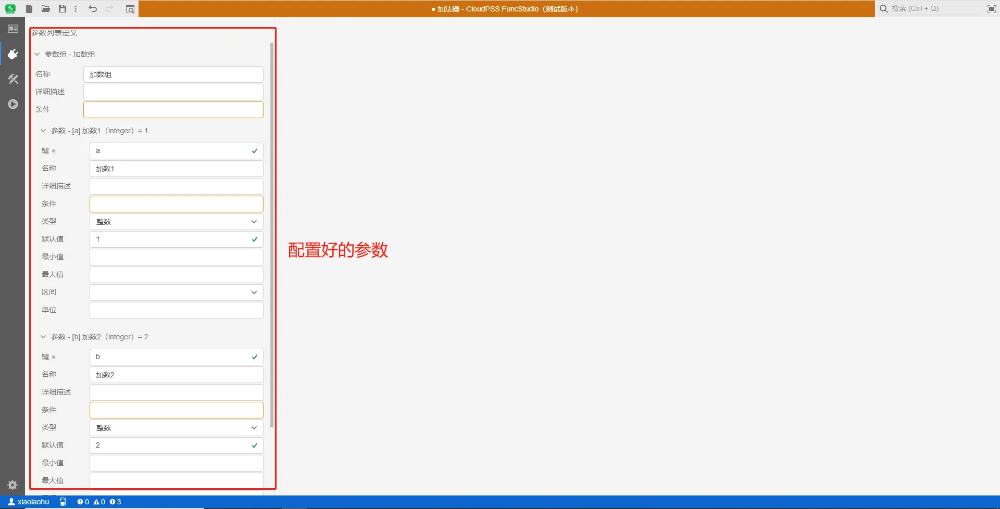
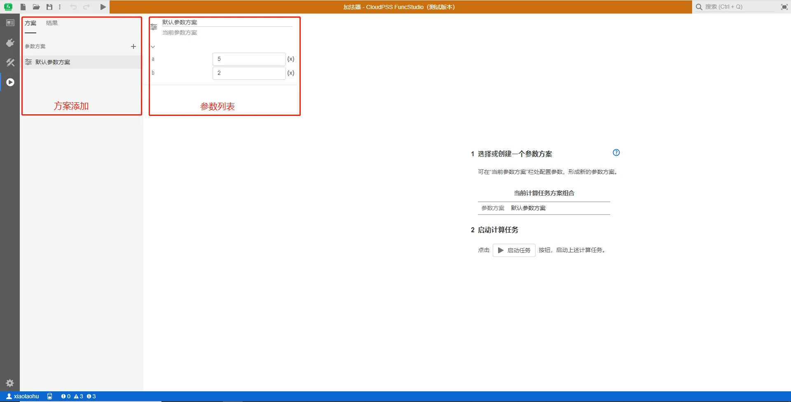
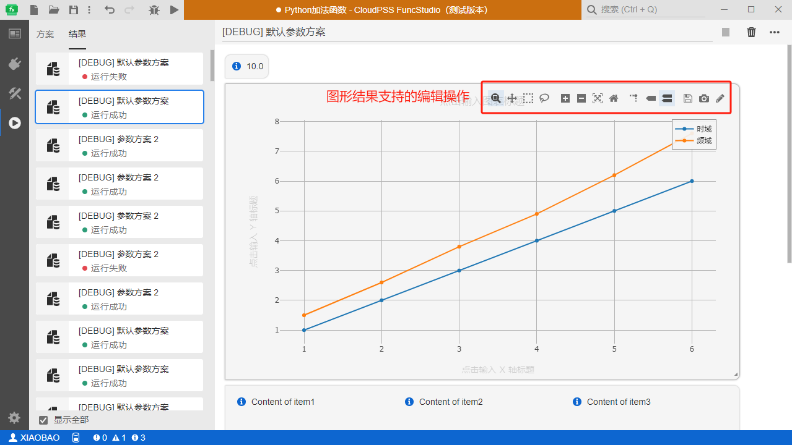

本节功能区第四个运行标签页的使用方法。

## 页面功能

当定义好函数的输入参数格式，指定好内核的命令行执行语句后，可在运行标签页对参数方案进行配置，并执行内核显示内核计算结果。运行标签页中拥有两个板块：方案板块与结果板块。

## 功能说明

### 方案

方案配置主要是参数方案配置，系统默认会添加一组参数方案。对于同一个项目，FuncStudio 支持配置多套参数方案，便于用户快速对比不同参数条件下的函数执行结果。
具体的，用户需要在**接口标签页**的参数列表内定义函数的输入参数。

此时**运行标签页参数方案**下的**默认参数方案**里面会将定义的参数列表显示出来，用户可以在这里面修改当前方案下的参数值，也可以点击`＋`添加新的参数方案，并配置方案名称。

未创建参数列表则无需进行参数配置，参数方案配置的具体使用方法详见[参数方案配置帮助](../../../../simstudio/basic/parameterCalculate/index.md)。

### 调试执行

点击工具栏的调试执行按钮，对当前参数方案下的函数内核在本地进行调试执行，相当于对程序`Debug`。详见[函数本地调试帮助](../../../basic/debug/index.md)。

:::info
仅在本地执行器中对本地实现类型的函数使用。
:::

### 启动任务

点击工具栏的启动任务按钮，会根据当前的参数方案远程调用函数内核，获取函数输出结果。详见[函数远程调用帮助](../../../basic/remote/index.md)。

:::info

启动任务功能网页版 FuncStudio 和FuncStudio 本地执行器里都有，对于云端代码实现类型的函数，仅有启动任务的功能。

一般的，对于本地实现类型的函数，首先需要再本地执行器里将内核调试成功，然后再**启动任务**远程调用函数的算法内核，获取函数输出结果。

:::

### 结果

对函数调试执行或启动任务后，可在**结果**页面查看函数输出结果。FuncStudio 对用户的每一次执行结果都进行存储，用户可在左侧输出结果列表中切换任务查看对应结果。右侧显示该函数的执行结果。

调试执行结果由调试信息、函数输出结果组成。通过点击 * 号查看更多的调试信息。调试的优点在于会把所有的信息都输出，包括结果、提示、警告和报错。

启动任务结果只有函数输出结果。

#### 显示全部

勾选**显示全部**后，会把用户在 FuncStudio 中执行过的所有函数输出结果都加载进来，包括调试执行和启动任务的结果。

#### 删除

用户通过右键点击仿真结果后可选择**删除**，来删除当前函数的输出结果。也可以点击左上角的**删除按钮**删除结果。

#### 导出结果

支持函数执行结的导出与导入功能，用户通过右键点击执行结果，选择**导出结果**，可将该执行结果导出为`cjob`格式的文件。

#### 导出为 ZIP 文件

点击左上角的`···`按钮，选择**导出为 ZIP 文件**，可将该执行结果导出为`ZIP`格式的文件，里面包括执行信息和输出结果数据文件。

#### 在新窗口中打开 

点击左上角的`···`按钮，选择**在新窗口中打开**，可以在新的窗口中打开执行结果。

#### 数据结果图形操作

FuncStudio 提供了多种数据类型的格式化输出方法，目前支持**消息类型**、**图形类型**、**表格类型**数据的输出，关于这些类型数据的格式化输出接口详见[FuncStudio SDK 帮助](../../../simstudio-sdk/index.md)。

对于图形类型的输出结果支持缩放、平移、重命名坐标轴名称、重命名标题名称、波形数据下载、波形图像下载、在`ChartStudio`中编辑等操作。

