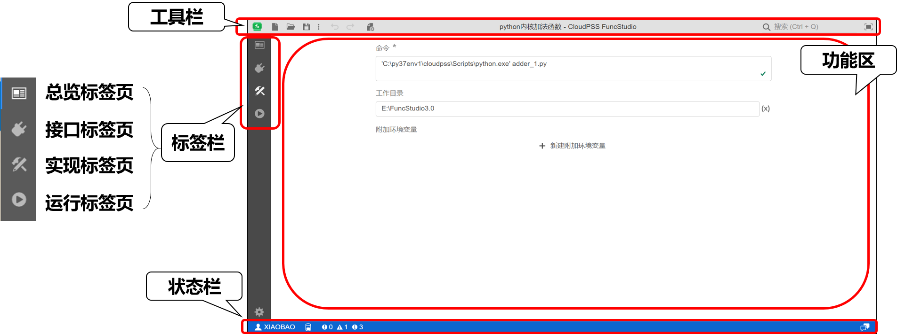
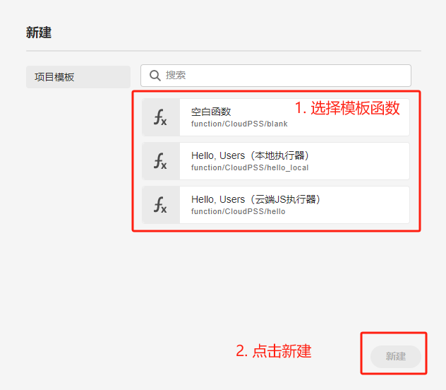
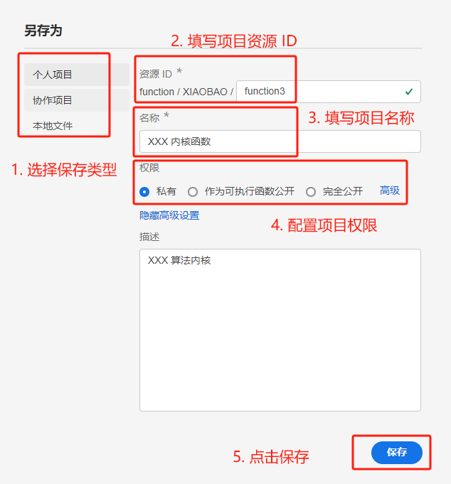
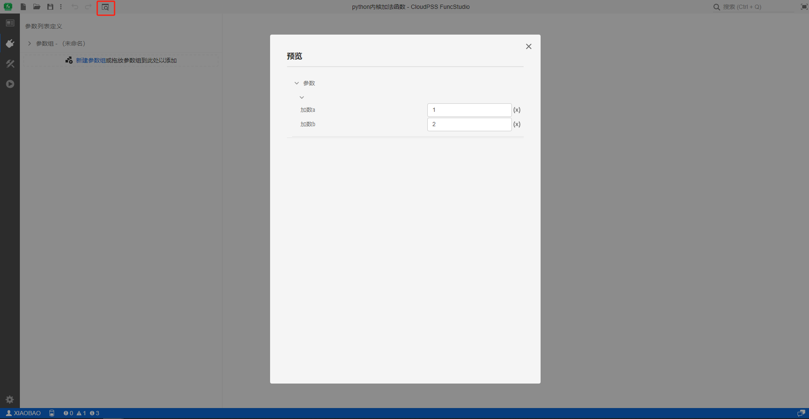
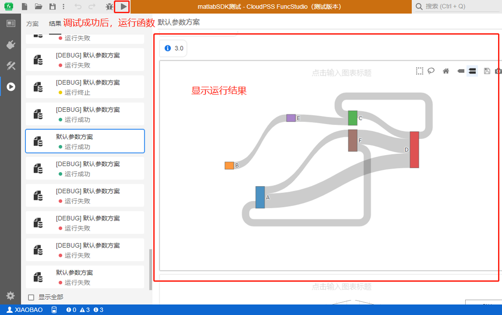

FuncStudio 工作台和 SimStudio 类似也分为四个个区域：上方的工具栏、左侧的标签栏、中间的功能区、以及下方的状态栏。其中标签栏用于切换功能区显示的标签页，包括总览、接口、实现、运行四个标签页，本节主要介绍工具栏的功能。

## 页面功能

工具栏包括 FuncStudio 工作台的通用工具：新建、打开、保存、另存为、撤销、重做、搜索、全屏。以及不同标签页下的特殊工具：接口标签页下的**预览**、实现标签页下的**更改实现类型**、运行标签页下的**调试执行**、**启动任务**等。

## 功能说明

### 新建

点击工作栏左上侧**新建**按钮，会弹出新建窗口，用户可以选择已有项目模板，点击**新建**进行搭建，也可以点击窗口外任意空白处关闭该窗口。

新建项目窗口中有 CloudPSS FuncStudio 平台预置的函数项目模板，包含空白函数模板、本地执行器模板、云端 JS 执行器模板，为用户搭建函数项目提供参考。

### 打开

点击工作栏左上侧**打开**按钮，会弹出打开窗口，用户可分别从**个人仿真**、**协作项目**、**仿真广场**以及**本地文件**打开所需的项目。

:::info

**个人仿真**是用户创建和保存在云空间的个人私有仿真项目。

**协作项目**是组织内合作的项目。

**仿真广场**中存储的是所有用户保存在云空间且选择公开的仿真项目。

**本地文件**是用户保存在本地设备的仿真项目文件，通过拖放文件或点击文件选择对话框选择文件，然后打开仿真项目。

:::

### 保存/另存为

点击工作栏左上侧**保存**按钮、或右边**更多**弹出的**另存为**按钮后，会弹出另存为窗口，选择保存为云空间的**个人项目**、**协作项目**、或者**本地文件**。选择保存在云空间中，须填入资源ID和名称，权限、描述选填，点击保存按钮即可实现项目文件的保存。

:::warning

项目权限选择**私有**，项目将会保存在个人仿真中，仅自己可见。

项目权限选择**完全公开**，项目会同步到仿真广场中，所有用户可见。

关于**高级权限**配置详见[高级权限配置](../../../../account/settings/sdk-token/index.md)。

:::

### 撤销/重做

点击工作栏左上侧**撤销**按钮，撤回上一步操作。

点击工作栏左上侧**重做**按钮，返回上一步操作。

### 预览

当功能区切换到**接口标签页**时，工具栏会出现**预览**工具，点击预览按钮，实现对函数定义参数列表的预览。

<!-- ### 更改实现类型

当功能区切换到**实现标签页**时，工具栏会出现**更改实现类型**，点击更改实现类型按钮来选择实现类型。
对于网页版 FuncStudio，实现类型有**云端：JavaScript 模块**和**本地：自定义命令**，选择不同的实现方式将会进入不同的实现页面。
对于 FuncStudio 执行器只有**本地：自定义命令**。

 -->

### 调试执行

当功能区切换到**运行标签页**时，工具栏会出现**调试执行**工具，点击调试执行按钮，对函数的算法内核在本地进行调试执行，相当于对算法程序`Debug`，通过点击 * 号查看更多的信息。调试的优点在于会把所有的信息都输出，包括结果、提示、警告和报错.

:::info
调试执行功能只在**FuncStudio 本地执行器**里有，网页版 FuncStudio 没有。
:::

### 启动任务

当功能区切换到**运行标签页**时，工具栏会出现**启动任务**工具，点击启动任务按钮，会根据当前的参数方案远程调用函数的算法内核，获取函数输出结果。

:::info
启动任务功能网页版 FuncStudio 和FuncStudio 本地执行器里都有。

一般的，对于本地实现的内核，首先需要再本地执行器里将内核调试成功，然后在网页版中启动任务远程调用函数的算法内核，获取函数输出结果。
:::

### 全屏

在网页版 FuncStudio 中点击工作栏右上侧搜索栏旁边的**全屏**按钮，FuncStudio 工作台将进入全屏模式，全屏模式下再次点击该按钮将退出全屏。
