import Tabs from '@theme/Tabs';
import TabItem from '@theme/TabItem';

本文档共两个案例，分别为[从零开始建立一个simstudio元件模块项目](#从零开始建立一个simstudio元件模块项目)（以交流滤波器模块为例）、[将一个现有的SimStudio模型封装为模块](#将一个simstudio模型项目封装为模块)（以光伏为例），并在光伏封装模块的基础上介绍模块的单元测试方法。

<Tabs>
<TabItem value="case1" label="案例1">
## 从零开始建立一个SimStudio元件/模块项目

这里从零开始构建一个简单的交流滤波器模块，实现功能：
- 可接在三相电气节点上，实现RLC滤波的功能。
- 可自定义RLC的参数大小。
- 可通过虚拟引脚量测滤波器的三相交流电流、三相交流电压。
- 通过控制输出引脚量测滤波器的有功、无功功率。

### 接口标签页配置

首先，[新建](../../../../simstudio/workbench/toolbar/index.md#新建)一个```空白电力系统元件(model/CloudPSS/Blank_Component)```。

进入[接口标签页](../../../workbench/function/interface/index.md)，按[参数列表相关文档](../parameter-list/index.md)所述的方法，新建名为**RLC设置**的参数组，分别按下表建立三个参数：

| 配置项 | 电阻 | 电感 | 电容 |
| :--- | :--- | :--- | :--- | 
| **键** | R | L | C |
| **名称** | 电阻 | 电感 | 电容 |
| **详细描述** | 填写滤波器电阻。 | 填写滤波器电感。 | 填写滤波器电容。 |
| **条件** | true | true | true |
| **类型** | 实数 | 实数 | 实数 |
| **输入类型** | 常量 | 常量 | 常量 |
| **默认值** | 500 | 5e-3 | 3 |
| **最小值** | 0 | 0 | 0 |
| **最大值** | 1000 | 1 | 100 |
| **区间** | (左开区间] | (左开区间] | (左开区间] |
| **单位** | Ω | H | μF |

新建名为**量测**的参数组，分别按下表建立2个虚拟引脚参数：

| 配置项 | 三相交流电压量测 | 三相交流电流量测 |
| :--- | :--- | :--- |
| **键** | Vmeasure | Imeasure |
| **名称** | 三相交流电压量测 | 三相交流电流量测 |
| **详细描述** | 填写三相交流电压量测虚拟引脚，以#开头。 | 填写三相交流电流量测虚拟引脚，以#开头。 |
| **条件** | true | true |
| **类型** | 虚拟引脚 | 虚拟引脚 |
| **输入类型** | 常量 | 常量 |
| **默认值** |  |  |
| **数据X维数** | 3 | 3 |
| **数据Y维数** | 1 | 1 |
| **数据类型** | 实数 | 实数 |
| **连接类型** | 输出 | 输出 |

按[引脚列表相关文档](../pins-list/index.md)所属的方法，建立键名为**ele**、**P**、**Q**的引脚，引脚配置如下

| 配置项 | 三相电气端口 | 有功量测 | 无功量测 |
| :--- | :--- | :--- | :--- | 
| **键** | ele | P | Q |
| **名称** | 三相电气端口 | 有功量测 | 无功量测 |
| **详细描述** | 交流滤波器的三相电气端口 | 交流滤波器的有功量测 | 交流滤波器的无功量测 |
| **可见** | true | true | true |
| **条件** | true | true | true |
| **数据X维数** | 3 | 1 | 1 |
| **数据Y维数** | 1 | 1 | 1 |
| **数据类型** | 实数 | 实数 | 实数 |
| **连接类型** | 电气 | 输出 | 输出 |

定义好的参数和引脚列表如下图所示：


在[图标绘制工作区](../icon/index.md)中，拖入一个**矩形**，设置大小和位置为：```X=0, Y=0, 宽度=40, 高度=60```

拖入一个**路径**组件，该路径用来绘制引脚的标识。参考[路径配置文档](../icon/path/index.md)，设置大小和位置为：```X=0, Y=0```，设置路径的配置项如下：

```
M 20 0
v -20
M 40 20
h 20
m -20 20
h 20
```

此外，再拖入一个**路径**组件，该路径组件用来绘制滤波器的图标。设置大小和位置为：```X=0, Y=0```，设置**线条宽度**为1px，设置路径的配置项如下：

```
M 20 25
a 15 15 180 1 1 0 30
a 15 15 180 1 1 0 -30
m 0 2 v 3
m -5 0 h 10
m -10 2 h 10
m -5 0 v 3 h -6 v 2
a 1.5 1.5 180 1 0 0 3
v 0.1
a 1.5 1.5 180 1 0 0 3
v 0.1
a 1.5 1.5 180 1 0 0 3
v 2 h 6 v 2
m 0 -15.2 h 6 v 2
l 0.8 0.8 l -1.6 1.6 l 1.6 1.6 l -1.6 1.6 l 1.6 1.6 l -0.8 0.8
v 3.2 h -6
```

此时图标绘制区如下图所示：

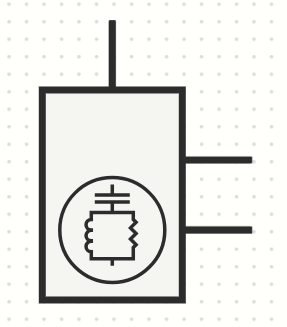

拖入一个**文本**组件，用来放在图中作为滤波器标识。设置大小和位置为：```X=0, Y=5,```，设置文本为```Filter```。

拖入第二个和第三个**文本**组件，用来作为有功量测P和无功功率Q引脚的标识。这两个文本组件的参数设置如下表：

设置大小和位置为：```X=20, Y=10```，设置文本为```P```，设置其它参数如下表。

| 配置项 | P | Q |
| :--- | :--- | :--- |
| **X** | 20 | 20 |
| **Y** | 10 | 30 |
| **文本** | P | Q |
| **字体大小** | 8 | 8 |
| **文本对齐** | 左对齐 | 左对齐 |
| **横向基础偏移** | 0.5em | 0.5em |
| **纵向基础偏移** | -0.6em  | -0.6em |

然后，再拖入三个**引脚**组件，参考[绑定引脚相关文档](../icon/index.md#在图标中添加引脚并绑定)所述方法，将三个引脚绑定到引脚列表中的三个引脚，并放置在对应的位置上。

最终，绘图区中，元件图标的示意图如下：


采用[图标检查](../icon/regulations/index.md#图标检查)所述方法，打开图形预览，可以看到该图形满足绘图规范：

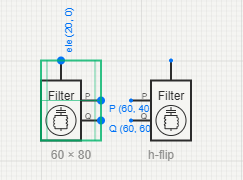

### 实现标签页配置

在[实现标签页](../../../workbench/function/design/index.md)中，分别拖入一个电感、电阻、电容元件以及一个接地点元件，配置参数如下：

| **参数** | 电感 | **参数** | 电阻 | **参数** | 电容 |
| :--- | :--- | :--- | :--- | :--- | :--- |
| **Dimension** | Three Phase | **Dimension** | Three Phase | **Dimension** | Three Phase |
| **Inductance** | ```$L``` | **Resistance** | ```$R``` | **Capacitance** | ```$C``` |
| **Branch Current** |  | **Branch Current** |  | **Branch Current** | ```#Ic``` |

注意，配置RLC参数时，请参考[“表达式”模式相关文档](../../parameterSystem/index.md#表达式模式)所述内容，将参数列表中的R、L、C参数输入到这三个元件中。

再按[在模型实现中添加引脚并绑定](../pins-list/index.md#在模型实现中添加引脚并绑定)文档所述内容，添加3个模块端口元件到图纸中，分别绑定```ele```、```P```、```Q```三个引脚。

按[虚拟引脚调用](../parameter-list/virtual-pins/index.md#虚拟引脚调用)相关说明，将2各虚拟引脚端口添加到图纸中，分别绑定```Vmeasure```, ```Imeasure```引脚。

参考[量测相关文档](../../../../../emtlab/emtp-calc/measure/index.md#电气量量测方法)，在模型库的```量测```标签下，找到并添加```电压表(model/CloudPSS/_NewVoltageMeter)```元件，设定量测电压信号名为```#V```，Dimension参数为```Three Phase```；同样在模型库的```量测```标签下，找到并添加```三相功率量测(model/CloudPSS/_newPowerMeter_3p)```元件，设定'Three Phase Voltage'引脚赋值为```#V```, 'Three Phase Current'引脚赋值为```#Ic```。

最后，按下图所示配置各个元件的连接关系：


### 总览标签页配置以及保存

在[总览标签页](../../../workbench/function/summary/index.md)中配置好模块的名称为“三相交流滤波器封装演示”，并设置```元件标签```为“模块封装演示”。这里的名称和元件标签均可以自行修改，其作用参考[元件标签相关文档](../save/index.md#元件标签)。此外，还可以按需求编写描述以及元件文档。

进一步，点击[工具栏](../../../workbench/toolbar/index.md)中的[保存](../../../workbench/toolbar/index.md#保存)或[另存为](../../../workbench/toolbar/index.md#另存为)按钮，在弹出的保存选项配置窗口中配置元件资源ID，这里填入与其它元件不同的**唯一标识符**，例如样例中填入```myRLCFilter```。

总览标签页的设置如下：


点击```保存```按钮，即可保存该模块。此后，就可以在其它项目中，从模型库中[调用](../../callModule/index.md)这个封装好的模块，如下图所示。

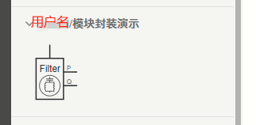

</TabItem>
<TabItem value="case2" label="案例2">
## 将一个SimStudio模型项目封装为模块

案例2以CloudPSS提供的光伏系统模板案例为例，介绍如何将现有项目封装为模块。

拟定封装的模块需要实现以下功能：

- 可自定义光伏电厂的并联台数和额定电压，通过单机模型倍乘的方法实现。
- 可通过引脚输入光照和温度条件。
- 可通过参数修改电流环的PI控制环节参数。
- 可通过虚拟引脚量测光伏并网点的有功、无功功率。


首先，[新建](../../../../simstudio/workbench/toolbar/index.md#新建)一个**光伏平均化模型**，如下图所示。

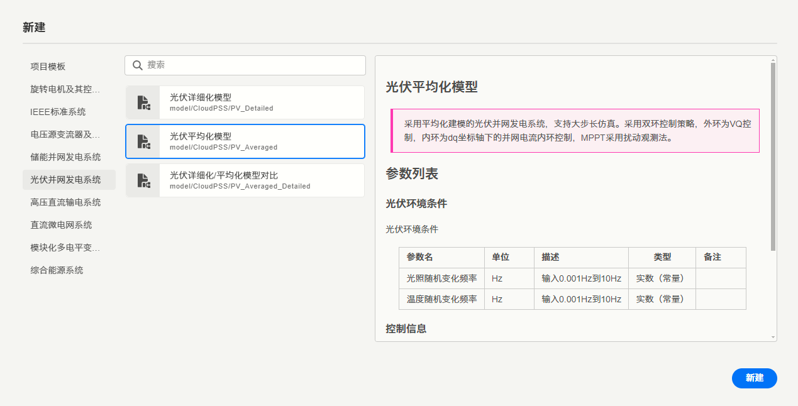


### 总览标签页配置

进入[总览标签页](../../../workbench/function/summary/index.md)，将```模型类型```改为```元件```，并设置一个```元件标签```。这里将元件标签设置为“模块封装演示”。

此外，可按需求更改模块名称，本案例中保持不变。

设置后，总览标签页的配置如下图：

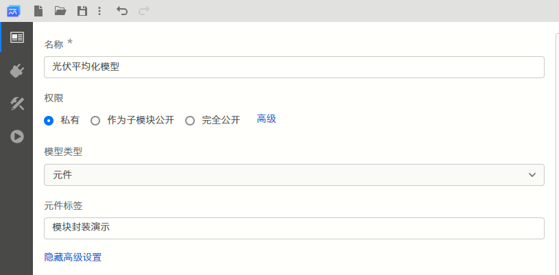

### 接口标签页配置

进入[接口标签页](../../../workbench/function/interface/index.md)。这里的模板项目已经具有名为```光伏环境条件```的参数组，用于设置光照和温度的变化频率。由于我们需要从引脚直接输入光照和温度系数，因此这里可直接[删除](../parameter-list/index.md#删除参数组)该参数组。此外，按[参数列表相关文档](../parameter-list/index.md)所述的方法，在**控制信息**的参数组下，分别按下表添加三个参数：

| 配置项 | Ki | Ti | Ilim |
| :--- | :--- | :--- | :--- | 
| **键** | Ki | Ti | Ilim |
| **名称** | 电流环比例系数 | 电流环积分时间常数 | 电流环限幅 |
| **详细描述** | VSC控制中，电流内环PI环节的比例系数 | VSC控制中，电流内环PI环节的积分时间常数 | VSC控制中，电流内环PI环节的限幅 |
| **条件** | true | true | true |
| **类型** | 实数 | 实数 | 实数 |
| **输入类型** | 常量 | 常量 | 常量 |
| **默认值** | 5 | 0.4 | 0.15 |
| **最小值** | 0 | 0 | 0 |
| **最大值** |  |  |  |
| **区间** | [闭区间] | [闭区间] | (左开区间] |
| **单位** |  | s | p.u. |

新建名为**基本设置**的参数组，分别按下表添加2个参数：

| 配置项 | 并联数量 | 额定电压 |
| :--- | :--- | :--- |
| **键** | num | Vpcc |
| **名称** | 并联数量 | 额定电压 |
| **详细描述** | 并联光伏发电设备数量 | 额定交流端口相电压幅值 |
| **条件** | true | true |
| **类型** | 实数 | 实数 | 
| **输入类型** | 常量 | 常量 | 
| **默认值** | 1 | 0.35 |
| **最小值** | 0 | 0 | 
| **最大值** |  |  | 
| **区间** | (左开区间] | (左开区间] |
| **单位** |  | kV |

新建名为**量测**的参数组，分别按下表建立2个虚拟引脚参数：

| 配置项 | 有功量测 | 无功量测 |
| :--- | :--- | :--- |
| **键** | Pmeasure | Qmeasure |
| **名称** | 有功量测 | 无功量测 |
| **详细描述** | 虚拟引脚，量测光伏端口有功功率。 | 虚拟引脚，量测光伏端口无功功率。 |
| **条件** | true | true |
| **类型** | 虚拟引脚 | 虚拟引脚 |
| **输入类型** | 常量 | 常量 |
| **默认值** |  |  |
| **数据X维数** | 1 | 1 |
| **数据Y维数** | 1 | 1 |
| **数据类型** | 实数 | 实数 |
| **连接类型** | 输出 | 输出 |


按[引脚列表相关文档](../pins-list/index.md)所属的方法，建立三个引脚，引脚配置如下

| 配置项 | 三相电气端口 | 光照条件 | 温度条件 |
| :--- | :--- | :--- | :--- | 
| **键** | pcc | Gctrl | Tctrl |
| **名称** | 三相电气端口 | 光照条件 | 温度条件 |
| **详细描述** | 光伏的三相电气端口 | 交流滤波器的有功量测 | 交流滤波器的无功量测 |
| **可见** | true | false | false |
| **条件** | true | true | true |
| **数据X维数** | 3 | 1 | 1 |
| **数据Y维数** | 1 | 1 | 1 |
| **数据类型** | 实数 | 实数 | 实数 |
| **连接类型** | 电气 | 输入 | 输入 |

注意这里的**光照条件**和**温度条件**的**可见**设定为false，即不会在图标中显示。

参数和引脚列表总览如下：

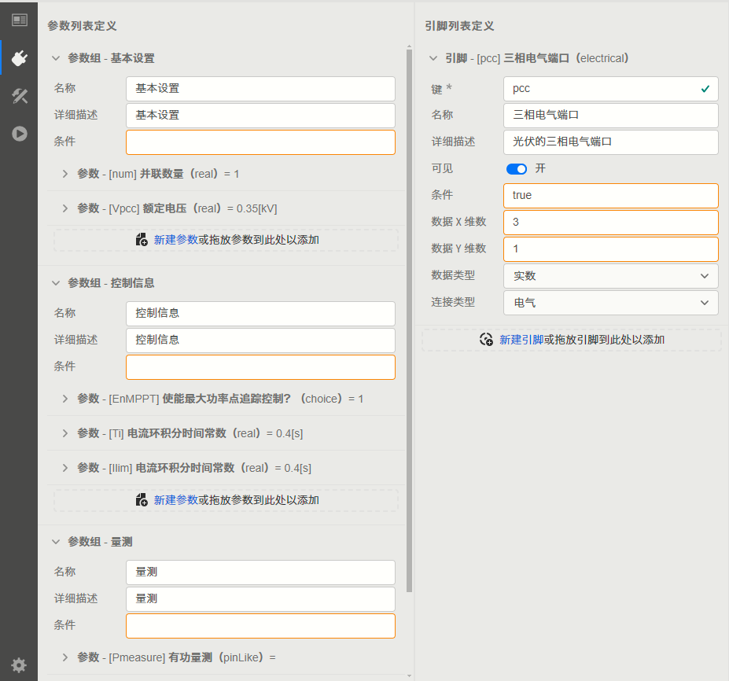

下面绘制该模块的图标。

在[图标绘制工作区](../icon/index.md)中，拖入一个**矩形**，设置大小和位置为：```X=0, Y=0, 宽度=60, 高度=60```

拖入一个**路径**组件，该路径用来绘制引脚的标识。参考[路径配置文档](../icon/path/index.md)，设置大小和位置为：```X=0, Y=0```，设置路径的配置项如下：

```
M 0 30
h -20
```

拖入第二个**路径**组件，该路径用来绘制光伏的标识图案，设置大小和位置为：```X=0, Y=0```，设置**线条宽度**为1px，设置路径的配置项如下：

```
M 12 30
a 1.5 1.5 0 0 0 0 3
a 1.5 1.5 0 0 0 0 -3
m 0 -3.5 q 1,3 4.35,2.5
q -2,2.5 0,5
q -3.35,-0.5 -4.35,2.5
q -1,-3 -4.35,-2.5
q 2,-2.5 0,-5
q 3.35,0.5 4.35,-2.5
z

M 24.5 30 l -10 20 h 25 l 10 -20 z
m 5 0 l -10 20
m 15 -20 l -10 20
m 15 -20 l -10 20
m 15 -20 l -10 20
m -17.5 -5 h 25
m -22.5 -5 h 25
m -22.5 -5 h 25
```

这段代码共绘制了一个圆圈、6段贝塞尔曲线和11条直线。

到现在，得到的图标样式如下图所示：

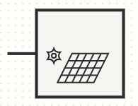

拖入一个**文本**组件，用来放在图中作为光伏的文字标识。设置大小和位置为：```X=60, Y=30,宽度=60, 高度=30```，设置文本为```PV Station```。

然后，再拖入一个**引脚**组件，参考[绑定引脚相关文档](../icon/index.md#在图标中添加引脚并绑定)所述方法，将引脚图标组件绑定到引脚列表中的**pcc**引脚上，并放置在对应的位置。

注意，由于引脚**Tctrl**和**Gctrl**引脚设定的**可见性**为false，故不需要在绘图区配置这两个引脚。

最终，绘图区中，元件图标的示意图如下：

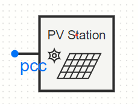

采用[图标检查](../icon/regulations/index.md#图标检查)所述方法，打开图形预览，可以看到该图形满足绘图规范：


### 实现标签页配置

在封装模块的过程中，需要在实现标签页中完成的**基础工作**主要是**绑定引脚**即可。

然而在本案例中则针对前面提到的需求，需要分别完成以下工作：

- 通过单机模型倍乘的方法实现自定义光伏并联数量及额定电压功能。
- 将电流环的PI控制环节参数与参数列表中的对应参数绑定。
- 配置虚拟引脚，量测光伏并网点的有功、无功功率。

下面分别展开介绍。

**(1) 绑定引脚**

本模块共有3个引脚，即**pcc**电气引脚、**Gctrl**和**Tctrl**控制输入引脚。

首先绑定电气引脚，这里按[在模型实现中添加引脚并绑定](../pins-list/index.md#在模型实现中添加引脚并绑定)文档所述内容，添加1个模块端口元件到图纸中，绑定**pcc**引脚。

在拓扑中，光伏器件将通过该引脚与外部电气系统相连，因此该模块端口元件将代替目前的电压源位置。可以删除电压源，并将模块端口接在并网点上，如下图所示：

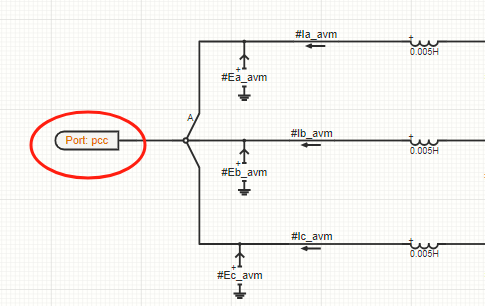

此外，在原模板项目的**光伏电池设定**[图纸](../../../workbench/function/design/canvas/index.md)中，已有产生光照和温度信号的相关控制环节，这里可以将其删除或[关闭启用](../../../workbench/function/design/para/index.md#启用)，并按[在模型实现中添加引脚并绑定](../pins-list/index.md#在模型实现中添加引脚并绑定)文档所述内容，添加2个模块端口元件到图纸中，分别绑定**Gctrl**和**Tctrl**引脚，如下图所示：

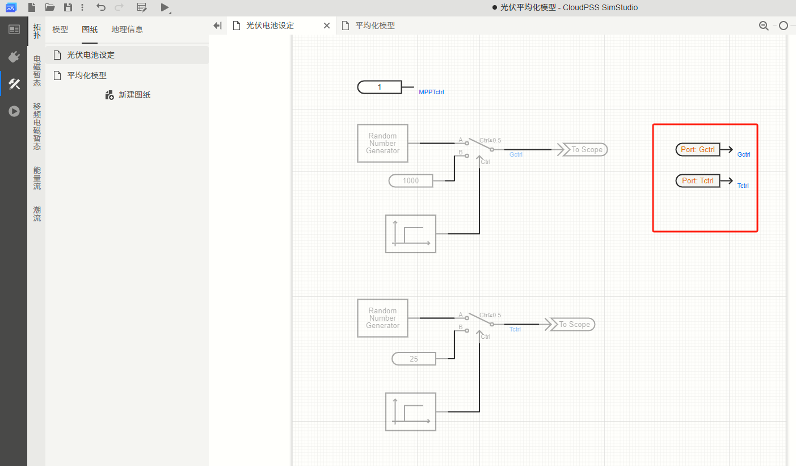


**(2) 通过单机模型倍乘的方法实现自定义光伏并联数量及额定电压功能**

由于这里采用的是平均化模型，整个光伏系统可以被分为**VSC交流测的电气部分**、**VSC平均化模型受控源计算**、**VSC直流侧电气部分**、**VSC控制系统**四个部分，如下图所示。

import Flowchart1 from './flowchart1.svg'

<Flowchart1 className="themed"/>

实现倍乘模型时，最好使修改的内容尽可能少，这样能减少失误以及调试的时间。因此，在这里只让电气部分进行倍乘处理，将输送给控制系统的量测量反向倍乘，转化为原始模板中的单机系统量测值。

倍乘后的系统结构如下图所示。

import Flowchart2 from './flowchart2.svg'

<Flowchart2 className="themed"/>

可见，图中只将VSC交流测的电气部分进行了倍乘处理，同时将量测的电压电流进行倍乘输送给平均化模型受控源计算以及VSC控制系统模块。处理量测的电压时，应除以接入点额定电压、乘以原模型的单机额定电压，即$$V_{single}=\frac{V_0}{\$V_{pcc}}V_{measure}=\frac{0.35kV}{\$V_{pcc}}V_{measure}$$；
处理量测的电流时，应除以并联光伏设备台数**\$num**，即$$I_{single}=\frac{I_{measure}}{\$num}$$。

具体来说，在[实现标签页](../../../workbench/function/design/index.md)中，首先将#Ea_avm、#Eb_avm、#Ec_avm、#Va_vsc、#Vb_vsc、#Vc_vsc、#Ia_avm、#Ib_avm、#Ic_avm、#Ia_vsc、#Ib_vsc、#Ic_vsc这些量测信号分别改为#Ea_avm_raw、#Eb_avm_raw、#Ec_avm_raw、#Va_vsc_raw、#Vb_vsc_raw、#Vc_vsc_raw、#Ia_avm_raw、#Ib_avm_raw、#Ic_avm_raw、#Ia_vsc_raw、#Ib_vsc_raw、#Ic_vsc_raw，将三个受控电压源的控制信号Va_ctrl、Vb_ctrl、Vc_ctrl分别改为Va_ctrl_mult、Vb_ctrl_mult、Vc_ctrl_mult。

然后，从模型库中的```控制-线性传递函数```标签下找到```增益(model/CloudPSS/_newGain)```元件，将6个该元件添加至图纸中。选中这6个**增益**元件，使用[“表达式”模式](../../parameterSystem/index.md#表达式模式)统一设置增益参数Gain Constant为```0.35/$Vpcc```（原模型的额定电压为0.35kV），并分别配置引脚为#Ea_avm_raw → #Ea_avm, #Eb_avm_raw → #Eb_avm, #Ec_avm_raw → #Ec_avm, #Va_vsc_raw → #Va_vsc, #Vb_vsc_raw → #Vb_vsc, #Vc_vsc_raw → #Vc_vsc。

另外将6个**增益**元件添加至图纸中。选中这6个**增益**元件，使用[“表达式”模式](../../parameterSystem/index.md#表达式模式)统一设置增益参数Gain Constant为```1/$num```，并分别配置引脚为#Ia_avm_raw → #Ia_avm, #Ib_avm_raw → #Ib_avm, #Ic_avm_raw → #Ic_avm, #Ia_vsc_raw → #Ia_vsc, #Ib_vsc_raw → #Ib_vsc, #Ic_vsc_raw → #Ic_vsc。

在处理受控电压源的电压信号Va_ctrl, Vb_ctrl, Vc_ctrl时，应当乘以乘以接入点额定电压、除以原模型的单机额定电压，即$$V_{ctrl}=\frac{\$V_{pcc}}{V_0}V_{ctrl-single}$$。

因此，另外将3个**增益**元件添加至图纸中。选中这3个**增益**元件，使用[“表达式”模式](../../parameterSystem/index.md#表达式模式)统一设置增益参数Gain Constant为```$Vpcc/0.35```，并分别配置引脚为Va_ctrl_mult → Va_ctrl, Vb_ctrl_mult → Vb_ctrl, Vc_ctrl_mult → Vc_ctrl。

此外，对于电气部分（电感、电阻、电容等），需要进行倍乘处理。即修改电阻和电感为原来的$$\frac{(\$Vpcc/0.35)^2}{\$num}$$倍，修改电容为原来的$$\frac{\$num}{(\$Vpcc/0.35)^2}$$倍。

最终，**VSC交流测的电气部分**部分如下图所示（图中为```Vpcc=0.7kV, num=10```的情形。）：

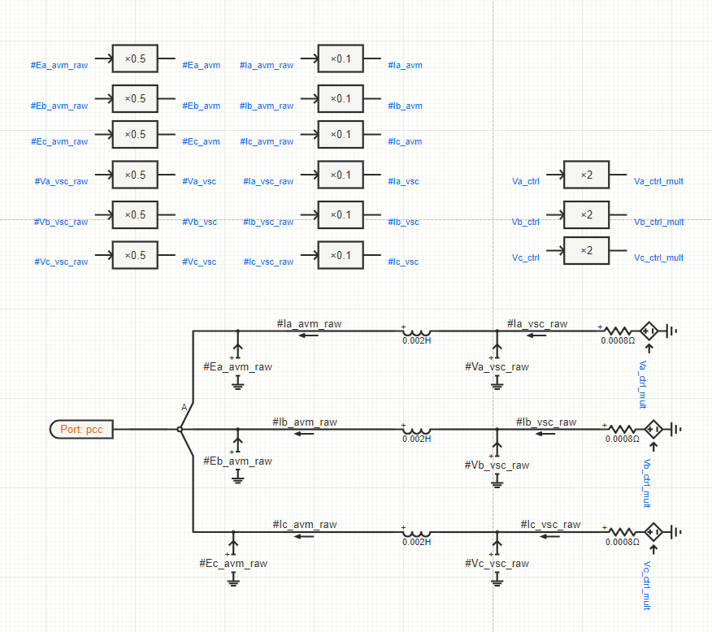

**(3) 将电流环的PI控制环节参数与参数列表中的对应参数绑定。**

在参数列表中，定义了三个电流环相关参数：Ki, Ti, Ilim。现在需要将拓扑中电流环的相关元件参数绑定为这三个全局参数。

在**平均化模型**[图纸](../../../workbench/function/design/canvas/index.md)中，找到电流环相关的两个**PI环节**，使用[“表达式”模式](../../parameterSystem/index.md#表达式模式)将**Proportional Gain**参数改为```$Ki```，将**Integral Time Constant**参数改为```$Ti```，将**Maximum Limit**参数改为```$Ilim```，将**Minimum Limit**参数改为```-$Ilim```，如下图所示：


此外，还可以将PI环节之后的限幅环节也同样设置**Upper Limit**和**Lower Limit**参数，如下图所示：

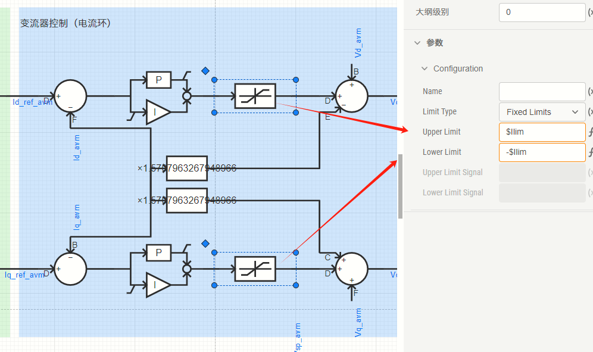

**(4) 配置虚拟引脚，量测光伏并网点的有功、无功功率。**

在参数列表中，定义了两个虚拟引脚用于输出光伏的有功、无功。对应地，需要在实现标签页中完成这部分逻辑实现。

在模型库的```控制-基础```标签下，找到并添加```多路信号合并(model/CloudPSS/_ChannelMerge)```元件，用于合并三相电压量测信号和三相电流量测信号。

在模型库的```量测```标签下，找到并添加```三相功率量测(model/CloudPSS/_newPowerMeter_3p)```元件。

按[虚拟引脚调用](../parameter-list/virtual-pins/index.md#虚拟引脚调用)相关说明，将2个虚拟引脚端口添加到图纸中，分别绑定```Pmeasure```, ```Qmeasure```虚拟引脚。

最后，按下图所示方案配置多路信号合并、三相功率量测和虚拟引脚端口元件的引脚连接关系：


### 保存

点击[工具栏](../../../workbench/toolbar/index.md)中的[保存](../../../workbench/toolbar/index.md#保存)或[另存为](../../../workbench/toolbar/index.md#另存为)按钮，在弹出的保存选项配置窗口中配置元件资源ID，这里填入与其它元件不同的**唯一标识符**，例如该样例中填入```myPVmodel```。


点击```保存```按钮，即可保存该模块。此后，就可以在其它项目中，从模型库中[调用](../../callModule/index.md)这个封装好的模块，如下图所示。

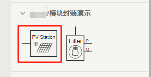

</TabItem>
<TabItem value="case3" label="模块的单元测试方法（以案例2为例）">

模块的单元测试是指，直接在模块内部搭建测试系统用于在开发时测试元件/模块的正确性，而不用在另一个项目中调用该封装模型进行测试。

在创建模块时，配置模块的单元测试实现具有以下好处：
- 可在开发时直接模块是否正常工作。
- 可测试在不同的参数下模块的正确性。
- 便于日后的调试和维护。

模块的单元测试方法具体来说分为下面几个步骤：(1)在接口标签页中添加```UnitTest```参数；(2)在实现标签页中搭建测试回路；(3)在运行标签页中设置参数，运行仿真测试。

下面以案例2封装的光伏模块为例，逐一介绍封装模块后的单元测试步骤。

**(1)在接口标签页中添加UnitTest参数**

进入[接口标签页](../../../workbench/function/interface/index.md)，按[参数列表相关文档](../parameter-list/index.md)所述的方法，添加一个名为**单元测试**的参数组，在参数组下建立一个[布尔参数](../parameter-list/bool/index.md)```UnitTest```，如下图所示进行配置。


该布尔参数的```选项```可以不进行配置，或者如下图所示进行配置：

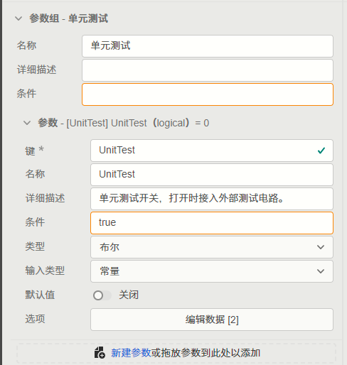

**(2)在实现标签页中搭建测试回路**

这里构建一个外接电压源的简单测试回路。

进入[实现标签页](../../../workbench/function/design/index.md)，从模型库的```电气-三相交流元件```中找到```三相交流电压源(model/CloudPSS/_newACVoltageSource_3p)```元件，添加到拓扑中，连接在风机的**pcc**端口处。使用[“表达式”模式](../../parameterSystem/index.md#表达式模式)将该电压源的```启用```属性改为```$UnitTest```，并对应配置该电压源的其它参数，如下图所示。

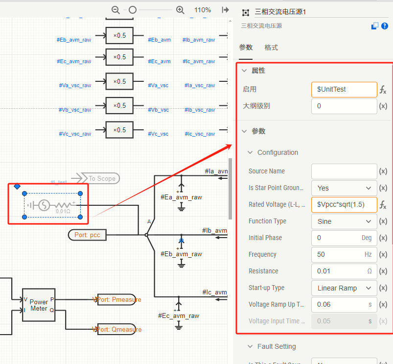

可见，在默认的```$UnitTest=0```的状态下，该电压源不启用，即正常作为模块调用时，该电压源在仿真计算中被注释掉了。

此外，可以添加一些输出通道，用于输出单元测试的结果。这里输出该电压源的三相交流电流，将电压源的Monitoring参数组下的```3 Phase Source Current Vector [kA]```参数设为```#I_test```；从模型库的```输出```标签下添加```输出通道```元件至图纸，设置维数为3，设置```启用```属性改为```$UnitTest```，并配置好通道名称和引脚名，如下图所示：

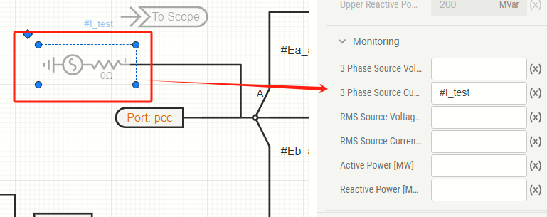

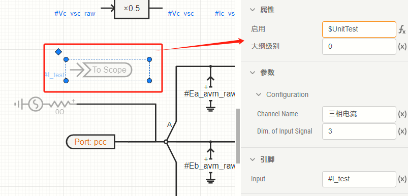

此外，对于Gctrl和Tctrl端口，我们也从模型库的```控制-基础```标签下添加```常量输入```元件至图纸，将```启用```属性改为```$UnitTest```，分别作为两个控制端口的单元测试输入。对应地，将两个控制信号的模块端口的```启用```属性改为```not $UnitTest```，如下图所示：

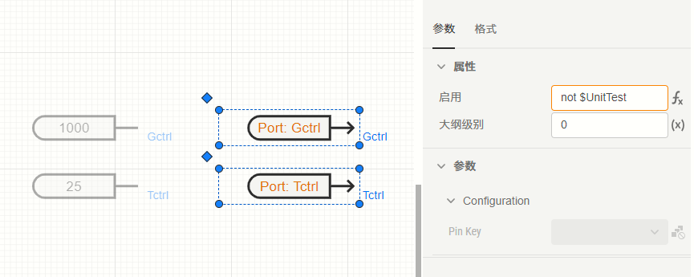

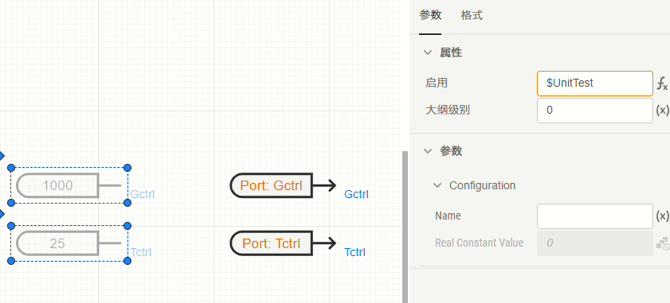

**(3)在运行标签页中设置参数，运行仿真测试。**

进入[运行标签页](../../../workbench/function/run/index.md)，可以在这里的[参数方案](../../../workbench/function/run/index.md#参数方案)找到[接口标签页](../../../workbench/function/interface/index.md)中定义的参数。

这里需要将```UnitTest```参数设定为**打开**，其它参数可根据需求设置，如下图所示。

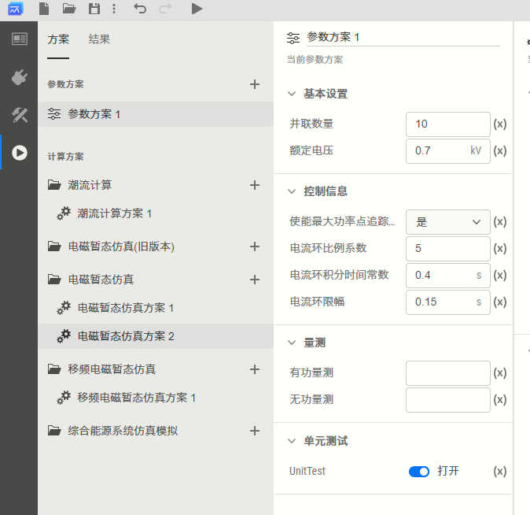

在[计算方案](../../../workbench/function/run/index.md#计算方案)方面，目前已经存在默认的电磁暂态仿真方案，我们可以[重新创建](../../../workbench/function/run/index.md#新建计算方案)一个[电磁暂态仿真方案](../../../../../emtlab/emtp-calc/job/index.md)，设置结束时间为10s、积分步长为0.00005s，在[配置输出通道](../../../../../emtlab/emtp-calc/measure/index.md#信号输出)中配置好刚才配置的**三相电流**量测通道，如下图所示：


完成配置后，点击```启动任务```按钮或使用快捷键```ctrl+R```，可以开始仿真计算，其结果如下：


</TabItem>
</Tabs>

----------

## 示例模型下载连接

案例1：[三相交流滤波器封装演示](./case-1.cmdl)

案例2：[光伏模型封装演示](./case-2.cmdl)
