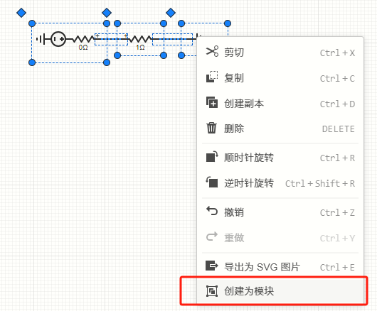
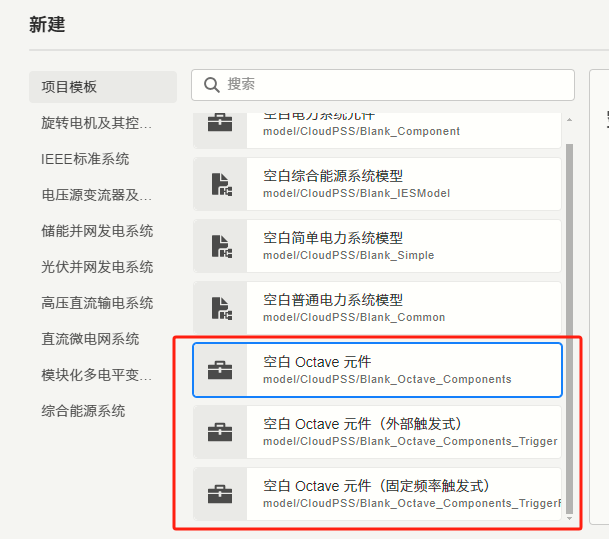

本节首先介绍 SimStudio 的模块封装功能，然后通过 X 个案例介绍模块封装的使用方法。该功能仅支持在 SimStudio 平台使用。

## 主要用途

CloudPSS支持模块化封装建模功能，可将若干复杂元件封装为一个“盒子”，其对外的图标、参数以及引脚均可自定义。模块封装可提高建模效率以及项目的可读性。

通过模块封装的功能，用户可自主构建和保存自定义的模型，模块封装功能的应用场景示例如下：

- 在大规模工程项目中，可能含有大量风机、光伏、直流等设备，每个设备均由多个分立元件构成。可采用模块封装的功能，将每种设备分别封装为一个模块，方便重复调用。
- 某工程项目含有大量元件，可读性较差，需要采用模块化设计的理念提高项目可读性。
- 您可能希望其它用户也能使用您创作的模型，并能自主决定他们是否能查看到内部细节。

## 模块封装流程

本节介绍模块封装的步骤。模块封装流程分为[模块构建](#模块构建编辑模块内部拓扑及参数)、[定义参数列表](#定义元件模块参数列表)、[定义引脚列表](#定义元件模块引脚列表)、[设计图标](#设计元件模块图标)、[配置调用权限](#配置元件模块调用权限)、[保存](#保存)六个步骤。可点击文档中的跳转链接查看更详细的说明。

### 模块构建（编辑模块内部拓扑及参数）

本节介绍模块的构建方法。在仿真计算中调用模块时，实际调用的是本节介绍的模块内部实现。

模块内部实现的构建方法包括[拓扑搭建](#采用拓扑搭建方法)、[代码实现](#采用代码octavepython实现)、[S-Function模型](#采用s-function元件模型实现)实现三种。

#### 采用拓扑搭建方法
用户可使用已有的Simstudio模型库元件，或其他的封装模型，通过拓扑连接的方式构建模块。

共有两种方法构造拓扑实现的模块：

- 从**新建空白电力系统元件**开始

    可以在Simstudio的工作台页面中，点击[新建](../../workbench/toolbar/index.md#新建)按钮，在弹出框中选择**空白电力系统元件**，创建空拓扑实现的模块。

    

    进一步，可以在[实现标签页](../../workbench/function/design/index.md)中进行[拓扑编辑](../../workbench/function/design/edit/index.md)。

- 从已有待封装元件开始
    
    有时，用户已经搭建了一个仿真项目，此时想将项目的一部分元件封装为模块。此时可选中待封装的元件，右键选择**创建为模块**，并参考[项目保存相关文档](../../workbench/toolbar/index.md#另存为)在弹窗中填写对应的资源ID及名称即可。

    

#### 采用代码Octave、Python实现

可以在Simstudio的工作台页面中，点击[新建](../../workbench/toolbar/index.md#新建)按钮，在弹出框中选择**空白Octave元件**，创建Octave实现的模块；或者在弹出框中选择**空白Python元件**，创建Python实现的模块。

具体的Octave及Python元件的实现方法可参考[自定义Octave元件文档](../../../../emtlab/emtp-calc/self-config/octave/index.md)以及[自定义Python元件文档](../../../../emtlab/emtp-calc/self-config/python/index.md)

目前在公网平台 (www.cloudpss.net) 中，暂不支持自定义python元件。

#### 采用S-Function元件模型实现

S-Function元件的构建方法请参考[文档](../../../../emtlab/emtp-calc/self-config/s-function/index.md)

### 定义元件/模块参数列表

详见子页面

### 定义元件/模块引脚列表
详见子页面
### 设计元件/模块图标
详见子页面
### 配置元件/模块调用权限
详见子页面
### 保存
详见子页面

## QA