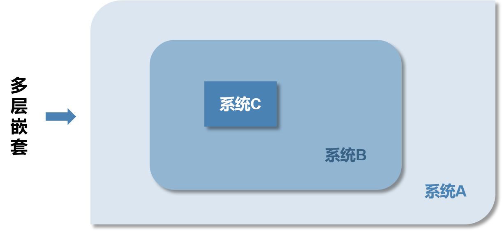

本节首先介绍 SimStudio 的模块封装功能，然后通过 X 个案例介绍模块封装的使用方法。该功能仅支持在 SimStudio 平台使用。

## 主要用途

CloudPSS支持模块化封装建模功能，可将若干复杂元件封装为一个“盒子”，提高建模效率、提高项目的可读性。

模块封装功能的应用场景示例如下：

- 在大规模工程项目中，可能含有大量风机、光伏、直流等设备，每个设备均由多个分立元件构成。可采用模块封装的功能，将每种设备分别封装为一个模块，方便重复调用。
- 含有大量元件的工程项目可读性较差，需要采用模块化设计的理念提高项目可读性。
- 您可能希望其它用户也能使用您创作的模型，并能自主决定他们是否能查看到内部细节。

项目的模块封装功能可为当前模型提供对外的图标、参数以及引脚定义。在CloudPSS SimStudio中，每个仿真项目都由电气、控制、量测、输出等类型元件按照一定拓扑关系构成。接口标签页的模块封装功能可将仿真项目打包为一个模块，并对其对外的特性（图标、参数和引脚）进行设计。保存后的模块可在其他算例中直接使用，极大地提高了用户构建大型算例、模块化算例的灵活性。此外，CloudPSS中的模块支持多层嵌套的功能。

## 模型封装流程

### 模型构建（编辑模型内部拓扑及参数）

#### 可采用拓扑搭建方法
跳转
#### 可采用代码Octave、Python实现
跳转
#### 可采用黑箱模型实现
跳转

### 定义元件/模块参数列表
详见子页面
### 定义元件/模块引脚列表
详见子页面
### 设计元件/模块图标
详见子页面
### 配置元件/模块调用权限
详见子页面
### 保存
详见子页面