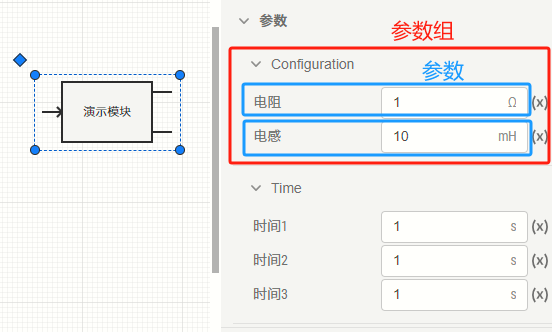
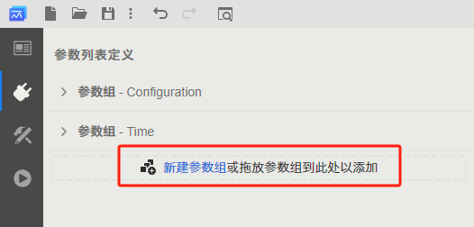
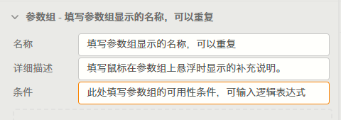
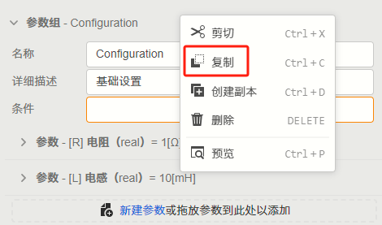
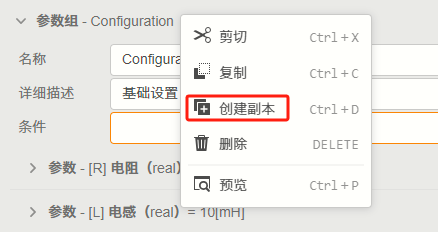
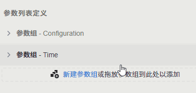
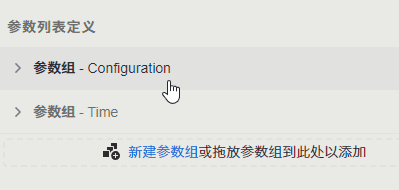

此文档主要介绍元件/模块的参数列表定义方法。

在SimStudio中，参数列表被分为**参数组**-**参数**两个层级。两个层级为包含关系，即一个元件/模块可含有若干**参数组**，每个参数组可含有若干**参数**，如下图所示。



元件/模块参数列表定义的步骤主要包括[编辑参数组](#编辑参数组)、[编辑参数](#编辑参数)两个部分。

在完成参数列表定义后，元件/模块的参数可在模块内部被引用，详见[参数相关文档](../../parameterSystem/index.md#参数)。

## 编辑参数组

一个参数组具有**名称**、**详细描述**、**条件**三个可配置项，它们的含义及说明如下表所示。

| 配置项 | 含义 | 说明 |
| :--- | :--- | :--- | 
| **名称** | 参数组的显示名称 | 填写字符串，可以填写中文，可以重复。 | 
| **详细描述** | 鼠标在参数组上悬浮时，悬浮框显示的补充说明 | 填写字符串，可以填写中文，可以重复。 |
| **条件** | 参数组的可用性条件 | 填写逻辑表达式，默认为true，可以直接调用其它参数。以调用**键**为```par```的参数为例，可以支持``` (par-1)>1 ```, ```sqrt(par)```等形式。与[参数调用的“表达式”模式](../../parameterSystem/index.md#表达式模式)的区别在于，此处在参数定义时不需要使用$标识符。 |


用户可自行新建、删除、修改参数组，也可以复制、粘贴参数组以及调整参数组顺序。具体操作如下。

### 新建参数组

在[接口标签页](../../../workbench/function/interface/index.md)中，点击参数列表的最下方的**新建参数组**按钮即可新建一个空的参数组，如下图所示。




### 删除参数组
用户可右键参数组，选择**删除**可以删除整个参数组。

注意，此时参数组下的所有**参数**也会被同步删除！


### 修改参数组
用户可根据需求自行设置新参数组中的**名称**、**详细描述**和**条件**。



### 复制、粘贴及创建副本

用户可以创建已有参数组的副本，此时所有**该参数组下的参数**也会被同时复制。

共有三种方式创建参数组的副本，分别为**复制-粘贴**、**右键-创建副本**以及**按住ctrl直接拖拽**。

- 复制-粘贴方式

用户可在右键参数组时找到**复制**按钮（快捷键ctrl+c），并在最下方空白处右键时找到**粘贴**按钮（快捷键ctrl+v）。



- 创建副本方式

用户可在右键参数组时找到**创建副本**按钮（快捷键ctrl+d）。



- 按住ctrl直接拖拽

用户可按住ctrl键拖拽参数组，完成参数组的复制。



### 参数组顺序调整

用户可直接拖拽参数组，调整参数组顺序。



## 编辑参数


### 新建参数

### 删除参数

### 修改参数

### 复制、粘贴及创建副本

### 参数顺序调整

## 参数类型

### 实数
子页面

### 整数
子页面

### 文本
子页面

### 代码
子页面

### 布尔
子页面

### 选择
子页面

### 多选
子页面

### 表格
子页面

### 虚拟引脚 
子页面

