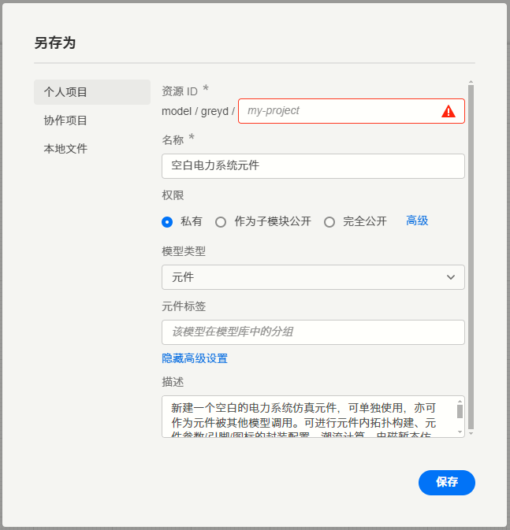
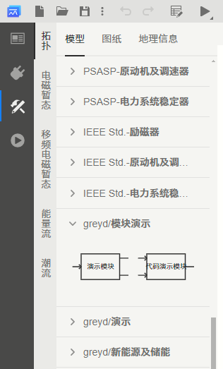
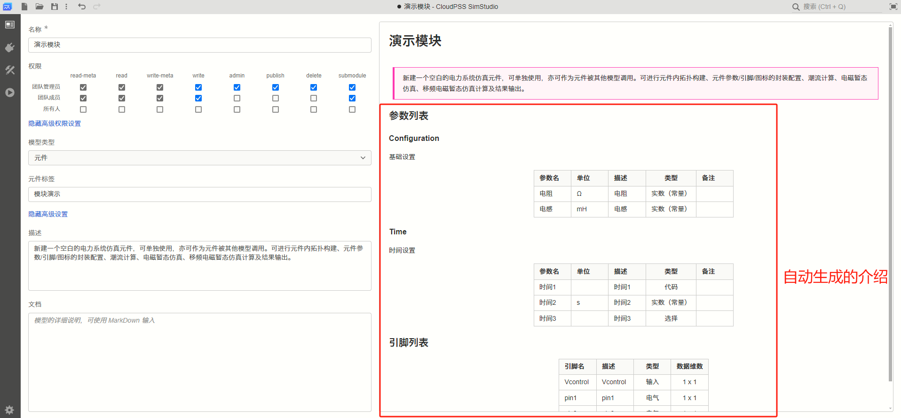

本文档介绍封装元件/模块的保存操作，必要的步骤包括[配置 RID](#配置-rid)和[配置元件标签](#元件标签)两步，此外可以按需求[填写其它信息](#其他信息描述文档等)。

## 配置 RID

点击[工具栏](../../../workbench/toolbar/index.md)中的[保存](../../../workbench/toolbar/index.md#保存)或[另存为](../../../workbench/toolbar/index.md#另存为)按钮，将会弹出保存选项配置窗口，如下图所示。



这里必须进行配置的是```资源ID```栏，用户必须输入该个人空间或协作空间下**唯一**的资源ID（即RID）。

资源ID是本模块以及本项目的唯一标识符，需要以字母开头，仅包含字母、数字、下划线```_```、横线```-```。

## 元件标签

元件标签的作用是对元件进行分类，只有填写了元件标签后，该元件才会在[模型库](../../../workbench/function/design/index.md#模型)中显示。

在图1所示的保存窗口，以及[总览标签页](../../../workbench/function/summary/index.md)中，均可以找到元件标签的配置栏。

元件标签可以填写中文。同元件标签的元件/模块将被置于模型库中的同一个栏目下，如下图所示。



## 其他信息（描述、文档等）

在封装模块时，将会根据参数列表和引脚列表的数据，自动生成参数和引脚的介绍，如下图所示。



此外，用户可以在[总览标签页](../../../workbench/function/summary/index.md)中填写额外的```描述```和```文档```，如图3的左下方所示。

```描述```栏填写元件的简要描述，会被显示在元件文档的最上方。可以用markdown格式输入。

```文档```栏填写元件的额外说明，会被显示在元件文档的最下方。可以用markdown格式输入。