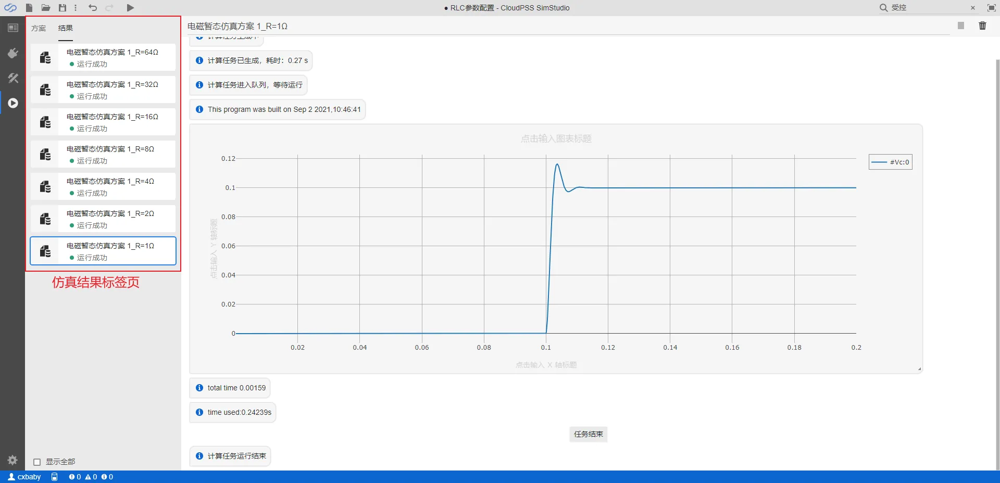
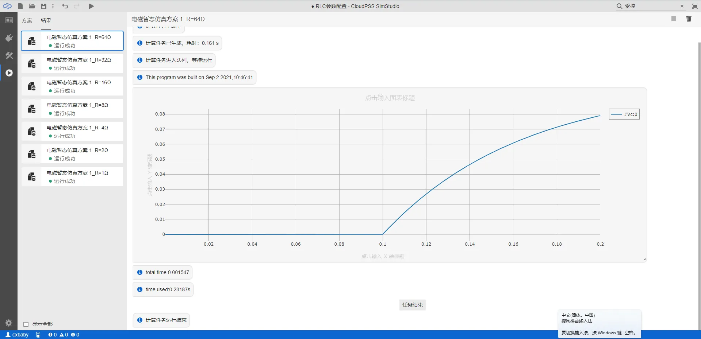

本节介绍 SimStudio 实现标签页中参数方案配置功能。

## 功能定义

对于同一个项目，SimStudio 支持配置多套参数方案，运行可以选择不同的参数方案对同一套模型进行仿真。

## 功能说明

### 主要用途

在同一个仿真项目中可配置多套参数方案，并执行并发的多场景仿真运算。参数方案配置可方便用户实现多个仿真参数结果的对比。

### 配置流程

- 1.用户需要搭建好仿真算例，并选取需要进行参数方案配置的元件参数；
  
- 2.在接口标签页的参数列表内[定义参数列表](../moduleEncapsulation/pins-list/index.md)；
  
- 3.在相应元件参数配置面板内通过**参数键名**引用该参数的值，例如参数键名为`R`时，在元件参数引用参数值时应
  切换为表达式输入模式填写`$R`；

- 4.最后，用户可以在运行标签页的参数方案下添加多套不同参数的方案并仿真

## 案例

import Tabs from '@theme/Tabs';
import TabItem from '@theme/TabItem';

<Tabs>
<TabItem value="js" label="配置不同的方案进行批量仿真">

以不同阻抗参数**RLC电路的阶跃响应仿真**为例，介绍参数方案配置的详细使用方法。

- 1.搭建算例，选取需要进行参数方案配置的元件参数

  拖拽元件至拓扑编辑窗口，搭建如下图所示的仿真拓扑，其中阶跃发生器在**0.1s**由**0**上升为**100**。
  
  此时，受控电压源在 0.1s 时刻由 0V 上升到 100V，将导致电容电压从 0V 以不同的暂态特性到达稳态值 100V，暂态特性与RLC 的阻抗值有关。

  通过仿真需求分析，选取**电阻**、**电感**、**电容**的值作为进行参数方案配置的元件参数。

  

- 2.在接口标签页，定义参数列表

  在接口标签页的参数列表内，添加对应电阻、电感、电容阻抗值的参数，如下图所示。

  

- 3.在元件参数面板引用定义的参数

  在电阻、电感、电容的元件参数面板内通过**参数键名**引用参数的值，如下图所示。

  

- 4.配置不同的参数方案并仿真

  在运行标签页，点击**新建参数方案**并创建多个参数方案，依次重命名为**方案1：R=1Ω，方案2：R=2Ω，···，方案7：R=64Ω**。点击参数方案，将参数列表中的电阻值依次修改为 1Ω，2Ω，···，64Ω。点击电磁暂态仿真方案1，设置结束时间为0.2s，选择输出通道为电容电压，且采样频率为10000。

  

  依次选取参数方案，并点击**启动任务**，将会生成 7 个仿真结果如下图所示。可在结果页面的左侧的仿真结果标签页自由查看不同参数方案下的仿真结果。

  

  

</TabItem>
</Tabs>

## 常见问题

全局变量可以在参数方案中配置吗？
:   参数方案只能配置接口标签页的参数列表，全局变量只能在拓扑编辑过程中配置。

