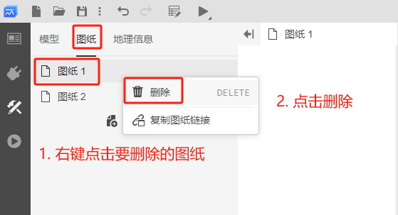

本文档介绍 **SimStudio 工作台** - **实现标签页** - **图纸** 相关功能。

## 页面功能

当单张仿真拓扑图过大时，考虑到美观和使用便捷性，可将规模较大的模型拓扑拆分为不同分区，分别放置于不同图纸中。**每个 SimStudio 项目至少包含一个图纸**。

SimStudio 项目中的图纸通过**图纸标签栏**进行统一管理。**图纸标签栏**以列表的形式显示当前项目包含的全部图纸。

## 功能说明

### 添加图纸

点击**实现标签页**左侧资源栏顶部的**图纸**，切换至图纸标签栏，点击**新建图纸**即可添加新的图纸。

一个 SimStudio 项目可添加任意数量的图纸。

### 删除图纸

在图纸标签栏鼠标右键点击待删除的图纸，在弹出菜单中点击**删除**即可删除选中的图纸。图纸删除后，该图纸内的所有元件也将随之删除。

### 重命名图纸

在图纸标签栏选中待删除的图纸，在右侧属性栏顶部即可编辑图纸名称。

:::warning
图纸名称是图纸的唯一标识符，不能重复。这个对么？？？？？？？
:::

### 全局变量

点击图纸上的任意空白区域（取消选中图纸上的元素），在拓扑编辑区右侧属性栏点击**全局变量**标签，进入**全局变量卡**。

全局变量卡提供当前 SimStudio 项目下的全局变量编辑功能。其详细使用方法参见 [参数、变量及引脚体系](../../../../basic/parameterSystem/index.md) 帮助页。

### 图纸选项

点击图纸上的任意空白区域（取消选中图纸上的元素），在拓扑编辑区右侧属性栏点击**图纸选项**标签，进入**图纸选项卡**。

图纸选项卡支持配置图纸样式（背景、网格、分割线、操作习惯等）显示特性。

#### 背景颜色

配置图纸背景颜色。颜色包括主题色和自定义两类。

#### 网格类型

为图纸选择不同的网格底纹，包括隐藏、点阵、网状和双层网状 4 个选项。默认为**双层网状**。

#### 网格颜色

配置网格颜色。

#### 页面分割线

开启状态下，会在图纸中显示页面分割线。默认为**开**。

#### 默认拖拽画布

+ 开启状态下，按住鼠标左键可以拖拽画布；
+ 关闭状态下，按住 `Ctrl + 鼠标左键` 可以拖拽画布。默认为**关**。

#### 元件标签

开启后会在图纸中显示所有元件的标签（`Label`）。默认为**关**。

#### 引脚标签

开启后会在图纸中显示所有元件的引脚标签。默认为**开**。

## 辅助工具

### 超链接

当项目具有大量图纸时，为方便快速定位到某一特定图纸，SimStudio 提供了**超链接**功能。该功能类似于 Windows 系统的快捷方式。其使用方法如下。
+ 在模型标签栏，在从**工具**模型库分组中拖拽**超链接**元件至拓扑编辑区；
+ 在图纸标签栏，鼠标右键点击待链接的图纸，在弹出菜单中点击**复制图纸链接**，即可复制当前图纸的链接；
+ 将复制的链接粘贴回**超链接**元件的**目标地址**再点击图纸超链接元件并在右侧参数面板的**目标地址栏**中粘贴刚复制的待链接图纸的地址，该地址即就是图纸再浏览器地址栏#号后面的链接。完成后，双击图纸超链接元件，可直接跳转到所链接的图纸。

### 分割线

### MarkDown 文本

## 常见问题

不同图纸间的元件如何连接？

:   图纸间的元件引脚通过标号进行连接。

<!-- 为什么全局变量设置无效？

:   在使用全局变量过程中，需要注意以下几点：
    1. 全局参数仅用于配置元件参数，因此必须在仿真开始前赋值，参数在仿真过程中不可改变。
    2. 全局变量之间可以互相引用。
    
     -->

