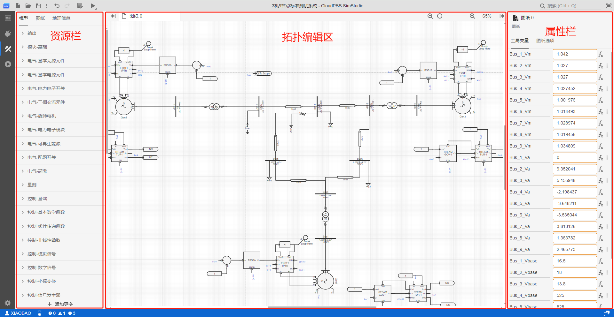
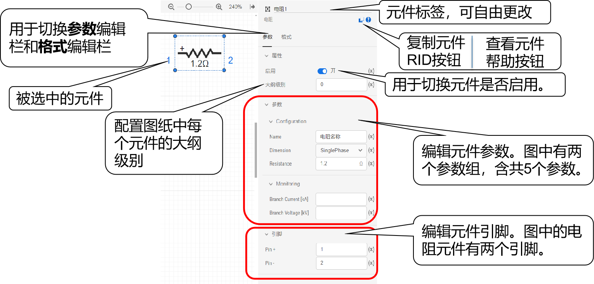

本节介绍功能区第三个实现标签页的使用方法。

## 页面功能

实现标签页用于实现当前项目的内核。对于简单模型项目和普通模型项目实现方式只有**拓扑实现**；对于元件项目实现方式有拓扑实现和代码实现。本节主要介绍拓扑实现，对于用拓扑实现的项目而言，**实现**标签页中具有的三个板块：模型库与图纸板块、拓扑编辑板块、属性编辑板块。用户在实现标签页可进行元件的选取、拓扑的连接及构建、元件参数的配置、以及页面格式/元件格式的调整。关于代码实现详见[模型封装](../../../basic/moduleEncapsulation/index.md)。

## 功能说明

### 模型

模型标签中可以浏览模型库中的元件模型，这些模型被置于不同的标签下，可直接拖拽进拓扑编辑区。内放置了仿真拓扑构建中所需要的典型元件，包括电气、控制、量测、输出、系统、工具、BPA、PSASP、IEEEStd 在内的 9 种类型、100 余种元件，并支持用户自定义分类元件。点击最下方的**添加更多**可以为本算例订阅更多的模型。关于模型订阅详见[模块调用文档下的订阅模块介绍](../../../basic/callModule/index.md)。

### 图纸

图纸为拓扑编辑的特殊功能，当仿真拓扑图过大时，考虑到美观和便捷性，可以使用图纸功能来对拓扑图进行分区划分及管理，将同一个项目中的模型分别置于不同图纸中，一个项目内不同图纸上的拓扑，本质上为同一级别。选中一个图纸后可以在标签页右侧的属性编辑板块编辑**全局变量**和**图纸选项**，详见[图纸功能帮助](./canvas/index.md)。

### 地理信息

### 拓扑编辑

拓扑编辑板块是进行仿真拓扑构建的编辑区域。用户可将模型库中的元件拖拽至拓扑编辑窗口内，进行元件连线及配置，并组织成完整的仿真拓扑。详见[拓扑编辑功能帮助](./edit/index.md)。

### 参数标签

实现标签页右侧为属性编辑板块，在单击选中某一元件后，最上方为元件标签，可以自由更改，不同元件的标签名可以重复。元件标签右下方有两个小按钮，分别为**复制模型RID**按钮和元件**帮助**按钮。下方是元件的参数标签和格式标签，分别用于配置元件的参数和格式。对于参数标签，由属性、参数和引脚三部分组成。

#### 属性
属性包括**启用**和**大纲级别**。当启用开关打开时，元件被启用，关闭时，该元件会在图纸上被注释掉了，不参与仿真计算。当图纸中元件过多，为了方便显示，可以配置图纸中每个元件的大纲级别，不同大纲级别的元件在不同的图纸缩放比例下显示。

#### 参数
参数部分可有多个分组，每个分组下可有多个参数。例如电感元件则有两个参数组（Configuration、Monitoring），每个参数组下具有2~3个参数。用户可在参数的配置框内进行参数的输入或选择。

#### 引脚
引脚部分的框内可输入引脚标号，实现不同元件间引脚的虚拟连接。

如图中展示的是电阻元件，共有2个参数组和2个引脚。

关于参数和引脚的配置方式详见[参数及引脚体系帮助](../../../basic/parameterSystem/index.md)。

关于每个元件的参数介绍详见该元件的帮助文档，可以通过点击元件标签右下方的元件**帮助**按钮快速跳转。

### 格式标签

格式标签支持配置元件或连线的大小位置、排列、样式等显示特性。格式栏的具体使用方法详见[格式栏功能帮助](./font/index.md)。

<!-- ## 案例

### 构建一个仿真拓扑模型

## 常见问题

### 为什么全局变量设置无效？ -->

