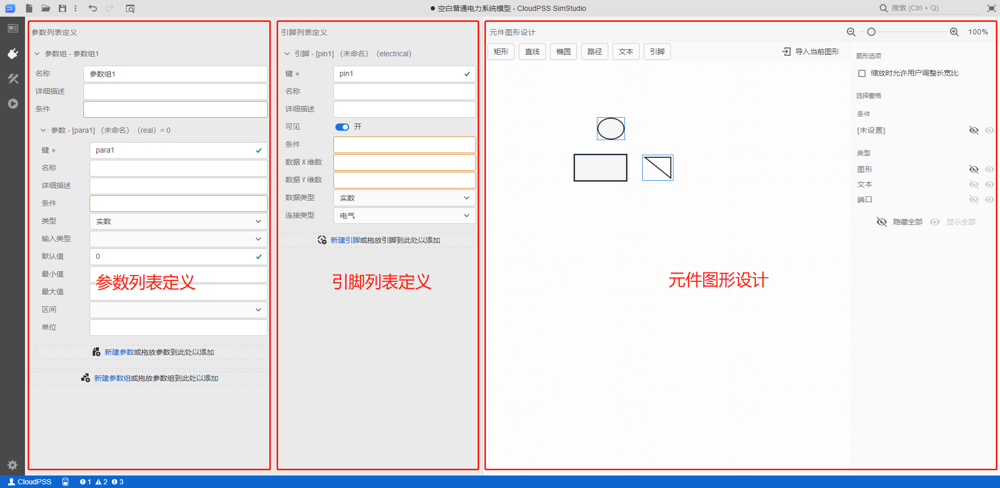

本节首先介绍功能区第二个接口标签页的功能，然后通过 1 个案例说明接口标签页的使用方法。

## 页面功能
SimStudio 支持模块的多层嵌套，接口标签页可以实现模块嵌套的接口定义。对于不同的项目类型，接口标签页的组成内容不同。对于简单模型项目，接口标签页会隐藏；对于普通模型项目，接口标签页仅包含参数列表定义，该参数编辑栏可用于进行仿真参数方案配置；对于元件项目，接口标签页包含参数列表定义、引脚列表定义、元件图形设计，用于对元件项目进行**模块封装**。

## 功能说明

### 参数列表定义 

参数列表定义用于实现当前项目的参数接口定义。提供**新建参数组**和**新建参数**的功能。一个项目可以包含多个参数组，每个参数组下可以包含多个参数。

支持实数、整数、文本、布尔、选择、多选、表格以及虚拟引脚9种类型参数的定义。

提供了参数的键、名称、详细描述、条件、类型、默认值等配置选项。配置好的参数，可在仿真主拓扑中元件的参数框内通过`$`符加**参数键值**进行引用。

参数列表定义主要有两种用法：

用法1: 用于给普通模型项目编辑参数，并在多参数方案仿真时使用。操作方法详见[参数方案配置功能帮助](../../../basic/parameterCalculate/index.md)。

用法2: 用于元件项目的模块封装，具体使用方法详见[定义元件/模块参数列表帮助文档](../../../basic/moduleEncapsulation/parameter-list/index.md)。

### 引脚列表定义

引脚为元件对外连接的端口，一个元件可以没有对外引脚。

引脚列表定义用于实现对引脚的名称、数据维数、数据类型、端口连接类型的定义。引脚的显示与否可受条件表达式控制，以便根据不同的参数配置选项来显示不同的对外引脚。

具体使用方法详见[定义元件/模块引脚列表帮助文档](../../../basic/moduleEncapsulation/pins-list/index.md)。

### 元件图形设计

图标绘制窗口提供了元件图标的绘图工具，支持图形、线、点、引脚、文字等元素的添加，以及线条/填充颜色的图形格式配置。各元素的显示与否可受条件表达式控制，以便根据不同的配置选项来显示不同的元件图标。

具体使用方法详见[设计元件/模块图标帮助文档](../../../basic/moduleEncapsulation/icon/index.md)。

### 接口预览

在进行接口标签页的配置过程中，可通过**右击图标绘制窗口选择预览选项**或点击预览快捷按钮，实现对模块封装情况的预览。

用户可通过预览功能及时查看模块参数配置以及各部分联动是否正常。

## 案例

### 元件项目接口配置

