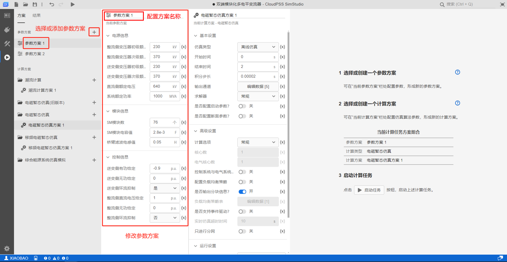
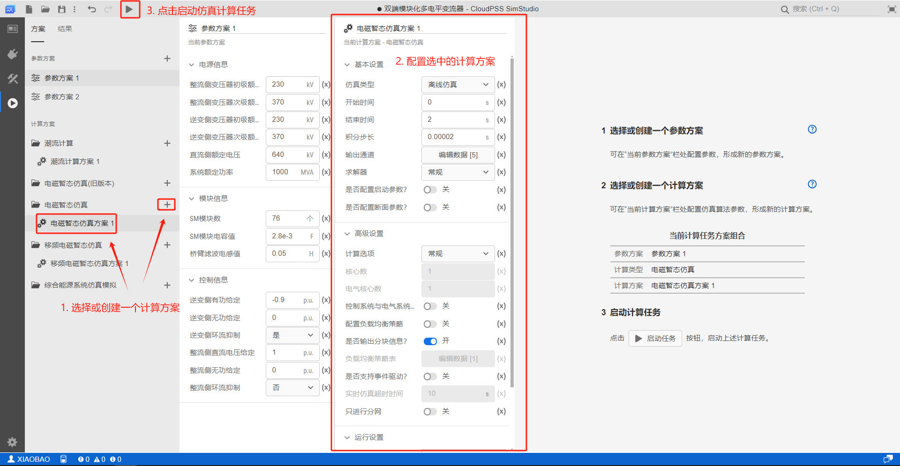
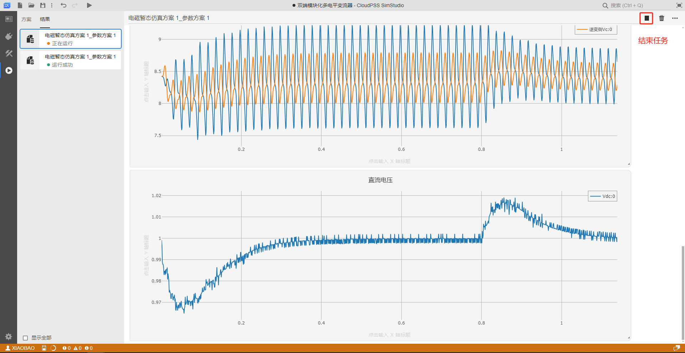
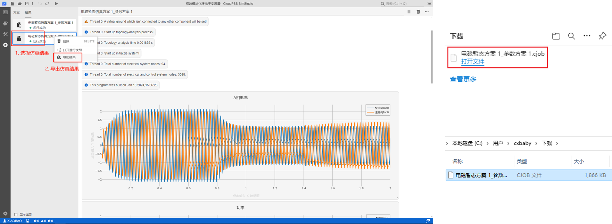

本节功能区第四个运行标签页的使用方法。

## 页面功能

当仿真拓扑构建完毕之后，可在运行标签页对参数和仿真方案进行配置，并开始仿真计算生成仿真结果，实现当前项目的方案配置与结果管理。运行标签页中拥有两个板块：方案板块与结果板块。

## 功能说明

### 方案

仿真方案配置包括了参数方案配置以及计算方案配置两部分，系统默认会添加一组参数方案和计算方案，如下图所示。

#### 参数方案

对于同一个项目，SimStudio 支持配置多套参数方案，执行并发的多场景仿真运算。参数方案配置可方便用户实现多个仿真参数结果的对比。
具体的，需要在**接口标签页**的参数列表内给当前项目添加参数定义，此时**运行标签页参数方案**下的**默认参数方案**里面会将定义的参数列表显示出来，用户可以在这里面修改当前方案下的参数值，也可以点击`＋`添加新的参数方案，并配置方案名称。例如对[双端模块化多电平变流器](https://cloudpss.net/model/CloudPSS/MMC_Benchmark#/interface)
模板算例定义了一系列参数，并添加了不同模块数的参数方案，如下图所示。

未创建参数列表则无需进行参数配置，参数方案配置的具体使用方法详见[参数方案配置帮助](../../../basic/parameterCalculate/index.md)。

#### 计算方案

对于同一个项目，SimStudio 支持配置多套仿真计算方案。平台内置的计算方案有潮流计算、电磁暂态仿真（旧版本）、电磁暂态仿真、移频电磁暂态仿真、综合能源系统仿真模拟，除了这些内置的计算方案外还支持第三方计算方案的接入。用户可根据仿真涉及的应用方向，进行计算方案的配置，选择并配置好计算方案后就可以点击**启动任务**按钮，启动上述计算任务。

以电磁暂态仿真方案配置为例，首先，在计算方案列表中选择或创建一个**电磁暂态仿真方案**；然后配置选中的计算方案，电磁暂态仿真方案配置主要包括基本设置、高级设置、运行设置，具体详见[计算方案配置帮助](../../../basic/parameterCalculate/index.md)；最后，点击启动按钮运行仿真计算方案。

#### 启动任务 

点击工具栏的启动任务按钮，或者右侧使用帮助区的启动任务按钮，启动当前参数和计算方案下仿真任务。

#### 结束任务 

当仿真任务启动后，在任务计算过程中，可以点击右上角的**结束任务**按钮，终止仿真任务。

### 结果

点击启动按钮启动仿真计算任务后，可在**结果**页面查看仿真结果。SimStudio 对用户的每一次仿真结果都进行存储，用户可在左侧仿真结果列表中切换任务查看对应结果。

右侧显示该任务的仿真结果，仿真结果由仿真信息、仿真输出数据结果组成。当仿真出现不收敛等错误情况时，仿真信息会给出相应的提示，常见的报错信息包括存在代数环、元件没有输入信号等。

对于潮流计算，输出结果为表格形式；对于电磁暂态仿真，输出结果为图形。

#### 显示全部

勾选**显示全部**后，会把用户在XStudio中执行过的所有任务的结果都加载进来，除了 SimStudio 外，还包括 FuncStudio 中执行过的任务结果。

#### 删除

用户通过右键点击仿真结果后可选择**删除**，来删除当前仿真结果。也可以点击左上角的**删除按钮**删除结果。

#### 打开运行快照

用户通过右键点击仿真结果后可选择**打开运行快照**，可以在新的窗口中打开该项目的运行快照。

#### 导出结果

支持仿真结果导出与导入功能，用户通过右键点击仿真结果，选择**导出结果**，可将该仿真结果导出为`cjob`格式的文件。

#### 导入结果

支持仿真结果导入，用户可通过仿真结果页面右上角搜索框搜索**导入结果** ，点击导入结果图标，导入`cjob`结果文件，或是直接通过快捷键“Ctrl+I” 快速导入仿真结果文件。

#### 导出为 ZIP 文件

点击左上角的`···`按钮，选择**导出为 ZIP 文件**，可将该仿真结果导出为`ZIP`格式的文件，里面包括仿真信息和输出结果数据文件。

#### 在新窗口中打开 

点击左上角的`···`按钮，选择**在新窗口中打开**，可以在新的窗口中打开仿真结果。

#### 数据结果图形操作 

数据结果曲线支持缩放、平移、重命名坐标轴名称、重命名标题名称、波形数据下载、波形图像下载、在`Chart Studio`中编辑等操作。

## 常见问题

为什么同一套模型能进行电磁暂态仿真却无法进行潮流计算？

:   要使用CloudPSS提供的潮流计算功能，首先需要搭建满足要求的算例。

    目前，潮流计算功能支持的设备元件包含静态负载、三相交流电压源、同步发电机、并联电容/电抗器、三相传输线、三相电阻、三相电 
    感、三相电容、三相双绕组变压器和三相三绕组变压器，更多元件支持将在后续版本中逐步加入。潮流计算功能是围绕着三相交流母线进行的。
    
    因此，上述设备元件中，单电气端口的元件（静态负载、三相交流电压源、同步发电机、并联电容/电抗器）只有当其电气端口与母线直接相连时，才会被计入；对于多电气端口的元件，则其每一个电气端口都必须与母线直接相连。
    
    特别地，电流表可以串入电路中，在潮流计算过程中将被忽略。每条母线至多连接一个电源（三相交流电压源或同步发电机），其节点类型和相关参数在电源的 Power Flow Data 页面指定。未连接电源的母线将作为 PQ 节点参与计算。
    
    同一个算例中可以包含多个独立的网络，每个网络都必须包含且仅包含一个平衡节点。