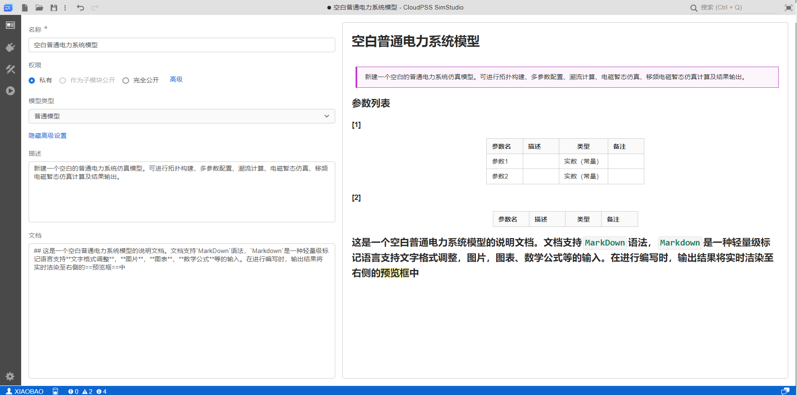
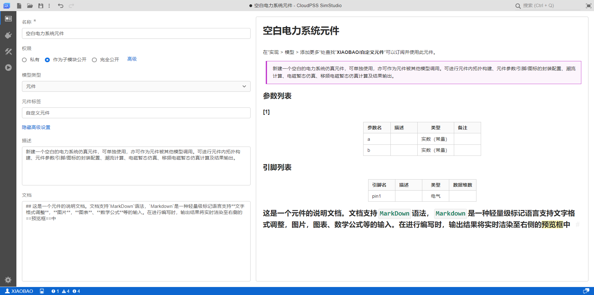

SimStudio 工作台的功能区可以切换展示总览、接口、实现、运行四个标签页，每个标签页具有不同的页面功能。本节首先介绍第一个总览标签页的功能，然后通过 3 个案例介绍总览标签页的使用方法。

## 页面功能

总览标签页用于实现对当前项目信息的配置，包括配置项目基本信息(包括名称、类型、权限信息以及标签)、描述以及文档。同时，总览标签页会显示描述与文档的预览。

## 功能说明

### 名称

显示项目的名称，可任意修改，可与其它项目重名。

### 模型类型

项目类型分为**简单项目**、**普通项目**和**元件**。简单项目适用于简单的小型测试项目；普通项目是最常用的构建算例方法；元件：通过参数与引脚设置，可将项目模型封装为一个模块化元件，在其它项目中直接调用。

### 权限

权限设置包括**私有**、**作为子模块公开**和**完全公开**。

当权限选择私有时，该项目仅保存在个人项目中，仅用户自己可见；

对于简单模型和普通模型，当项目权限选择完全公开时，该项目同时保存在个人项目和项目广场中，所有用户可见。

对于元件类型项目，可选择作为子模块公开，其他用户仅可以使用该元件，而不能查看元件内部细节；选择完全公开时，其他用户可以使用该元件并查看元件内部细节。

除了上述权限外，还可以点击高级为模型设置更多权限，详见[高级权限配置](../../../../../account/settings/sdk-token/index.md)。

### 元件标签

仅用于元件类型的项目，将元件在模型库中按标签分组。

在实现标签页 > 模型 > 添加更多处查找**用户名/元件标签**可以订阅并使用此元件。元件标签内容为空时则默认不将该元件放置于模型库。

### 隐藏高级设置 

点击后会隐藏权限、模型类型和元件标签等配置项，仅可设置项目名称，项目权限为默认的私有。

### 描述

为该项目添加描述性文字，该文字将会显示在个人中心的项目列表中，便于用户进行简要注释。

### 文档

可为项目添加说明性文档，该文档可在个人中心的项目列表中打开查看。

### 预览

在描述和文档部分编辑时，输出结果将实时渲染至右侧的预览框中。

对于普通模型项目，预览框内还会显示接口标签页的**参数列表**；对于元件项目，预览框内还会显示接口标签页的**参数列表**和**引脚列表**。

描述及文档内容的编写支持`MarkDown`语法，`Markdown`是一种轻量级标记语言，支持文字格式调整，图片、图表、数学公式等的输入。

`MarkDown`语法的介绍详见[MarkDown语法介绍](https://markdown.com.cn/)。

## 案例

import Tabs from '@theme/Tabs';
import TabItem from '@theme/TabItem';

<Tabs>
<TabItem value="js" label="案例1">

简单模型项目信息配置

</TabItem>
<TabItem value="java" label="案例2">

普通模型项目信息配置

</TabItem>
<TabItem value="py" label="案例3">

元件模型项目信息配置

</TabItem>
</Tabs>

