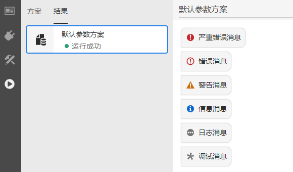
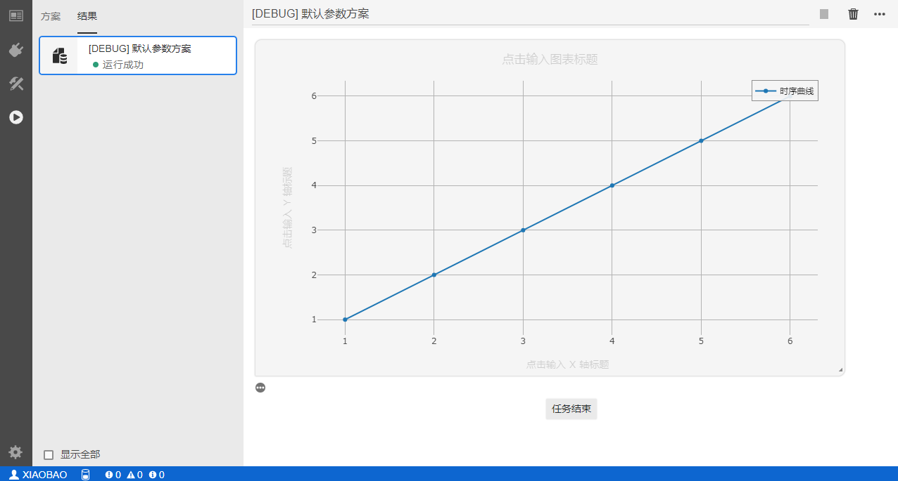
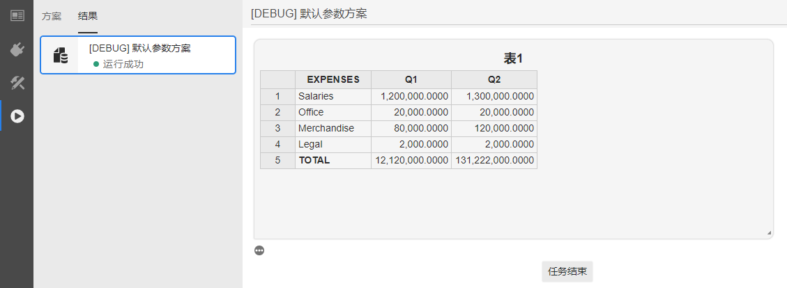

本节介绍 FuncStudio 函数内核计算结果的格式化输出功能。

## 功能定义

FuncStudio 支持用户将算法内核的计算结果以特定的格式发送到运行标签页的结果栏中进行显示，包括消息、图形和表格类型的结果。

## 功能说明

### 消息类型结果输出

在用户自定义算法内核中添加调用 FuncStudio SDK 提供的 `log` 方法的代码，实现在 FuncStudio 运行结果里面输出文本类消息。

log 方法的定义为：`def log(self, content, level='info', html=False, key=None):`

包含 4 个参数: 

|参数|类型|描述|
|:--:|:--:|--|
|`content`|字符串/变量|消息内容|
|`level`|字符串|消息级别。默认为`info`，可选：`critical`(严重错误), `error`(错误), `warning`(警告), `info`(信息), `verbose`(日志), `debug`(调试)|
|`html`|字符串|是否为`HTML`格式，默认是`false`,可选`ture`或者`false`|
|`key`|字符串|消息键(看作是一个标识符)。`key`相同的内容会写入同一条消息，并覆盖掉前面的内容|

import Tabs from '@theme/Tabs';
import TabItem from '@theme/TabItem';

<Tabs>
<!-- 大tab分割线---- -->
<TabItem value="1" label="level 参数用法">
每条消息前面的**图标**和level参数的设置有关，不同 level 参数的消息如下。
<Tabs>
<!-- 小tab分割线---- -->
<TabItem value="python" label="Python 内核用法示例">
```py showLineNumbers
import cloudpss  
if __name__ == '__main__': 
    job = cloudpss.currentJob() 
    job.log('严重错误消息','critical') 
    job.log('错误消息','error') 
    job.log('警告消息','warning') 
    job.log('信息消息','info') 
    job.log('日志消息','verbose') 
    job.log('调试消息','debug') 
```
</TabItem>
<!-- 小tab分割线---- -->
<TabItem value="matlab" label="Matlab 内核用法示例">
```matlab showLineNumbers
cloudpss.utils.syncenv; 
cloudpssMod = py.importlib.import_module('cloudpss');
job = cloudpssMod.currentJob(); 
job.log('严重错误消息','critical'); 
job.log('错误消息','error'); 
job.log('警告消息','warning'); 
job.log('信息消息','info'); 
job.log('日志消息','verbose'); 
job.log('调试消息','debug'); 
```
</TabItem>
<!-- 小tab分割线---- -->
</Tabs>
上述代码输出效果如下图：



:::tip 
其中，日志消息和调试消息需要**点击消息前面的图标**显示。
:::
</TabItem>
<!-- 大tab分割线---- -->
<!-- 大tab分割线---- -->
<TabItem value="2" label="html 参数用法">

消息支持 html 格式，当内容是 html 标签时，将 html 参数选为 `True`, 会渲染出效果后显示。

<Tabs>
<!-- 小tab分割线---- -->
<TabItem value="python" label="Python 内核用法示例">
```py showLineNumbers
import cloudpss  
if __name__ == '__main__': 
    job = cloudpss.currentJob() 
    job.log('<b>加粗字体</b>',html=False) # 不识别 html 标签，仅当作字符输出
    job.log('<b>加粗字体</b>',html=True) # 识别 html 标签加粗内容字体
```
</TabItem>
<!-- 小tab分割线---- -->
<TabItem value="matlab" label="Matlab 内核用法示例">
```matlab showLineNumbers
cloudpss.utils.syncenv; 
cloudpssMod = py.importlib.import_module('cloudpss');
job = cloudpssMod.currentJob(); 
job.log('<b>消息内容</b>'); % 不识别 html 标签，仅当作字符输出
job.log('<b>消息内容</b>','info','True') % 识别 html 标签加粗内容字体
```
:::warning
Matlab 不支持关键字参数，在设置 html 参数的时候，它前面的 level 参数不能省略，顺序也不能变动，否者会报错，
此时，就可以使用默认值`info`占据 level 参数的固定位置。
:::

</TabItem>
<!-- 小tab分割线---- -->
</Tabs>

上述代码输出效果如下图：


</TabItem>
<!-- 大tab分割线---- -->
<!-- 大tab分割线---- -->
<TabItem value="3" label="key 参数用法">

使用 key 参数时，需要注意以下两点：

:::tip
- 不同 key 参数的消息会在 FuncStudio 中显示出多条消息，未指定 key 参数的消息，会单独发送一条独立的消息；
- 相同 key 参数的消息只会在 FuncStudio 中显示一条，后面消息的内容会覆盖前面的内容。
:::

<Tabs>
<!-- 小tab分割线---- -->
<TabItem value="python" label="Python 内核用法示例">
```py showLineNumbers
import cloudpss  
if __name__ == '__main__': 
    job = cloudpss.currentJob() 
    job.log('消息内容1') # 未指定 key 参数的消息，单独发送一条独立的消息
    job.log('消息内容2', key='log-1') 
    job.log('消息内容3', key='log-1') # 相同 key 参数的消息只会显示一条，后面消息的内容会覆盖前面的内容
```
</TabItem>
<!-- 小tab分割线---- -->
<TabItem value="matlab" label="Matlab 内核用法示例">
```matlab showLineNumbers
cloudpss.utils.syncenv; 
cloudpssMod = py.importlib.import_module('cloudpss');
job = cloudpssMod.currentJob(); 
job.log('消息内容1','info','false'); %未指定 key 参数的消息，单独发送一条独立的消息
job.log('消息内容2','info','false','log-1');
job.log('消息内容3','info','false','log-1'); %相同 key 参数的消息只会显示一条，后面消息的内容会覆盖前面的内容
```
</TabItem>
<!-- 小tab分割线---- -->
</Tabs>

上述代码输出效果如下图：


</TabItem>
<!-- 大tab分割线---- -->
</Tabs>


### 图形结果输出

在用户自定义算法内核中添加调用 FuncStudio SDK 提供的 `plot` 方法的代码，实现在 FuncStudio 运行结果里面输出图形类消息。

plot 方法的定义为：`def plot(self, traces=[], layout={}, title='', key=None, verb='replace'):`

包含 5 个参数: 

|参数|类型|描述|
|:--:|:--:|--|
|`traces`|数组/列表|图形数据组|
|`layout`|字典|图形的坐标轴格式|
|`title`|字符串|图形的标题|
|`key`|字符串|`key`相同的数据将显示到同一个图形上|
|`verb`|字符串|数据的发送方式。默认为`replace`，可选 `replace`, `append`,`prepend`,`update`|


<Tabs>
<!-- 大tab分割线---- -->
<TabItem value="1" label="traces 参数用法">

`traces`参数用于配置图形的数据，是一个存放图形数据的字典列表，可以包含多个图形数据，每个图形数据是一个格式固定的字典。

以绘制**二维曲线图形**为例，trace 参数如下：

`trace = [t1,t2,...]`，其中：`t1={'name':str,'type':'scatter','x':float[],'y':float[]}`

|参数|类型|描述|
|:--:|:--:|--|
|`name`|字符串|曲线名称|
|`type`|字符串|曲线类型`scatter`|
|`x`|实数列表|输出的x轴数据|
|`y`|实数列表|输出的y轴数据|

:::warning
注意输出的 X 轴和 Y 轴数据必须是可以 JSON 化的实数列表。
:::

<Tabs>
<!-- 小tab分割线---- -->
<TabItem value="python" label="Python 内核用法示例">
```py showLineNumbers
import cloudpss  
if __name__ == '__main__': 
    job = cloudpss.currentJob() 
    t1 = {
        "name":"时序曲线",
        "type":"scatter",
        "x": [1,2,3,4,5,6],
        "y": [1,2,3,4,5,6]
    }
    job.plot([t1])
```
</TabItem>
<!-- 小tab分割线---- -->
<TabItem value="matlab" label="Matlab 内核用法示例">
```matlab showLineNumbers
cloudpss.utils.syncenv; 
cloudpssMod = py.importlib.import_module('cloudpss');
job = cloudpssMod.currentJob(); 
t1 = {}
t1.name ='时序曲线域';
t1.type ='scatter'; 
t1.x =[1,2,3,4,5,6];
t1.y =[1,2,3,4,5,6];
job.plot({t1})  
```
:::warning
Matlab 中每一个图形数据字典都是一个**元胞数组**。
:::

</TabItem>
<!-- 小tab分割线---- -->
</Tabs>

上述代码输出效果如下图：



####  同一个图形中显示多条曲线

一个二维曲线图形中可以显示多条曲线，只需再参数`traces`的列表内添加其他曲线的数据字典即可，不同曲线的颜色 FuncStudio 会自动区别。

<Tabs>
<!-- 小tab分割线---- -->
<TabItem value="python" label="Python 内核用法示例">
```py showLineNumbers
import cloudpss  
if __name__ == '__main__': 
    job = cloudpss.currentJob() 
    t1 = {
        "name":"曲线1",
        "type":"scatter",
        "x": [1,2,3,4,5,6],
        "y": [1,2,3,4,5,6]
    }
    t2 = {
        "name":"曲线2",
        "type":"scatter",
        "x": [1,2,3,4,5,6],
        "y": [6,5,4,3,2,1]
    }
    t3 = {
        "name":"曲线3",
        "type":"scatter",
        "x": [1,2,3],
        "y": [6,5,4]
    }  
    job.plot([t1,t2,t3])
```
</TabItem>
<!-- 小tab分割线---- -->
<TabItem value="matlab" label="Matlab 内核用法示例">

```matlab showLineNumbers
cloudpss.utils.syncenv; 
cloudpssMod = py.importlib.import_module('cloudpss');
job = cloudpssMod.currentJob(); 

t1 = {}
t1.name ='曲线1';
t1.type ='scatter'; 
t1.x =[1,2,3,4,5,6];
t1.y =[1,2,3,4,5,6];

t2 = {}
t2.name ='曲线2';
t2.type ='scatter'; 
t2.x =[1,2,3,4,5,6];
t2.y =[6,5,4,3,2,1];

t2 = {}
t2.name ='曲线3';
t2.type ='scatter'; 
t2.x =[1,2,3];
t2.y =[6,5,4];

job.plot({t1,t2,t3})
```
</TabItem>
<!-- 小tab分割线---- -->
</Tabs>

上述代码输出效果如下图：


####  高级图形输出

FuncStudio 支持绘制`plotly`库提供的多样化图形，例如，`Sankey`桑基图、`Sunburst`旭日图等，具体可以查看[plotly 帮助文档](https://plotly.com/javascript/)。

不同的图形样式，其 traces 列表中的字典格式也是不一样的，使用时只需要参照`plotly`里面给定的`data`格式来定义图形数据字典，并写入 `traces` 列表内即可。

<!-- 案例待补充： -->

</TabItem>
<!-- 大tab分割线---- -->
<!-- 大tab分割线---- -->
<TabItem value="2" label="layout 参数用法">

`layout` 参数用于配置图形的坐标轴格式，定义如下：

`layout={'xAxis':dict,'yAxis':dict}`

|属性|类型|描述|
|:--:|:--:|--|
|`xAxis`|字典|X标轴的设置参数|
|`yAxis`|字典|y标轴的设置参数|

不同类型的图形，`xAxis` 和 `yAxis`参数的字典格式也不同，以**二维曲线图形**为例，字典格式如下：

`xAxis={'title':str,'type':str,'range':list/str,...}`

`yAxis={'title':str,'type':str,'range':list/str,...}`

|属性|类型|描述|
|:--:|:--:|--|
|`title`|字符串|轴标题|
|`type`|字符串|轴类型,可选`linear`,`log`,`date`|
|`range`|列表/字符串|坐标轴的显示范围,例如`[下限,上限]`,`auto`|

<Tabs>
<!-- 小tab分割线---- -->
<TabItem value="python" label="Python 内核用法示例">
```py showLineNumbers
import cloudpss  
if __name__ == '__main__': 
    job = cloudpss.currentJob() 
    # 散点图的字典数据
    t1 = {
    'name':'频域曲线',
    'type':'scatter',
    'x': [1,10,100,1000,10000],
    'y': [0.2,0.8,1,50,70]
    }
    # 设置散点图的坐标轴样式
    layout = {
        'xAxis':{
        'title':'曲线', 
        'type':'log', # 对数坐标
        'range':[0,4] # 对数坐标时表示指数范围
        },
        'yAxis':{
        'title':'幅值',
        'type':'linear', # 线性坐标
        'range':'auto' # 显示范围自适应
        }        
    }
    job.plot([t1],layout=layout,title ='频域曲线图',key='plot-1')
```
</TabItem>
<!-- 小tab分割线---- -->
<TabItem value="matlab" label="Matlab 内核用法示例">
```matlab showLineNumbers
cloudpss.utils.syncenv; 
cloudpssMod = py.importlib.import_module('cloudpss');
job = cloudpss.currentJob();
% 散点图的结构图数组数据
t1={};
t1.name ='频域曲线';
t1.type ='scatter'; 
t1.x =[1,10,100,1000,10000]; 
t1.y =[0.2,0.8,1,50,70]; 
% 设置散点图的样式
layout={};
layout.title ='频域曲线图'; 
xaxis={};
xaxis.title ='频率';
xaxis.type ='log'; % 对数坐标 
xaxis.range =[0,4]; % 对数坐标时表示指数范围 
yaxis={};
yaxis.title ='幅值'; 
yaxis.type ='linear'; % 线性坐标 
yaxis.range ='auto'; % 显示范围自适应 
layout.xaxis = xaxis;
layout.yaxis = yaxis;
job1.plot({t1},layout,'频域曲线图','plot-1');
```

:::warning
Matlab 需要定义一个空的 layout 元胞数组和两个 xaxis、yaxis 的空元胞数组；给 xaxis、yaxis 的空元胞数组数组内添加坐标轴标题 title、type、range 字段的值；最后将 xaxis/yaxis 的元胞数组作为 layout 里面 xaxis、yaxis 字段的值。
:::

</TabItem>
<!-- 小tab分割线---- -->
</Tabs>

上述代码输出效果如下图：


</TabItem>
<!-- 大tab分割线---- -->
<!-- 大tab分割线---- -->
<TabItem value="3" label="verb 参数用法">

`verb` 参数用于配置图形数据的发送方式，可选项有`replace`（替换数据）、`append`（向后追加数据）、`prepend`（向后追加数据）和 `update` 更新。使用 verb 参数时，需要注意：

:::tip
- 相同`key`参数的图形数据组仅会在 FuncStudio 中显示为一张图形，显示方式与每个图形数据的发送方式有关，不同的`verb`生效的前提必须是向同一个`key`参数的图形数据数据。
:::

<Tabs>
<!-- 小tab分割线---- -->
<TabItem value="python" label="Python 内核用法示例">

```py showLineNumbers
import cloudpss  
if __name__ == '__main__': 
    job = cloudpss.currentJob() 

    t1 = {
        "name":"曲线1",
        "type":"scatter",
        "x": [1,2,3],
        "y": [1,2,3]
    }
    t2 = {
        "name":"曲线2",
        "type":"scatter",
        "x": [4,5,6],
        "y": [4,5,6]
    }
    t3 = {
        "name":"曲线3",
        "type":"scatter",
        "x": [-3,-2,-1],
        "y": [-3,-2,-1]
    } 

    job.plot([t1],key='a')# 发送一张图形
    job.plot([t2],key='a',verb='repalce') # replace：替换当前数据
    
    job.plot([t1],key='b')# 创建一张图形
    job.plot([t2],key='b',verb='append') # append：向后追加数据

    job.plot([t1],key='c')# 创建一张绘图
    job.plot([t3],key='c',verb='prepend') # prepend：向前追加数据
```

</TabItem>
<!-- 小tab分割线---- -->
<TabItem value="matlab" label="Matlab 内核用法示例">

```matlab showLineNumbers
cloudpss.utils.syncenv; 
cloudpssMod = py.importlib.import_module('cloudpss');
job = cloudpssMod.currentJob(); 

t1={};
t1.name ='曲线1';
t1.type ='scatter'; 
t1.x =[1,2,3]; 
t1.y =[1,2,3]; 

t2={};
t2.name ='曲线2';
t2.type ='scatter'; 
t2.x =[4,5,6]; 
t2.y =[4,5,6]; 

t3={};
t3.name ='曲线3';
t3.type ='scatter'; 
t3.x =[-3,-2,-1]; 
t3.y =[-3,-2,-1]; 

layout={};
layout.xaxis={};
layout.xaxis.title='x';
layout.yaxis={};
layout.yaxis.title='y';

job.plot({t1},layout,'fig1','a'); 
job.plot({t2},layout,'fig1','a','repalce'); % replace：替换当前数据

job.plot({t1},layout,'fig2','b')
job.plot({t2},layout,'fig2','b','append'); % append：向后追加数据

job.plot({t1},layout,'fig3','c')
job.plot({t3},layout,'fig3','c','prepend'); % prepend：向前追加数据
```
</TabItem>
<!-- 小tab分割线---- -->
</Tabs>

上述代码输出效果如下图：


</TabItem>
<!-- 大tab分割线---- -->
</Tabs>


### 表格结果输出

在用户自定义算法内核中添加调用 FuncStudio SDK 提供的 `table` 方法的代码，实现在 FuncStudio 运行结果里面输出表格类消息。

table 方法的定义为: `table(self, columns=[], title='', key=None, verb='replace')`

|参数|类型|描述|
|:--:|:--:|--|
|`columns`|数组/列表|表格的列数据组|
|`title`|字符串|表格的标题|
|`key`|字符串|`key`相同的数据将显示到同一个表格中|

其中，`columns`用于配置表格的列数据，是一个存放列数据的字典列表，可以包含多个列数据，

每个列数据是一个格式固定的字典，如下所示：

`columns = [c1,c2,c3,...]`，其中：

|属性|类型|描述|
|:--:|:--:|--|
|`name`|`html`标签|列名称|
|`type`|字符串|`data`类型，可选`text,html,number`|
|`data`|列表|列数据|

<Tabs>
<!-- 大tab分割线---- -->
<TabItem value="1" label="columns 参数用法">

columns 参数用于定义表格的列数据。

<Tabs>
<!-- 小tab分割线---- -->
<TabItem value="python" label="Python 内核用法示例">

```py showLineNumbers
import cloudpss  
if __name__ == '__main__': 
    job = cloudpss.currentJob() 
    # 定义列数据
    c1 = {
        'name':'<b>EXPENSES</b>',  # 给<b></b>之间的文字字体加粗
        'type':'html', # 支持在`data`里面添加`html`标签
        'data': ['Salaries', 'Office', 'Merchandise', 'Legal', '<b>TOTAL</b>']
    }
    c2 = {
        'name': "<b>Q1</b>",
        'type': 'number',
        'data': [1200000, 20000, 80000, 2000, 12120000]
    }
    c3 = {
        'name': "<b>Q2</b>",
        'type': 'number',
        'data': [1300000, 20000, 120000, 2000, 131222000]
    }   
    job.table([c1,c2,c3],title = '表1',key = 'table-1')

```
</TabItem>
<!-- 小tab分割线---- -->
<TabItem value="matlab" label="Matlab 内核用法示例">

```matlab showLineNumbers
cloudpss.utils.syncenv; 
cloudpssMod = py.importlib.import_module('cloudpss');
job = cloudpssMod.currentJob(); 

% 创建一个python 的列表
list = py.list(); % 对于字符数组/字符串数组需要转化为python的列表。
list.append("Salaries");
list.append("Office");
list.append("Merchandise");
list.append("Legal");
list.append("<b>TOTAL</b>");
c1={};
c1.name='<b>EXPENSES</b>';
c1.type='html';
c1.data= list ;
c2={};
c2.name='<b>Q1</b>';
c2.type='number';
c2.data=[1200000, 20000, 80000, 2000, 12120000];
c3={};
c3.name='<b>Q2</b>';
c3.type='number';
c3.data=[1300000, 20000, 120000, 2000, 131222000];
job1.table({c1,c2,c3},'表1','table-1');
```

:::warning
data 参数要求字符数组/字符串数组必须是 Python 的列表。
:::

</TabItem>
<!-- 小tab分割线---- -->
</Tabs>

上述代码输出效果如下图：


</TabItem>
<!-- 大tab分割线---- -->
</Tabs>