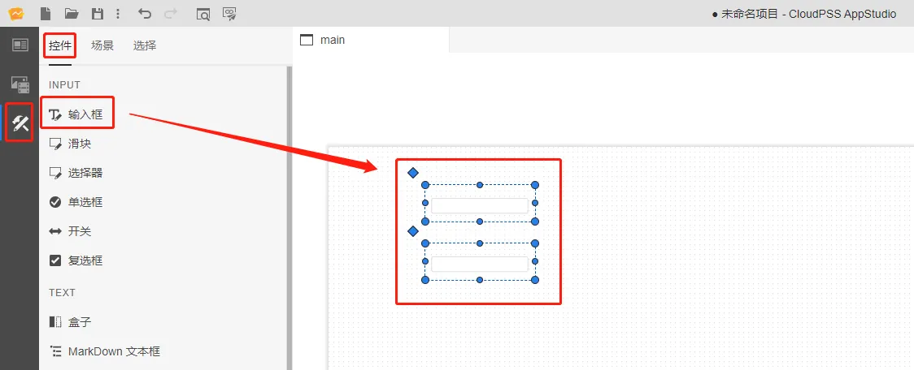
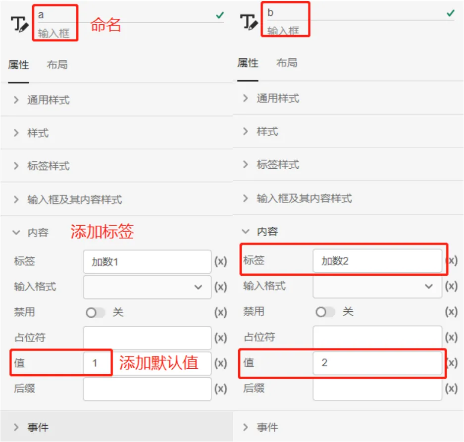
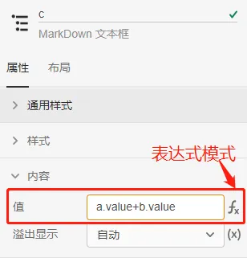
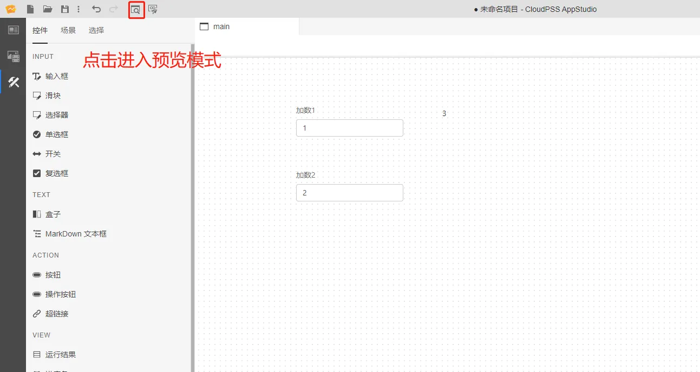
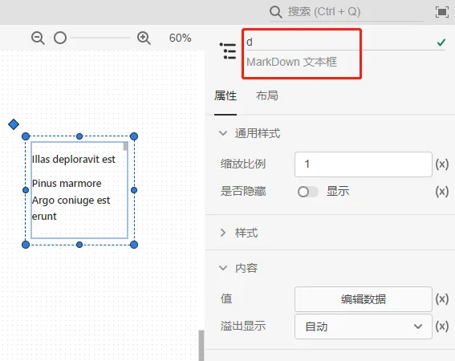
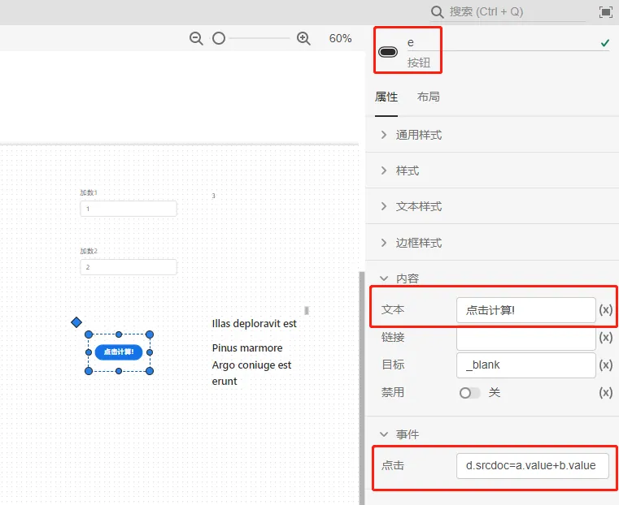
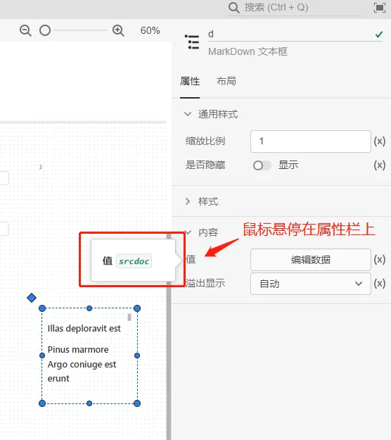
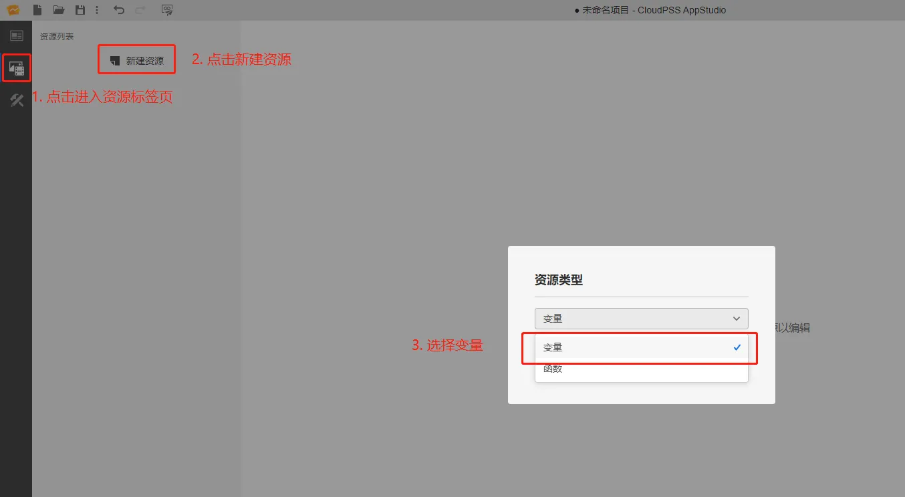
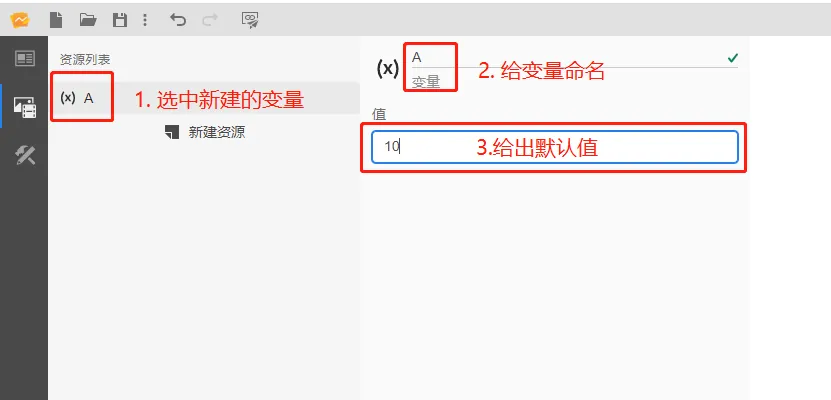
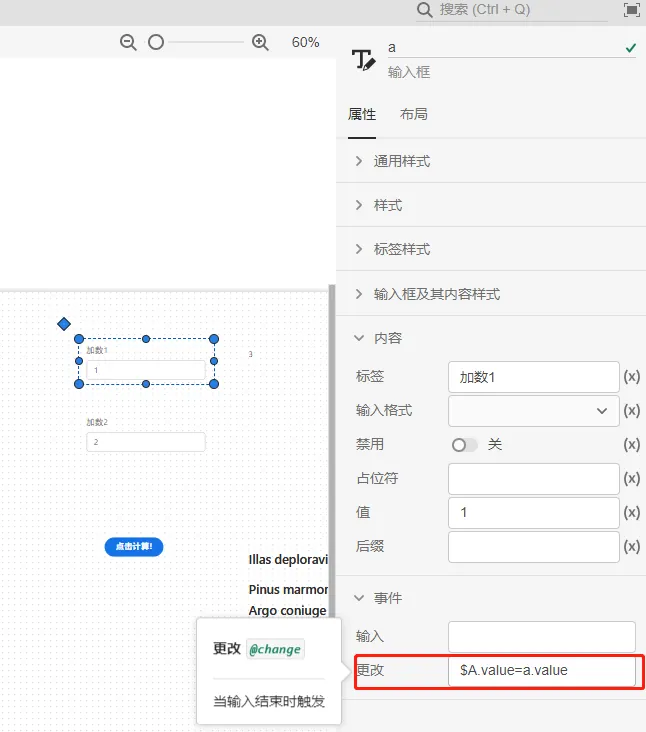

--- 
title: 简单应用
description: 构建一个简单应用
---

本节主要介绍不添加 FuncStudio 的资源函数来在 AppStudio 里面构建一个简单的加法应用场景。

## 创建应用

首先登录到 CloudPSS 的主页，点击 AppStudio 图标进入个人中心，点击**新建空白项目**，即创建一个空白项目，并进入AppStudio 工作台。

点击左侧标签栏的**场景**按钮，进入**场景**标签页，编辑加法应用的场景。下面介绍三种不同的加法应用实现方法。

## 利用表达式进行计算

### 放置控件并配置表达式

在左侧的控件列表区内选择两个**输入框**元素，放置到中间的场景编辑区内。

点击两个添加好的输入框控件选中后，在右侧的属性配置区内给输入框命名为`a`和`b`，默认值设置为`1`和`2`。

接着在控件列表区内选择一个**MarkDown文本框**控件，放置到中间的场景编辑区内。

点击添加好的 MarkDown 文本框控件选中后，在属性配置区内给文本框命名为`c`。

然后，点击**内容/值**一栏最右边的(x)，从**值**模式输入切换到**表达式**模式输入，输入`a.value+b.value`的表达式，

该表达式的含义是**计算输入框 a 和输入框 b 值的和**。

此时 MarkDown 文本框会自动将数值类型的计算结果转换为字符串类型显示。

:::tip
- 切换到表达式模式下属性栏的边框会变成黄色，边框为黄色的属性栏只能输入表达式。

- 从**表达式**模式切换回**值**模式时原本输入的表达式会丢失。

- 输入框会自动检查表达式的状态，若表达式输入有误，选中属性栏后，会在最右侧出现**报错提示**，鼠标悬浮到上面会显示报错信息；若表达式输入正确，会在最右侧自动计算出表达式的当前值。
:::

### 效果预览

完成上述场景搭建后，点击工具栏的**预览**快捷按钮，会进入预览模式，展示出加法应用的效果，

在预览模式内可以修改输入框的值，修改后，MarkDown 文本框会自动显示出相应的计算结果。

## 通过事件触发机制进行计算

### 放置控件并添加事件

在上述场景的基础上，再在控件列表区选择一个**MarkDown文本框**控件，添加到场景编辑区，命名为`d`。

接着，在控件列表区选择一个**按钮**控件，放置到场景编辑区。选中添加好的按钮，在属性配置区内给按钮命名为`e`，在**内容/文本**属性栏内填入**点击计算**提示文本，并在**事件/点击**属性栏内填入`d.srcdoc=a.value+b.value`的表达式。

添加了一个点击按钮后触发的事件：计算输入框 a 的值和输入框 b 的值的，并将值赋给 MarkDown 文本框**d**的`srcdoc`属性。

:::tip

`d.srcdoc`指 MarkDown 文本框**d** 的**值**属性的键，同理每个控件的所有属性值都可以通过**控件名.属性键值**的表达式来获取。

将鼠标悬停在控件属性栏上，属性的键值会自动显示在左侧。
:::

### 效果预览

在弹出的预览页面点击添加的按钮元素，在 MarkDown 文本框**d**中即可看到相应的计算结果。

## 利用变量资源进行计算

### 添加变量资源

在上述场景的基础上，点击左侧的**资源**按钮，进入**资源**标签页，在资源创建区点击**新建资源**，选择**变量**。

选中该变量，给其命名为**A**，并填入默认值。

### 放置控件并引用变量资源

在控件列表区选择一个 **MarkDown 文本框**控件，添加到场景编辑区，选中添加好的MarkDown文本框，命名为**f**，在**值**属性栏内输入`$A.value+b.value`的表达式，表示计算变量资源 A 的值和输入框 b 的值之和。

:::tip
引用**资源**标签页内的变量或者函数需要在表达式的前面加上**$**。
:::

### 添加事件修改变量资源

选中添加好的输入框**a**，在**事件/更改**属性栏内填入`$A.value=a.value`的表达式。

添加了一个当输入框值**变更时触发的事件**：将输入框**a**更改后的值赋给变量资源**A**。

### 效果预览

在预览模式下修改输入框**a**的值后，将输入框**a**的值赋值给变量资源**A**。

