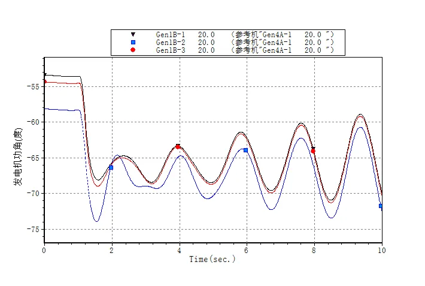
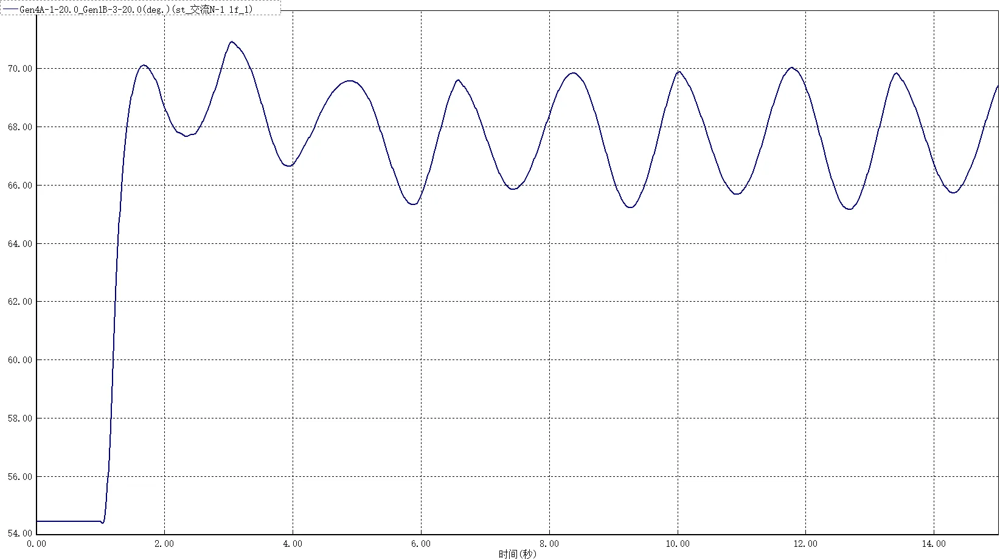

该算例对应中国电机工程学会 Github 发布算例中的 CSEE-DAS-49 算例。

## 场景描述
风火打捆经交直流并联送出系统，新能源、火电通过长链式交流通道送往受端电网，长链式交流通道三永N-1故障后导致系统动态功角失稳。

## 系统概况
根据某区域实际电网拓扑和数据，搭建如图所示的两区域交直流混联电网，所在分区分别为区域1A、1B（此处区域为BPA中的分区名称），输电网架共有53个节点（500kV主网架为16个节点），输电网架概况如表所示。系统内1条直流，直流送出功率为100万千瓦。

## 拓扑与线路概况
系统共有交流线路26条，变压器30台、直流回路1回，线路及变压器概况如下。

## 电源概况
火电机组总装机6000MW，其中区域1A装机3600MW，区域1B装机1800 MW；风电、光伏2种新能源机组总装机4800MW，均位于区域1A；新能源机组装机占比接近45%。系统电源装机概况详见下表。

## 负荷概况
全网总负荷5383MW，其中区域1A负荷102.3MW，区域1B负荷5280.7MW。系统负荷概况详见下表。

## 故障场景
bus1A-1~busA-2线路N-1故障，送端电网机组相对受端电网机组动态失稳。BPA、PSASP 以及 CloudPSS 中仿真结果如下所示。

 -->